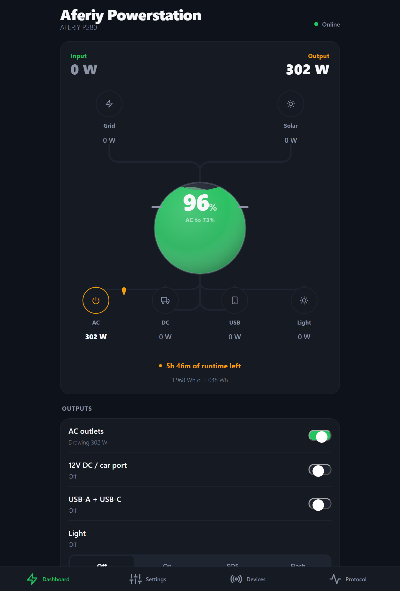
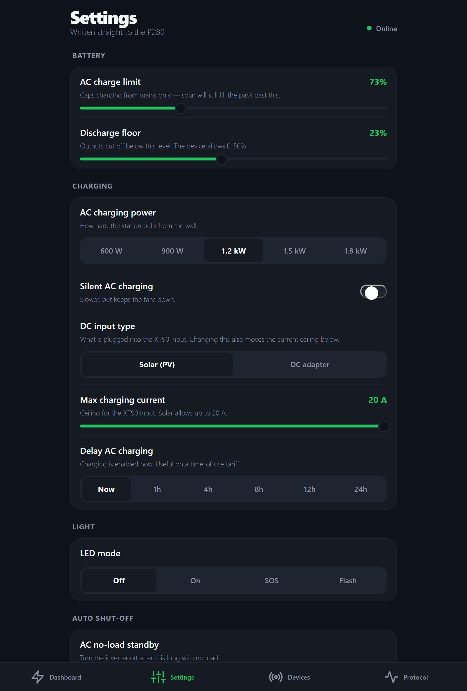
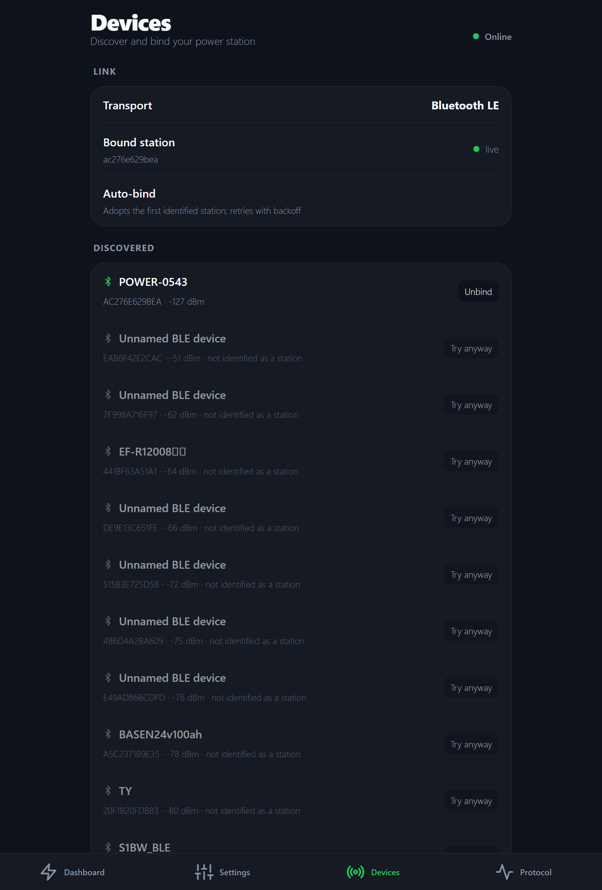
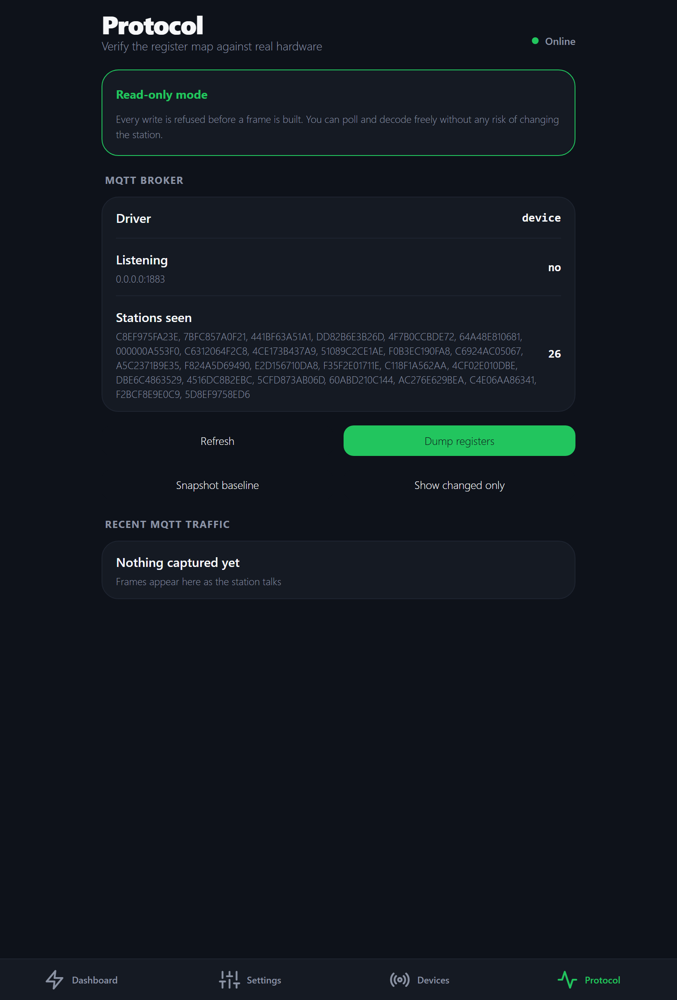

# kraftverk

Local control for **Sydpower-stack portable power stations** — monitor and
control them from iOS and the browser, over Wi‑Fi or Bluetooth, **without the
vendor cloud**.

Developed and verified against an **AFERIY P280**.

<p align="center">
  
</p>

> **Unofficial.** Not affiliated with, endorsed by, or supported by AFERIY,
> Sydpower, Fossibot or any related company. Those names appear only to identify
> the hardware this software talks to.
>
> *kraftverk* is Swedish for "power plant".

---

## Supported models

| Model | Status | Notes |
| --- | --- | --- |
| **AFERIY P280** | ✅ **Verified** | Every setting confirmed against real hardware over BLE. The reference device for this project. |
| AFERIY P210 / P310 | ⚠️ Untested | Same Sydpower stack; listed as supported by other community projects. Expect most things to work. |
| FOSSiBOT F2400 / F3600 / F3600 Pro | ⚠️ Untested | The published register maps were originally derived from these. |
| Eco Play SYD2400 / SYD3600 | ⚠️ Untested | Same stack. |
| ABOK Power Ark3600 | ⚠️ Untested | Same stack. |

If it works with the **BrightEMS** app, it is probably speaking this protocol.

**Untested does not mean compatible.** Several values are known to be
model-specific — the AC charging power scale is 600–1800 W on a P280 but
300–1100 W on an F2400, and the register map has diverged from the published
version in six places on the P280 alone. Assume yours differs until you have
checked it.

The **Protocol** tab exists precisely for this: dump your registers, compare
against [docs/P280-FINDINGS.md](docs/P280-FINDINGS.md), and open an issue with
what differs. Model-specific handling and a model selector in the UI are on the
roadmap; today the decoding assumes a P280.

---

## ⚠️ This software can permanently destroy your power station

Read this before running anything.

This project writes directly to a battery management system over an
**undocumented, reverse-engineered protocol**. The failure mode is not a crash
or a bad reading — it is **hardware that never turns on again**.

- **Writing `0` to holding register 68 permanently bricks the station.** Not a
  soft-lock. It does not come back. This is documented by multiple independent
  reverse-engineering efforts, and the vendor's own app removes the option that
  would send it.
- Registers 25 and 26 are reported to *toggle* on any write rather than honour
  the value sent.
- Writing an undocumented register may do anything at all. Nobody has a
  datasheet.

The code has three independent guards against the known brick value — a
register whitelist, a schema, and a test asserting the write is refused — and a
read-only mode that blocks every write at the driver. **None of that makes this
safe.** It makes it less likely that *this* code is what destroys your unit.

**There is no warranty of any kind, and the authors accept no liability for
damage to hardware, property, or anything else.** That disclaimer matters far
more here than for ordinary software: the realistic worst case is not lost data,
it is a dead battery pack worth roughly a thousand euros, and very likely a
voided warranty. Using this software is your decision and your risk alone.

If you are not willing to lose the station, do not run this against it.

Additional cautions:

- Do not change output ports while medical, heating, security, networking or
  other availability-critical equipment is connected.
- Start every session with a new unit in `--read-only`, which is the default for
  the hardware modes.
- The API has no authentication and permissive CORS. Keep it on your LAN. Never
  port-forward it.

---

## What it does

- **Live telemetry** — state of charge, power in and out per source and port,
  runtime remaining, AC voltage and frequency, firmware versions.
- **Full settings control** — charge limit, discharge floor, AC charging power,
  silent charging, charge scheduling, DC input type, standby timers, screen
  timeout, light modes, and every output port.
- **Two transports** — a local MQTT broker the station connects to instead of
  the vendor cloud, or a direct Bluetooth LE link. Both carry identical frames.
- **Protocol diagnostics** — full register dumps, a snapshot/diff workflow for
  identifying unknown registers, and a live frame log.
- **A simulator**, so the app is fully usable with no hardware present.

| Dashboard | Settings | Devices | Protocol |
| --- | --- | --- | --- |
|  |  |  |  |

---

## How it talks to the station

AFERIY does not write its own firmware stack — it rebadges **Sydpower**, the
platform also behind Fossibot, Eco Play and ABOK. One vendor app (BrightEMS)
drives all of them, which is why reverse-engineering work transfers between
brands. **Search for "Sydpower" and "Fossibot", not AFERIY.**

The station is a **MODBUS RTU slave at address `0x11`**, reachable two ways:

| Transport | How it reaches the device | Requires |
| --- | --- | --- |
| `mqtt` | The station connects to a broker embedded in this server | Redirecting `mqtt.sydpower.com` to your machine |
| `ble` | Direct Bluetooth LE GATT connection | A Bluetooth adapter on the server machine |

Both carry byte-identical frames, so one codec and one register map serve both.

### The detail that will cost you a day

**The CRC is big-endian**, which contradicts the MODBUS specification. A stock
MODBUS library byte-swaps it and the device silently drops every frame with no
error at all. Verified against three independent captures:

| Frame | CRC | On the wire |
| --- | --- | --- |
| `110400000050` | `0xA6F2` | `a6f2` |
| `1106003f003c` | `0x47BB` | `47bb` |
| 168-byte response | `0xDFB5` | `dfb5` |

### Findings specific to this model

The published register maps were derived largely from **Fossibot F2400/F3600**
hardware. Several things differ on a P280, and trusting the published values
would give you plausible-looking wrong answers:

- **AC charging power** spans 600–1800 W in five steps, not the documented
  300–1100 W.
- **Register 48** is a bitmask reading `0x8040`, not the documented exact
  `0x8000`, so an equality check never sees the charging flag.
- **Register 41 bit 2** is the *inverter*, not AC input. The published mask
  would report a station running on its own battery as grid-connected.
- **The inverter backfeeds the AC input sense line** — 59.1 V at 0 Hz with
  nothing plugged in. Voltage alone cannot be used to detect mains.
- **Registers 15 and 47–50 are undocumented**: DC input type, and the four
  component firmware versions.
- **Register 67 caps AC charging only.** Solar charges straight past it.

Every claim above was verified against real hardware. The evidence for each,
and an explicit list of what remains unverified, is in
**[docs/P280-FINDINGS.md](docs/P280-FINDINGS.md)**.

---

## Getting started

### Prerequisites

- **Node 20.19+** (22 or 24 recommended) for Expo and Metro
- **Bun** — `winget install Oven-sh.Bun`, or see [bun.sh](https://bun.sh)
- On Windows you cannot run the iOS Simulator; use **Expo Go** on a phone

### Install and run

```bash
npm install
```

```bash
npm run dev
```

That starts the simulator and the web app — no hardware needed. Open
`http://localhost:8081`.

Against a real station, **read-only by default**:

```bash
npm run dev:ble
```

```bash
npm run dev:device
```

Only when you have verified reads and decided to accept the risk:

```bash
npm run dev:ble:write
```

### Connecting over Wi-Fi

1. Start with `npm run dev:device`; the server listens for MQTT on `:1883`.
2. Redirect the vendor hostname to your machine in your router or Pi-hole:

   ```
   mqtt.sydpower.com  ->  <your machine's LAN IP>
   ```

3. Power-cycle the station so it re-resolves DNS.
4. Open the **Devices** tab; it appears and binds automatically.

The station still needs internet on first connect — it fetches MQTT credentials
from the vendor cloud before connecting. Only the MQTT traffic is redirected.

Windows Firewall usually blocks the inbound connection:

```bash
netsh advfirewall firewall add rule name="kraftverk MQTT" dir=in action=allow protocol=TCP localport=1883 profile=private
```

### Connecting over Bluetooth

```bash
npm run dev:ble
```

**Close the vendor app first.** These stations accept one BLE connection at a
time, and while the phone holds it, Windows sees only the generic GATT services
and the vendor service is invisible. Pairing is *not* required.

---

## API

Base URL: `http://<host>:3333/api`

| Method | Path | Purpose |
| --- | --- | --- |
| `GET` | `/health` | Liveness |
| `GET` | `/version` | Name, version, runtime, uptime, link mode |
| `GET` | `/status` | Live telemetry |
| `GET` `PATCH` | `/settings` | Read / update station settings |
| `POST` | `/ports/:id` | Toggle `ac` \| `dc` \| `usb` \| `led` |
| `GET` | `/devices` | Discovered stations and current binding |
| `POST` | `/devices/bind` · `/devices/unbind` | Bind or release a station |
| `GET` | `/diagnostics/registers` | Full register dump, raw and named |
| `POST` | `/diagnostics/snapshot` | Capture a baseline for diffing |
| `GET` | `/diagnostics/scan` | Read an arbitrary register range (read-only) |
| `GET` | `/diagnostics/traffic` · `/gatt` · `/blocked` | Frames, GATT, refused writes |
| `POST` | `/diagnostics/raw` | Arbitrary frame — needs `ALLOW_RAW_MODBUS=1` |

### Environment

| Variable | Flag | Default | Meaning |
| --- | --- | --- | --- |
| `STATION_DRIVER` | `--driver=` | `sim` | `sim` \| `device` \| `ble` |
| `READ_ONLY` | `--read-only` | on for hardware modes | Refuse every write |
| `DEVICE_ID` | `--device=` | — | Bind this station instead of auto-binding |
| `PORT` / `HOST` | — | `3333` / `0.0.0.0` | HTTP API |
| `MQTT_PORT` / `MQTT_HOST` | — | `1883` / `0.0.0.0` | Embedded broker |
| `ALLOW_RAW_MODBUS` | — | — | `1` enables raw frames |

---

## Identifying unknown registers

The **Protocol** tab implements the workflow that produced everything in the
findings document:

1. **Snapshot baseline** — captures all 160 registers
2. Change **one** thing on the station itself
3. **Dump registers**, then **Show changed only**

Whatever moved is the register behind that control. One change at a time, or the
diff stops being evidence. Note that USB switches itself off after about three
minutes with no load, so take the second dump promptly.

Two things that workflow taught us, worth knowing before you trust a hypothesis:

- **Two registers sharing a value proves nothing.** Three separate "mirror
  register" theories died this way.
- **A write can change a register you did not write.** Switching DC input type
  also moved the charging-current ceiling.

---

## Tests

```bash
npm test
```

56 tests covering frame construction, response parsing and telemetry decoding
against captured traffic from real hardware, plus the write-safety whitelist and
the behaviours confirmed on a P280.

---

## Project layout

```
client/                  Expo app (iOS + web)
  app/(tabs)/            dashboard, settings, devices, protocol
  src/components/        EnergyFlow, Card, Row, ModeRow, …
  src/state/             one poll loop for the whole app
server/
  src/protocol/          modbus codec + register map (+ tests)
  src/transport/         mqtt and ble transports
  src/drivers/           device driver, simulator
docs/P280-FINDINGS.md    evidence log: confirmed vs. assumed
docs/PROJECT-BRIEF.md    long-term plan and architecture brief
```

---

## Credits

This builds directly on other people's work:

- **[schauveau/sydpower-mqtt](https://github.com/schauveau/sydpower-mqtt)** —
  the most complete MQTT + MODBUS specification, and the primary source here
- **[iamslan/ha-fossibot](https://github.com/iamslan/ha-fossibot)** — Home
  Assistant integration; source of the writable-register whitelist
- **[dandwhelan/fossibot-bluetooth](https://github.com/dandwhelan/fossibot-bluetooth)** —
  BLE protocol and GATT UUIDs
- **[ylianst/esp-fbot](https://github.com/ylianst/esp-fbot)** — ESP32 BLE bridge
- **[bootuz-dinamon/Aferiy-Fossibot-Reverse-Engineering](https://github.com/bootuz-dinamon/Aferiy-Fossibot-Reverse-Engineering-)** —
  RS485 approach, and the only source naming the P280
- **[Jack Reeve — Reverse Engineering my smart battery](https://medium.com/@jack_57343/reverse-engineering-my-smart-battery-c01d711c770b)** —
  the write-up that established how the vendor app reaches the cloud

## Legal

Reverse engineering a device you own for interoperability is generally lawful in
the EU and US. Everything here targets hardware on your own network. Do not
point it at anyone else's.

## Licence

MIT — see [LICENSE](LICENSE). Note in particular the warranty and liability
disclaimers, and the hardware warning at the top of this file.
