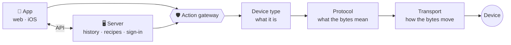

<p align="center">
  
</p>

<h1 align="center">kraftverk</h1>

<p align="center">
  <strong>A small home hub where every device gets first-class support — written as code.</strong><br>
  Reverse-engineered gear and things you built yourself, each one a package with its own<br>
  screens, settings and safety rules. Local, safe and pleasant to use. On its own, or next to Home Assistant.
</p>

<p align="center">
  <a href="https://github.com/olofd/kraftverk/actions/workflows/ci.yml"></a>
  <a href="LICENSE"></a>
  
  
  
  
  </p>

<p align="center">
  <a href="#quick-start">Quick start</a> ·
  <a href="#supported-devices">Supported devices</a> ·
  <a href="#code-not-configuration">Why</a> ·
  <a href="#add-your-own-device">Add your own device</a> ·
  <a href="#home-assistant">Home Assistant</a> ·
  <a href="#documentation">Docs</a>
</p>

<p align="center">
  
  &nbsp;
  
  &nbsp;
  
  &nbsp;
  
</p>

---

## Code, not configuration

Home Assistant was built for a world where writing an integration was
expensive, so it made the common case configurable: generic entities, YAML,
dashboards you assemble yourself. **That world is ending.** With AI coding
agents, code is cheap. A screen made for one product, a precise settings
schema, a protocol nobody documented, a register map read out of a vendor app —
work that took weeks takes an afternoon.

kraftverk is built for that: **more code, less configuration.** A device is not
a pile of entities you arrange; it is a package that knows the product — its
own dashboard, its own settings grouped the way the product works, its own
safety rules and what it can be automated to do. **First-class support for
every device**, built by the people who own it.

**Standards are the floor; packages are the ceiling.** A device that speaks a
standard should need no code at all, and kraftverk will speak more of them over
time. But when you own the device, nothing stops at the standard — you can go
all the way.

What makes cheap code safe to run against real hardware is the rails around
it: a typed contract, a simulator and a contract test for every package, an
architecture check on every push, and one gateway every physical action must
pass.

<table>
<tr>
<td width="50%" valign="top">

### 🧩 Every device, first class
One TypeScript package says what a product is: what it measures, what it can
do, its settings and how to reach it. Generic pages come free; a device that
deserves more ships its own screens — the station's energy-flow dashboard is
one.

</td>
<td width="50%" valign="top">

### 🛡️ Safe with hardware that can break
Every physical action goes through one gateway: checked against the device's
schema, confirmed by a person when it is dangerous, read back to verify, and
written to a timeline. Read-only until you say otherwise.

</td>
</tr>
<tr>
<td valign="top">

### 📱 Your phone can be the hub
The same code runs in the server and in the app. A browser or phone can hold a
Bluetooth device itself — with a server for history and automations, or with
no server at all.

</td>
<td valign="top">

### 🔬 A workbench for the undocumented
Simulators for every device type, register dumps, snapshot-and-diff, frame
logs. Bringing up a device nobody documented is part of the product — for you,
and for the agent working beside you.

</td>
</tr>
</table>

And the things a home server should just have: sign-in for everyone, history
kept for two years, device secrets encrypted at rest under a key you choose,
and nothing leaving your network unless a device's own setup needs it.

## Supported devices

| | Device | Reached over | Support |
| :-: | --- | --- | --- |
| 🔋 | **[AFERIY P280](packages/devices/aferiy-p280/README.md)** — portable power station | Wi-Fi (kraftverk's own MQTT broker) · Bluetooth |  |
| 🔋 | Other Sydpower stations — AFERIY P210/P310, FOSSiBOT F2400/F3600, Eco Play, ABOK | the same |  [why](packages/devices/aferiy-p280/README.md#supported-models) |
| 🔌 | **Tuya / Smart Life energy plugs** — protocol 3.3, 3.4, 3.5 | Home network, no cloud |  |
| 🔌 | **ATORCH S1W** / S1WP / S1BW — plug with a meter and display | Home network, no cloud |  [notes](docs/ATORCH-S1W.md) |
| 🌤️ | **Open-Meteo** — weather forecasts, for solar | HTTPS, no account |  |

**Verified** — confirmed on real hardware by someone who owns one.
**Community** — works for its author, not checked here.
**Experimental** — built from published work; expect surprises.
Every device type also runs as a **simulator**, so you can use the app with no
hardware at all.

**Ways to reach a device:** Bluetooth LE (from the server, a browser through
Web Bluetooth, or a phone) · the home network · an MQTT broker kraftverk runs
for devices that expect a cloud · HTTPS.

<details>
<summary><strong>What kraftverk does not do</strong></summary>

<br>

- **Zigbee, Z-Wave, Matter, Thread.** Home Assistant and Zigbee2MQTT do these
  well.
- **Cloud-only devices.** A device is reached locally or not at all. Some need
  their vendor's cloud once, during setup — a Tuya key, a station's first
  connection — and each says so.
- **Cameras, media, voice.**
- **A dashboard editor or a scripting language.** Devices get pages drawn
  from what they are; automations are recipes that watch before they act.
- **App Store builds — yet.** The web app works on any phone; Bluetooth on
  iOS needs a development build.

</details>

## Quick start

**Try it without hardware.** Node 20.19+ is the only thing to install; the rest
of the toolchain comes with `npm install`.

```bash
git clone https://github.com/olofd/kraftverk.git
cd kraftverk
npm install
npm run dev
```

Open <http://localhost:8081>, create your account, and add any device — in
this mode every one of them is a simulator.

**Run it for real, always on** — on a NAS, a Raspberry Pi, anything with
Docker:

```bash
docker compose up -d --build
```

Open `http://<that machine>:8080` from your home network and create the first
account. [docs/DOCKER.md](docs/DOCKER.md) covers transports, secrets, HTTPS
from outside, backups and updates; [docs/RUNNING.md](docs/RUNNING.md) covers
every other way to run it, and connecting from a phone or browser.

> [!WARNING]
> **Some devices can be destroyed by a single wrong write.** Writing `0` to one
> register permanently bricks a P280. kraftverk refuses the writes it knows are
> dangerous in each device's own package, starts read-only, and asks a person
> before anything consequential — but it speaks undocumented protocols, and it
> comes with **no warranty**. Read a device's own page before you let kraftverk
> write to it.

## How it fits together


```mermaid
flowchart LR
  app["📱 App<br/>web · iOS"]
  server["🖥️ Server<br/>history · recipes · sign-in"]
  gateway{{"🛡️ Action gateway"}}
  type["Device type<br/>what it is"]
  protocol["Protocol<br/>what the bytes mean"]
  transport["Transport<br/>how the bytes move"]
  device(("Device"))

  app <-- API --> server
  app --> gateway
  server --> gateway
  gateway --> type --> protocol --> transport --> device
```

Three layers, one package each. A **transport** moves bytes (Bluetooth, the
home network, MQTT, HTTPS). A **protocol** knows what they mean — pure code,
no I/O. A **device type** says what the product is. Whoever holds a device's
connection — the server, or the app — runs the same packages, and every
command passes the same gateway. The layers are checked on every push.
[docs/ARCHITECTURE.md](docs/ARCHITECTURE.md) is the whole design.

## Add your own device

```bash
npm run new:device -- acme-plug
```

That is a working package — a simulator that already keeps the contract — which
the server finds at start. Then make it true:

```ts
export default defineDeviceType<Config>({
  id: 'community.acme-plug',
  apiVersion: '3',
  kind: 'hardware',
  meta: { name: 'Acme plug', category: 'smart-plug', support: 'experimental', icon: 'power' },
  capabilities: ['switch'],
  telemetry: [{ key: 'on', label: 'On', unit: '', kind: 'state', metric: 'switch.on' }],
  controls: [{ id: 'power', label: 'Power', kind: 'switch', capability: 'switch' }],
  config: { fields: {} },
  connections: [{ id: 'lan', label: 'Home network', protocol: 'tuya-local', transport: 'lan' }],
  async identify(connection) { /* read it once: who is it? */ },
  async createSession(ctx) { /* readings, capabilities, settings */ },
  async createSimulator(ctx) { /* the same, with no hardware */ },
});
```

The app gives it a card, controls, settings from its schema and history
charts, with no screen code — and when it deserves more, its own screens live in
the same package. Writing one with an AI coding agent works well: the contract,
the simulator and the tests tell it, and you, when it is wrong. A protocol or transport of its own is
`npm run new:protocol` or `npm run new:transport`.
[docs/ADDING-A-DEVICE.md](docs/ADDING-A-DEVICE.md) is the guide.

## Home Assistant

kraftverk is meant to sit next to Home Assistant, not replace it — and to be
better at one thing.

| | Home Assistant | kraftverk |
| --- | --- | --- |
| **Devices** | Thousands, through standards and integrations | Fewer, each one as deep as its owner wants |
| **Supporting a product** | A Python integration, configured into entities | A TypeScript package with its own screens, settings and rules |
| **What you see** | Entities, and dashboards you build | Pages made for the device |
| **A risky write** | A service call | Validated, confirmed, read back, on a timeline |
| **Your phone** | A remote control | Can hold a Bluetooth device itself |

**Planned:** every kraftverk device appears in Home Assistant through **MQTT
discovery** — sensors with the right device classes, switches and controls
whose commands still pass kraftverk's gateway and land on its timeline. It is
derived from each device type's declaration, so a device type written
tomorrow will appear too, with no Python. Dangerous settings and the
reverse-engineering tools stay in kraftverk, on purpose.
[docs/PRODUCT.md](docs/PRODUCT.md#3-next-to-home-assistant) has the mapping
and the plan.

## Documentation

| | |
| --- | --- |
| [RUNNING.md](docs/RUNNING.md) | Every way to start it; connecting from a phone or browser |
| [DOCKER.md](docs/DOCKER.md) | Always on, in containers |
| [ADDING-A-DEVICE.md](docs/ADDING-A-DEVICE.md) | Supporting a new product |
| [ARCHITECTURE.md](docs/ARCHITECTURE.md) | The design, its words, and the plan |
| [DATA-MODEL.md](docs/DATA-MODEL.md) | Adding a device screen by screen, and everything stored |
| [SECURITY.md](docs/SECURITY.md) | Accounts, sign-in and every defence, checkably |
| [API.md](docs/API.md) | Every endpoint and environment setting |
| [DEVELOPING.md](docs/DEVELOPING.md) | Tests, CI and where everything lives |
| [PRODUCT.md](docs/PRODUCT.md) | What kraftverk is for, and what comes next |
| [HANDOFF.md](docs/HANDOFF.md) | Where things actually stand, and the traps |

## Contributing

The most valuable contribution is **a device**: a new device type, or evidence
that yours differs from what a type assumes — a register dump from a Sydpower
station that is not a P280 is worth a lot. Open an issue with what you have.
Everything is TypeScript, tested with `npm test`, and checked with
`npm run typecheck` and `npm run check:architecture` — whether you wrote it by
hand or with an agent, the checks are the same.

## Credits

kraftverk stands on other people's reverse engineering. Each device's page
credits its sources — the station's are
[here](packages/devices/aferiy-p280/README.md#credits).

## Legal

**Unofficial.** Not affiliated with, endorsed by or supported by any
manufacturer named here; their names only identify the hardware kraftverk talks
to. Reverse engineering a device you own for interoperability is generally
lawful in the EU and US. Everything here targets hardware on your own network —
do not point it at anyone else's.

**Licence:** [MIT](LICENSE), including its warranty and liability disclaimers,
which [NOTICE](NOTICE) extends in so many words to damaged hardware.
*Kraftverk* is Swedish for "power plant".
