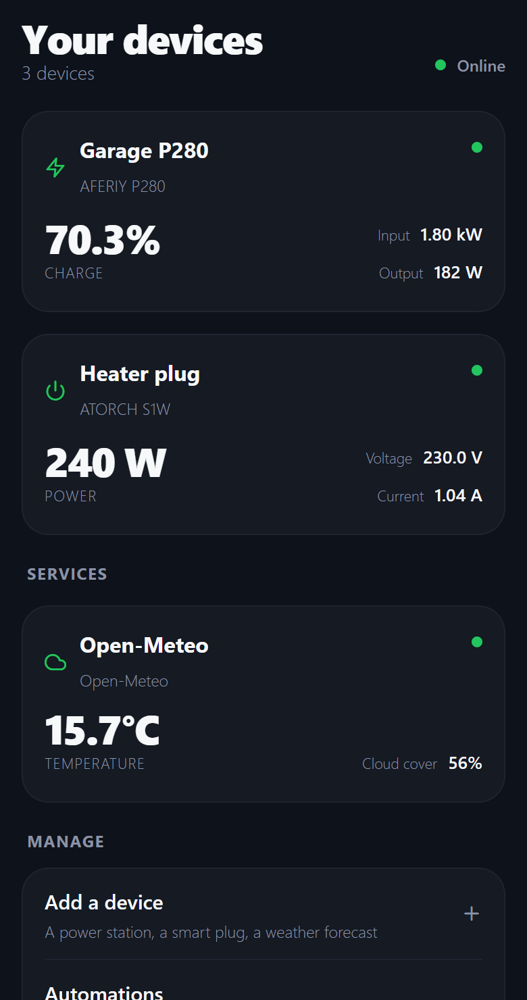
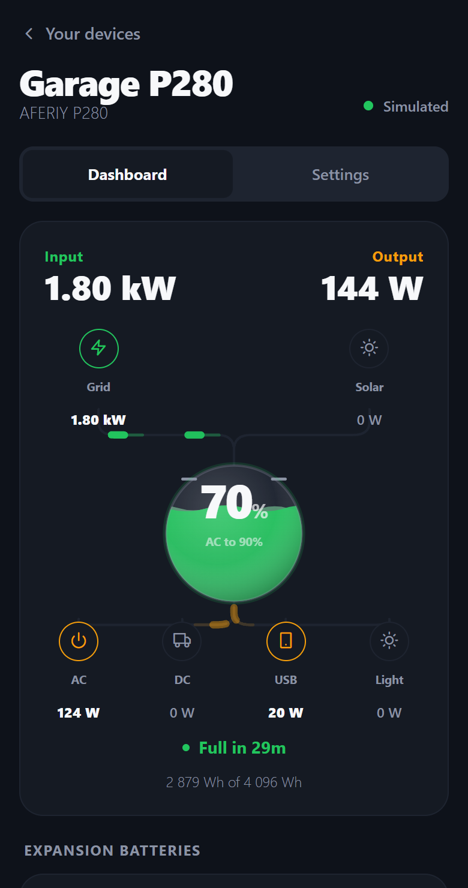
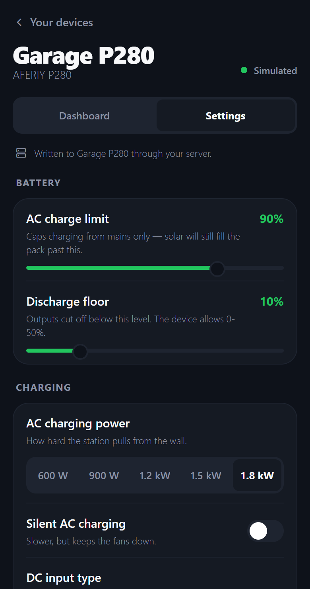
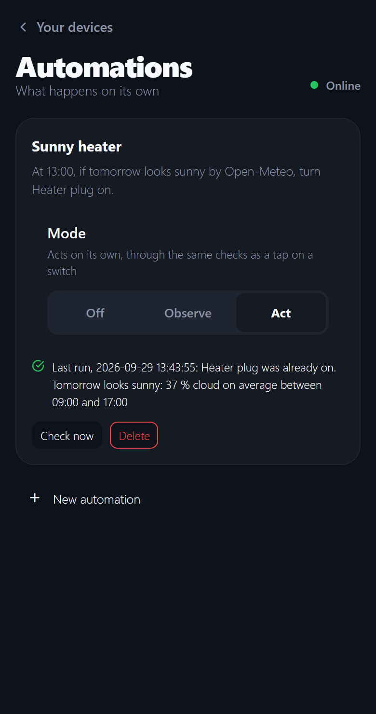
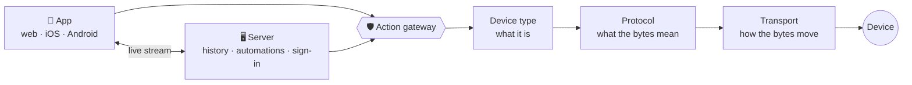

<p align="center">
  <a href="#"></a>
</p>

<h1 align="center">kraftverk</h1>

<p align="center">
  <strong>The home hub for the devices that matter and can break — every one supported as code.</strong>
</p>

<p align="center">
  Power stations, chargers, solar, reverse-engineered plugs, things you built yourself.<br>
  A package per product, one gateway every action passes, a receipt for everything that happens.<br>
  Local. Safe with hardware a wrong write can destroy. Yours to extend in an afternoon, by hand or with an agent.
</p>

<p align="center">
  <a href="https://github.com/olofd/kraftverk/actions/workflows/ci.yml"></a>
  <a href="LICENSE"></a>
  
  
  
  
  
</p>

<p align="center">
  <a href="#try-it-in-two-minutes">Try it</a> ·
  <a href="#what-you-get">What you get</a> ·
  <a href="#supported-devices">Devices</a> ·
  <a href="#add-your-own-device">Add a device</a> ·
  <a href="#safe-with-hardware-that-can-break">Safety</a> ·
  <a href="#next-to-home-assistant">Home Assistant</a> ·
  <a href="#where-it-stands">Status</a> ·
  <a href="#contributing">Contribute</a>
</p>

<p align="center">
  
  &nbsp;
  
  &nbsp;
  
  &nbsp;
  
</p>

<br>

> **Who it is for**
>
> - **You own a power station, a battery or a charger** that no platform supports well. Add it, see it deeply, switch it safely, and see it in Home Assistant too.
> - **You are bringing up a device nobody documented.** A workbench with rails: simulators, register dumps, frame logs, a contract test that says when you are wrong.
> - **You build your own hardware.** A hub that treats your device as a first-class product with its own pages, not a pile of entities.

## Try it in two minutes

No hardware needed. Node 20.19 or newer is the only thing to install.

```bash
git clone https://github.com/olofd/kraftverk.git
cd kraftverk
npm install
npm run dev
```

Open <http://localhost:8081>, create your account, and add any device as **Simulated**. Its simulator stands in for the real thing: the same pages, the same settings, the same safety rules, the same automations. A real device can sit beside it later.

**Run it for real, always on**, on a NAS, a Raspberry Pi, anything with Docker:

```bash
docker compose up -d --build
```

Open `http://<that machine>:8080` from your home network and create the first account. [DOCKER.md](docs/DOCKER.md) covers how devices are reached, secrets, HTTPS from outside, backups and updates. [RUNNING.md](docs/RUNNING.md) covers every other way to run it, including from a phone or a browser with no server at all.

> [!WARNING]
> **Some devices can be destroyed by a single wrong write.** Writing `0` to one register permanently bricks a P280. kraftverk refuses the writes it knows are dangerous in each device's own package, starts read-only, and asks a person before anything consequential. It speaks undocumented protocols and comes with **no warranty**. Read a device's own page before you let kraftverk write to it.

## What you get

<table>
<tr>
<td width="50%" valign="top">

### 🧩 Every device, first class
One TypeScript package says what a product is: its parts, what each reports, what it can be told, how it is reached. The app draws its card, its pages, its settings and its history from that alone. A device that deserves more ships its own screens in the same package.

</td>
<td width="50%" valign="top">

### 🛡️ One gateway, every action
A tap, an automation, a bridge: all go through the same gate. Read-only until you say otherwise, fresh data or nothing, confirmation when it matters, verified by reading back, and a receipt on the timeline. Also for the device a plug feeds.

</td>
</tr>
<tr>
<td valign="top">

### 🔁 Automations that watch before they act
Recipes with roles you fill with your devices, written as data a person can read in one sentence and a checker can type. A new one watches and says what it would have done. Letting it act is a deliberate act.

</td>
<td valign="top">

### 📱 Your phone can be the hub
The same packages run in the server, in a browser and on a phone. A browser or phone can hold a Bluetooth device itself, with a server for history and automations or with no server at all.

</td>
</tr>
<tr>
<td valign="top">

### 🔬 A workbench for the undocumented
A simulator for every device type, register dumps, snapshot and diff, datapoint scans, frame logs, raw frames behind the protocol's guard. Bringing up unknown hardware is part of the product.

</td>
<td valign="top">

### ⚡ Live, local, kept
Readings arrive as they change over one socket. History at a minute for two weeks and by the hour for two years. Sign-in for everyone, secrets sealed at rest, and nothing leaves your network unless a device's own setup needs it, which each device says up front.

</td>
</tr>
</table>

## Supported devices

| | Device | Reached over | Needs the internet | Support |
| :-: | --- | --- | --- | --- |
| 🔋 | **[AFERIY P280](packages/devices/aferiy-p280/README.md)**, portable power station | Wi-Fi through kraftverk's own MQTT broker · Bluetooth from the server, a browser or a phone | Never |  |
| 🔋 | Other Sydpower stations: AFERIY P210 and P310, FOSSiBOT F2400 and F3600, Eco Play, ABOK | the same | Never |  [why](packages/devices/aferiy-p280/README.md#supported-models) |
| 🔌 | **Tuya and Smart Life energy plugs**, protocol 3.3, 3.4 and 3.5 | Home network | Once, to fetch the local key |  |
| 🔌 | **ATORCH S1W**, S1WP and S1BW, plug with a meter and a display | Home network | Once, to fetch the local key |  [notes](docs/ATORCH-S1W.md) |
| 🌤️ | **Open-Meteo**, weather forecasts for planning around the sun | HTTPS, no account | Always, it is a web service |  |
| 🏷️ | **[Elpriset just nu](packages/integrations/elprisetjustnu/README.md)**, Sweden's electricity prices, for the cheapest hours | HTTPS, no account | Always, it is a web service |  |

**Verified**: confirmed on real hardware by someone who owns one. **Community**: works for its author, not checked here. **Experimental**: built from published work; expect surprises. Every device type can also be added **Simulated**.

Ways to reach a device today: Bluetooth LE, the home network, an MQTT broker kraftverk runs for devices that expect a cloud, and HTTPS. Standards come next; see [Where it stands](#where-it-stands).

## Add your own device

```bash
npm run new:integration -- acme
npm run new:device -- acme-plug acme
```

That is an integration — a platform, and the protocol it is spoken to in — and a product on it — working packages with a simulator that already keeps the contract, which the server finds at start. A product on a platform kraftverk already knows is the last line alone, naming that integration. Then make it true:

```ts
export default defineDeviceType<Config>({
  id: 'acme.plug',
  kind: 'hardware',
  meta: { name: 'Acme plug', category: 'smart-plug', support: 'experimental', icon: 'power' },
  config: { fields: {} },

  // What it is: its parts, what they report, what they can be told.
  describe: () => ({
    parts: [{ id: 'main', label: 'Plug', kind: 'outlet', energy: { role: 'load' }, offers: ['switch'] }],
    attributes: [
      { key: 'on', label: 'On', value: { type: 'boolean' }, means: 'on' },
      { key: 'watts', label: 'Power', value: { type: 'number', unit: 'W' }, quantity: 'power', means: 'power' },
    ],
  }),

  // How it is reached: its platform's ways in — a protocol over a transport, and whether that needs the internet.
  connections: ACME_WAYS,

  async identify(connection) { /* read it once: who is it? */ },
  async createSession(ctx) { /* readings, and the commands its parts take */ },
  async createSimulator(ctx) { /* the same, with no hardware */ },
});
```

From that declaration the app gives it a card, a section for each part, controls from the commands its parts take, settings from what it can be told, history charts and a place in automations, with no screen code. Standard meanings such as `charge` and `power` are what charts, automations and the Home Assistant bridge work from, so a device written tomorrow fits everything that exists today.

**Writing one with a coding agent works well, on purpose.** The contract, the simulator, the contract test and the architecture check tell the agent, and you, exactly where it is wrong. [ADDING-A-DEVICE.md](docs/ADDING-A-DEVICE.md) is the guide, and [AGENTS.md](AGENTS.md) is what an agent reads first. An integration of its own — a service, and its protocol — is `npm run new:integration`; a transport, `npm run new:transport`.

## Safe with hardware that can break

Every command and every settings write, from a screen, an automation or a bridge, passes one gateway that runs wherever the connection is held. It is what makes cheap code safe to run against a battery:

- **Read-only by default.** Every launch. Writes are allowed on purpose, per holder.
- **Fresh data or nothing.** Each attribute says how long its value stays current; a stale reading is unknown, and nothing is switched blind.
- **Confirmation when it matters.** What makes a command consequential is declared, not hard-coded: turning off a part that carries a load, or one that feeds another device. The dialog says why.
- **Verified, twice.** The device's own read-back is one proof. If the part feeds another device, that device's own reading is the second, taken after the command.
- **A receipt for everything.** Who, why, what was read before, what was sent, what was read after, and the verdict, on a timeline that outlives the device.
- **The one frame that bricks a station is refused everywhere**: by the package, by every holder, and by the broker itself.

## Automations that watch before they act

An automation is a recipe with roles you fill with parts of your devices, written as data: a trigger by clock, event or threshold, a condition, and commands through the gateway. It can read, compare and ask; it cannot run code, reach the network or skip a check.

| Recipe | What it does |
| --- | --- |
| **Charge between two levels** | Switch what charges a battery on when it stays below one level and off when it reaches another. A charge window of your own, below what the device's settings allow. |
| **When a battery runs low** | Below a level for a while, switch something: a charger plug on, a load off. |
| **When mains power is lost** | The moment a station says its mains went away, shed a load. |
| **Switch by the forecast** | Once a day, if tomorrow looks sunny by your forecast, switch something. |

Every automation reads back as one sentence, checks itself against your devices before it can be saved, watches until you let it act, and leaves a run on the timeline with its reasons. Packages bring the recipes their devices make possible. [AUTOMATIONS.md](docs/AUTOMATIONS.md) is the design, and why the language stays small.

## How it fits together


```mermaid
flowchart LR
  app["📱 App<br/>web · iOS · Android"]
  server["🖥️ Server<br/>history · automations · sign-in"]
  gateway{{"🛡️ Action gateway"}}
  type["Device type<br/>what it is"]
  protocol["Protocol<br/>what the bytes mean"]
  transport["Transport<br/>how the bytes move"]
  device(("Device"))

  app <-- live stream --> server
  app --> gateway
  server --> gateway
  gateway --> type --> protocol --> transport --> device
```

Three layers, one package each. A **transport** moves bytes: Bluetooth, the home network, MQTT, HTTPS. A **protocol** knows what they mean, as pure code with no I/O. A **device type** says what the product is. Whoever holds a device's connection, the server or the app, runs the same packages, and every command passes the same gateway. The layers are checked on every push, and so is that no product's name leaks into the core. [ARCHITECTURE.md](docs/ARCHITECTURE.md) is the whole design.

## Next to Home Assistant

kraftverk sits beside Home Assistant rather than replacing it, and is better at one thing: the devices that need code of their own and care when they are written to.

| | Home Assistant | kraftverk |
| --- | --- | --- |
| **Devices** | Thousands, through standards and integrations | Fewer, each as deep as its owner wants |
| **The unit** | Entities, and dashboards you build | A device made of parts, with pages drawn from what it is |
| **Supporting a product** | A Python integration and a review queue | A TypeScript package with a simulator and a contract test on day one |
| **A risky write** | A service call | Validated, confirmed, read back, on a timeline |
| **Automations** | Anything, in YAML or a builder | Recipes that watch before they act, checked before they run |
| **Your phone** | A remote control | Can hold a Bluetooth device itself |
| **Where the code runs** | A Python process on the hub | The same TypeScript in the server, your browser and your phone |

**Planned:** every kraftverk device appears in Home Assistant through MQTT discovery, with the right device classes, derived from each device's declaration. Commands from Home Assistant pass kraftverk's gateway and land on its timeline. Dangerous settings and the workbench stay in kraftverk, on purpose. [PRODUCT.md](docs/PRODUCT.md#3-next-to-home-assistant) has the mapping.

## What it does not do

- **Zigbee, Z-Wave, Matter, Thread.** Home Assistant and Zigbee2MQTT do these well. Matter is a spike on the roadmap, as a protocol over IP.
- **Cloud-only devices.** A device is reached locally or not at all. Some need their vendor's cloud once, during setup, and each says so before you choose it.
- **Cameras, media, voice.**
- **A dashboard editor or a scripting language.** Pages come from what a device is; automations are a small, closed language on purpose.
- **App Store builds, yet.** The web app works on any phone; Bluetooth on iOS needs a development build.

## Where it stands

Honesty is part of the product. As of September 2026:

- **Research and development, strict version 1.** The model changes everywhere at once and nothing is kept backward compatible. A database from an older schema is set aside on start and a new one begun. Until there is a production state to protect, that is the rule, and [AGENTS.md](AGENTS.md) says so.
- **One verified device.** The framework claim becomes credible at three to five reference devices across different transports. That is the most valuable thing you can contribute.
- **Nothing published yet.** No images, no add-on, no packages outside this repository. Running it means a clone and `npm install`, or a Docker build.
- **What is solid:** the layering, checked on every push; one gateway; one contract; the same code in every holder; the live stream; automations as data; end-to-end tests in a real browser against simulated devices; secrets sealed at rest.

**Next, in order:** the app drawn entirely from descriptions with the station's dashboard as the proof · a Home Assistant bridge from the projections · packages from outside the repository and the SDK on npm · standards as the floor: BTHome, Shelly, ESPHome · published images and a page you can try in a browser. [PRODUCT.md](docs/PRODUCT.md) is the plan; [HANDOFF.md](docs/HANDOFF.md) is where things actually stand, traps included.

## Contributing

The most valuable contribution is **a device**. In order of how much it helps:

| You have | Do this |
| --- | --- |
| A register dump or a capture from a Sydpower station that is not a P280 | Open a [**My device differs**](https://github.com/olofd/kraftverk/issues/new?template=device-differs.yml) issue. It turns "untested" into "verified" for a whole family. |
| A device nobody supports well: a BMS, a charger, an inverter, a plug with a meter | Open a [**Support my device**](https://github.com/olofd/kraftverk/issues/new?template=support-my-device.yml) issue, or write the package: `npm run new:device`. |
| An iPhone and a development build | Native Bluetooth has not run on a phone yet. Be the first. |
| A Home Assistant install and a device from the table | Try it beside Home Assistant and say what you missed. |

Everything is TypeScript. `npm test`, `npm run typecheck` and `npm run check:architecture` must pass, and `npm run test:e2e` drives the app in a browser. Whether you wrote it by hand or with an agent, the checks are the same. [CONTRIBUTING.md](CONTRIBUTING.md) has the rest.

## Documentation

| | |
| --- | --- |
| [RUNNING.md](docs/RUNNING.md) | Every way to start it; connecting from a phone or browser |
| [DOCKER.md](docs/DOCKER.md) | Always on, in containers |
| [ADDING-A-DEVICE.md](docs/ADDING-A-DEVICE.md) | Supporting a new product |
| [AUTOMATIONS.md](docs/AUTOMATIONS.md) | The rule language, recipes and functions |
| [ARCHITECTURE.md](docs/ARCHITECTURE.md) | The design, its words, and the plan |
| [DATA-MODEL.md](docs/DATA-MODEL.md) | Adding a device screen by screen, and everything stored |
| [SECURITY.md](docs/SECURITY.md) | Accounts, sign-in and every defence, checkably |
| [API.md](docs/API.md) | Every endpoint, the live stream, and every environment setting |
| [DEVELOPING.md](docs/DEVELOPING.md) | Tests, CI and where everything lives |
| [PRODUCT.md](docs/PRODUCT.md) | What kraftverk is for, and what comes next |
| [HANDOFF.md](docs/HANDOFF.md) | Where things actually stand, and the traps |

## Credits

kraftverk stands on other people's reverse engineering. Each device's page credits its sources; the station's are [here](packages/devices/aferiy-p280/README.md#credits).

## Legal

**Unofficial.** Not affiliated with, endorsed by or supported by any manufacturer named here; their names only identify the hardware kraftverk talks to. Reverse engineering a device you own for interoperability is generally lawful in the EU and the US. Everything here targets hardware on your own network. Do not point it at anyone else's.

**Licence:** [MIT](LICENSE), including its warranty and liability disclaimers, which [NOTICE](NOTICE) extends in so many words to damaged hardware.

<p align="center"><sub><em>Kraftverk</em> is Swedish for “power plant”.</sub></p>
