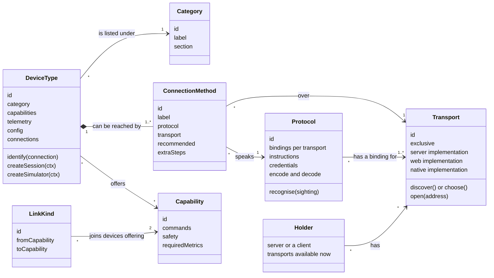
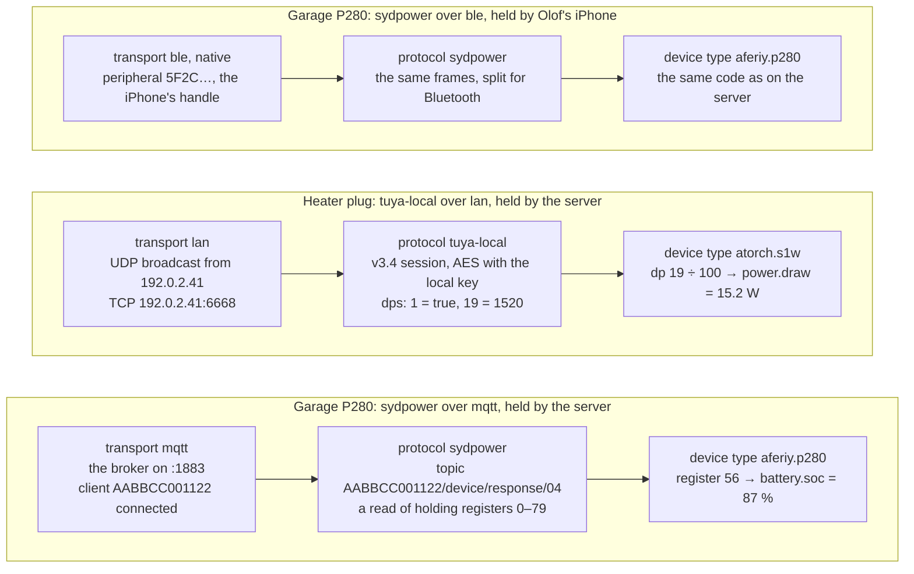

# The data model

**Status:** the authority for everything Kraftverk stores, and for every kind of
thing it knows about. Adopted 2026-09-27; [ARCHITECTURE.md](ARCHITECTURE.md)
points here for the model and §8 there says which step builds each part.
Nothing below is built yet unless ARCHITECTURE.md §8 says so.

The diagrams are Mermaid. GitHub, GitLab and VS Code (with a Mermaid preview)
draw them.

This document starts with a person adding a device, screen by screen, because
each thing that screen needs is a record or a definition. The model is what is
left once the flow is right. Part 1 is the flow. Part 2 is the definitions it
uses. Part 3 is the records it leaves behind. Part 4 covers what happens after
a device is added. Part 5 is today's schema and how it gets here.

Two halves, kept apart:

- **Definitions** live in code, in packages. They say what *can* exist: a
  kind of device, a way of reaching one. Supporting a new product means adding
  a package, never a table.
- **Records** live in the database. They say what *does* exist in this house:
  your station, how it is reached, what it measured. A record names a
  definition by its id, a string such as `aferiy.p280`, and never copies it.

---

## 1. Adding a device, screen by screen

Nothing is stored until step 10. Everything before it is a **draft**. Steps that
run on the server keep their part of the draft there for fifteen minutes,
including any secret a step found. The app sees a placeholder for the secret,
never the secret (see [SECURITY.md](SECURITY.md)).

### 1 · What are you adding?

| | |
|---|---|
| **You see** | Two sections. **Devices** shows *Power stations* and *Smart plugs*. **Services** shows *Weather*. Each category has its icon and how many products it covers. There is a search box for brand and model ("P280", "ATORCH"). When the server can see something nobody has added, a **Found near you** row sits at the top: "A power station is connected to this server over Wi-Fi". |
| **You choose** | A category, a search result (which goes straight to step 2's item), or something found. |
| **Comes from** | **Category** is a fixed list in the SDK. Each device type names one. **Sightings** come from the server's transports, recognised by a protocol. |
| **Leaves behind** | Nothing. A category is display only, and a sighting is live state. |

A simulator is never listed. A simulator belongs to every device type and is
used for tests and for "try without hardware". A device you can add is always a
real product or a real service.

"Found near you" skips steps 2–6: the sighting already says which transport,
which protocol and which address. If more than one installed type speaks that
protocol, step 7 reads the model and chooses the type. If the model can't be
read, step 2 appears, showing only those types.

### 2 · Which one?

| | |
|---|---|
| **You see** | The device types in the category, each with its picture, name, brand, the models it covers and its support level: *Verified on real hardware*, *Reported working by others*, or *Experimental*. At the bottom: *Don't see yours?*, which links to how support gets added. |
| **You choose** | A device type. |
| **Comes from** | **Device types**, from the installed packages. |
| **Leaves behind** | The draft's type. It becomes `device.type_id`. |

This screen is shown even when a category holds one type. It is where you
confirm the product and learn how well it is supported, and that is worth one
tap.

### 3 · How do you want to connect?

| | |
|---|---|
| **You see** | One row per way this type can be reached, *from where you are*. For a P280, in the phone app, with a server that has a Bluetooth radio: • **Wi-Fi, through your server** (*Recommended*). "Always on: history and automations keep running. The station needs to be set to use your server." • **Bluetooth, from your server**. "The station must be within about 10 m of the server." • **Bluetooth, from this phone**. "Only while this phone is near the station. History records while it is connected; automations can reach it only then." A row that can't be used here stays visible, greyed, with the reason: "Your server has no Bluetooth radio", or "Firefox can't use Bluetooth: use Chrome or Edge, or the phone app". |
| **You choose** | A **connection method** and **who holds it**: your server, or this phone or browser. |
| **Comes from** | The type's **connection methods**. Each is one protocol over one transport, and says nothing about where it runs. **Who can hold it** is worked out: the server and this app each report the transports they have right now, and a method is offered wherever its transport is. |
| **Leaves behind** | The draft's method and holder. They become `device_connection.method` and `.held_by`. |

If only one row exists, the screen is skipped and the next one says how it will
connect.

Where a method *runs* is never declared by the device author. MQTT through our
broker is only ever offered on the server, because only the server has the
broker. Bluetooth is offered on the server and in the app because both can have
a radio. The P280's code is the same either way.

### 4 · Get it ready

| | |
|---|---|
| **You see** | What to do to the device first, if anything, with your own values filled in. For Sydpower over MQTT: "In BrightEMS, open the station → Settings → Local MQTT broker, and enter `192.0.2.10`, port `1883`." For Bluetooth: "Turn the station on and stay near it." A button: *Done: find it*. |
| **Comes from** | The **protocol**, for how it rides that transport. The **transport** supplies values such as the broker's address. The **device type** may add its own step. |
| **Leaves behind** | Nothing. |

### 5 · Choose your device

| | |
|---|---|
| **You see** | **Held by the server:** a live list of what the server's transport can see and the protocol recognises. Each row has its advertised name, a short id, how recently it was seen and how it was found. Something already added stays in the list, greyed: "Already added as Garage P280". An empty list says what to try while it keeps waiting ("A sleeping station appears when you press its power button"). *Enter it yourself* takes an IP or MAC address when discovery can't work. **Held by this browser:** a button, *Find my station*, which opens the browser's own Bluetooth chooser. Browsers let only that chooser list devices, and only after a tap. It is filtered to the protocol's Bluetooth service. **Held by the phone app:** the same live list as the server's, from the phone's own scan. |
| **You choose** | One physical device. |
| **Comes from** | The **transport** of the chosen holder does the finding. The **protocol** filters it: which sightings are its devices, and which Bluetooth service to ask the browser for. |
| **Leaves behind** | The draft's address: what the transport knows the device by. That is a MAC, an IP address, or a browser's Bluetooth handle. It becomes `device_connection.address`. |

### 6 · Credentials

| | |
|---|---|
| **You see** | Only for protocols that need them. For Tuya local: "Your plug's local key", with *Fetch it with my Tuya account* (the account details are used once and never stored) or *Enter it*. |
| **Comes from** | The **protocol**. |
| **Leaves behind** | For a connection held by the server, the secret. It stays on the server, in `connection_secret`. For a connection held by the app, the secret stays on that phone or browser, in its secure storage, and the server never sees it. |

### 7 · Check it

The device type connects over the chosen method and reads the device once. It
learns two things: the device's **identity** (its own permanent id, read from
the device rather than from the transport) and its **model**. There are five
outcomes:

| Outcome | You see | What happens |
|---|---|---|
| New | "Found it: AFERIY P280. Battery 87 %, charging 120 W." | On to step 8. |
| Already yours | "This is your **Garage P280**. Add *Bluetooth, from this phone* as another way to reach it?" | No second device. The draft becomes a new connection on the existing one, and it is saved. |
| Yours before | "You had this station before: **Garage P280**, removed on 3 August. Bring it back with its history?" *Bring it back* or *Start fresh*. | Bringing it back clears `removed_at` and adds the new connection. Starting fresh makes a new device; the old one stays removed with its history. |
| Different model | "This is a P320, not a P280." *Add it as a P320* if that type is installed, otherwise "Not supported yet". | Back to this step, with the right type. |
| No answer | "It didn't answer." *Try again*. If the type allows it, *Save anyway* too, with the type's reason ("A sleeping station connects when it wakes"). | Saved without an identity. The first successful connection fills it in. If that identity belongs to another device, the connection is refused and the device's page says why. |

The identity is what makes "the same station, found by the server or by your
phone" one device. It can't be the address: a browser's Bluetooth handle is
private to that browser, and phones hide MAC addresses.

### 8 · Name it

Pre-filled from what the device calls itself, or from the model: "AFERIY P280".
If a device already has that name, a number is added: "AFERIY P280 2". Stored
as `device.name`.

### 9 · How is it connected?

Asked only when a **link kind** could join this device to one you already
have. For a smart plug when you own a station: "What is plugged into this
plug?", with *Garage P280 (its AC input)* or *Something else*, and what it
changes: "Kraftverk will check that the station sees mains power whenever it
switches this plug." For a station when you own a plug, the question is asked
the other way round. It can be skipped, and changed later on either device's
page. Stored as a `device_link`.

### 10 · Save

One transaction writes, or restores, the `device`, its `device_connection` and
its `connection_secret` rows, and its `device_link`. The holder then opens the
session, and the app opens the device's page, which shows the first live
reading.

### A service goes the same way

*Weather* → *Open-Meteo* → step 3 is skipped (one method: its web API, held by
the server) → no instructions → *Where?* (search a place, or use this phone's
location) → check: fetch one forecast → name → save. The place is
`device.config`; the API is its connection. A weather service that needs a key
keeps it in `connection_secret`, like any other credential.

---

## 2. Definitions: what code declares

| Definition | What it is | Lives in | Examples |
|---|---|---|---|
| **Category** | What a person would call the thing, and which section it sits in (devices or services). For finding things, never for behaviour. A fixed list, so two types can't spell the same category two ways. | `device-sdk` | `power-station` "Power stations", `smart-plug` "Smart plugs", `weather` "Weather" (a service) |
| **Transport** | How bytes or messages reach a device. It does all the I/O and the finding, and has no idea what the bytes mean. It ships one implementation for each place it can run. It is **exclusive** when an address means one physical thing, so only one device may claim it. There are few transports, and they are rarely added. | `packages/transports/*` | `mqtt`: our broker, server only, exclusive. `ble`: server (its radio), web (Web Bluetooth), native (phone); exclusive. `lan`: TCP and UDP on the home network, server and native; exclusive. `https`: the internet; server, web and native; not exclusive. |
| **Protocol** | The language spoken over a transport: framing, encryption, message shapes. It has one **binding** for each transport it rides: the MQTT topic names, the Bluetooth service and how frames are split. It **recognises** its own devices among sightings, and says what instructions and credentials setup needs. Pure code: no I/O, no Node or Bun built-ins, no product knowledge. | `packages/protocols/*` | `sydpower`: MODBUS-style frames, bindings for `mqtt` and `ble`, and the rule that register 68 is never written 0. `tuya-local`: encrypted frames, a binding for `lan`, the local-key credential. |
| **Device type** | One product or product family: what its values *mean*. It **identifies** a device (its identity and model) over any of its connection methods. Models of one family are *profiles*, as data, not separate types. Pure code too, because it runs wherever its connection is held. | `packages/devices/*`, `packages/services/*` | `aferiy.p280`, `atorch.s1w`, `tuya.plug` (one profile per socket), `open-meteo.weather` |
| **Connection method** | One (protocol, transport) pair a type supports, with an optional *recommended* flag and any extra setup steps of its own. It says nothing about *where* it runs. A type declares pairs, not two separate lists, because not every protocol rides every transport. | inside the device type | P280: `wifi` = sydpower over mqtt; `bluetooth` = sydpower over ble. ATORCH: `lan` = tuya-local over lan. Open-Meteo: `api` = open-meteo over https. |
| **Holder** | Somewhere a connection can be held: the server, or one client (a phone or browser running the app). It reports the transports it has *now*, and why one is missing. Setup offers a method wherever its transport is available. | runtime | The server: `mqtt`, `ble`, `lan`, `https`. Chrome on a laptop: `ble`, `https`. Firefox: `https` ("no Bluetooth in Firefox"). |
| **Capability** | A typed thing to read or command, with a safety level and the metrics it requires. | `device-sdk` | `switch`, `powerMeter`, `battery`, `outlets`, `acInput`, `weather.forecast` |
| **Link kind** | A physical fact between two devices, and which capability each end needs. | `device-sdk` | `feeds`: from a device with `switch` to one with `acInput` |

### A method's setup is assembled, not written

A device author declares "sydpower over mqtt" and gets its steps from the layers
underneath. Improving a layer improves every device that uses it.

| Step | Supplied by |
|---|---|
| 4 · Get it ready | the protocol's binding for that transport, filled in with the transport's values, plus any step the type adds |
| 5 · Choose your device | the holder's implementation of the transport, filtered by the protocol |
| 6 · Credentials | the protocol |
| 7 · Check it | the device type's `identify`, then one read |
| 8, 9, 10 | the core |

### One chain, end to end

Each layer talks only to the one next to it. The server and the app import none
of them by name: the server finds them at start-up, and the app's build lists
them. Each holder starts only the transports that its installed device types
need.

---

## 3. Records: what the database holds

```mermaid
erDiagram
  device ||--o{ device_connection : "is reached by"
  device_connection ||--o{ connection_secret : "needs"
  client |o--o{ device_connection : "holds (none: the server does)"
  device ||--o{ device_kv : "remembers"
  device ||--o{ sample : "recorded"
  device ||--o{ device_link : "is the source of"
  device ||--o{ device_link : "is the target of"
  users ||--o{ client : "signed in on"
  users ||--o{ sessions : "has"
  client |o--o{ sessions : "belongs to"

  device {
    text id PK "d-3f9a2c61b0e4 · or kept verbatim: power-station:16757b71"
    text type_id "aferiy.p280 · a DeviceType id · never changes"
    text identity "sydpower:AABBCC001122 · read from the device · null until first read"
    text name "Garage P280"
    json config "{} · the type's own choices · tuya.plug: {profile: atorch-s1} · Open-Meteo: {lat, lon}"
    text added_at "2026-09-27T19:40:00Z"
    text removed_at "null · set by Remove · history kept"
  }
  device_connection {
    text id PK "c-8e1d44a0f2b7"
    text device_id FK "d-3f9a2c61b0e4"
    text method "wifi · a ConnectionMethod id of the device's type"
    text transport "mqtt · copied from the method, for the address rule"
    text held_by FK "null = the server · or a client id: k-51d0e7a2c9f3"
    text address "AABBCC001122 · 192.0.2.41 · a browser's Bluetooth handle"
    int priority "0 = preferred · 1 = the fallback"
    json config "{} · the method's own choices · {protocolVersion: 3.4}"
    text created_at "2026-09-27T19:40:00Z"
    text last_connected_at "2026-09-27T21:02:10Z"
  }
  connection_secret {
    text connection_id PK "c-2b7e05d9a1c4"
    text field PK "localKey"
    text value "encrypted with KRAFTVERK_SECRET_KEY"
    int encrypted "1"
  }
  client {
    text id PK "k-51d0e7a2c9f3"
    text user_id FK "u-2a9c40e1b7d8"
    text name "Olof's iPhone · Chrome on the laptop · editable"
    text platform "ios · android · web"
    json transports "[ble, https] · reported at each sign-in"
    text created_at "2026-09-27T19:30:00Z"
    text last_seen_at "2026-09-27T21:05:00Z"
  }
  device_kv {
    text device_id PK "d-3f9a2c61b0e4"
    text key PK "sim.settings"
    text value "{acChargingWatts: 800}"
  }
  device_link {
    text id PK "l-0c7f3e19a2b8"
    text kind "feeds · a LinkKind id"
    text source_id FK "d-5b2e90c4a1d3 · Heater plug"
    text target_id FK "d-3f9a2c61b0e4 · Garage P280"
    text created_at "2026-09-27T19:45:00Z"
  }
  sample {
    text device_id PK "d-3f9a2c61b0e4"
    text key PK "soc · the type's own key · means battery.soc"
    text at PK "2026-09-27T19:41:00Z"
    real value "87"
  }
  automation {
    text id PK "a-71c2d0e5f9a3 · built with automations"
    text name "Charge when sunny"
    text recipe "charge-when-sunny"
    json params "{plug: d-5b2e90c4a1d3, station: d-3f9a2c61b0e4, cloudBelow: 30}"
    int enabled "1"
    text created_at "2026-10-15T08:00:00Z"
  }
  audit {
    int id PK "4812"
    text at "2026-09-27T19:51:12Z"
    text kind "device.control"
    text actor "olofdahlbom · automation:a-71c2d0e5f9a3 · client:k-51d0e7a2c9f3"
    text resource "d-3f9a2c61b0e4 · not a foreign key: it outlives the device"
    text summary "Switched the AC outlets off"
    json detail "{capability: outlets, command: set, outlet: ac, on: false}"
  }
  app_state {
    text key PK "legacy-import.decision"
    text value "declined"
    text updated_at "2026-09-01T10:00:00Z"
  }
  users {
    text id PK "u-2a9c40e1b7d8"
    text username UK "olof · unique regardless of case"
    text password_hash "argon2id"
    text created_at "2026-08-01T12:00:00Z"
    text created_by "null for the first account"
    text password_changed_at "2026-08-01T12:00:00Z"
    text last_login_at "2026-09-27T19:30:00Z"
  }
  sessions {
    text token_hash PK "sha-256 of the cookie · the token is never stored"
    text user_id FK "u-2a9c40e1b7d8"
    text client_id FK "k-51d0e7a2c9f3 · which phone or browser"
    text created_at "2026-09-27T19:30:00Z"
    text last_seen_at "2026-09-27T21:05:00Z"
    text expires_at "2026-10-27T19:30:00Z"
    text client_ip "the address it last came from"
    text user_agent "Safari on iOS"
  }
```

### What each table is for, traced to the flow

| Table | Why it exists | Filled in at |
|---|---|---|
| `device` | The thing you added, and the key its history hangs on. | step 10 |
| `device.identity` | So the same physical device is recognised however it was found, and so re-adding a removed one can bring its history back. | step 7, or at the first connection after *Save anyway* |
| `device.removed_at` | So Remove doesn't destroy years of history. | Remove |
| `device_connection` | A device can be reached more than one way, from more than one place. Your station over Wi-Fi from the server *and* over Bluetooth from your phone is one device with two connections. | step 10, or *Add another way to reach it* |
| `connection_secret` | Credentials belong to a way of reaching the device (the Tuya local key is part of *tuya-local over lan*), not to the device. | step 6 |
| `client` | "Held by this phone" needs a phone to point at, with a name the app can show: "Held by Olof's iPhone". | the first sign-in on a phone or browser |
| `device_link` | Facts about the house, such as which plug feeds which station, that the gateway, the energy view and automations all read. | step 9, or later on the device's page |
| `device_kv` | What a session keeps between runs: a simulator's settings, a plug's detected protocol version. | by the session |
| `sample` | History. | continuously, by the holder |

### Rules the schema and the code enforce

- **One device per identity.** There is a unique index on `device (identity)`
  where `removed_at IS NULL`. A removed device keeps its identity, so re-adding
  that device finds it (step 7, *Yours before*).
- **One connection per device, method and holder.** There is a unique index on
  `(device_id, method, IFNULL(held_by, 'server'))`.
- **An exclusive address belongs to one device.** For transports that declare
  themselves exclusive (`mqtt`, `ble`, `lan`), two server-held connections of
  different devices may not share a `(transport, address)`. Step 5 greys such a
  sighting out, and the save refuses it. `https` is not exclusive: two weather
  services can use the same API.
- **`type_id` never changes.** Changing what a device *is* means adding a new
  one, because its history would not mean the same thing.
- **`method` must be one of that type's methods,** checked on write against
  the installed definitions. Each `config` is validated against the schema
  its definition declares: the type's for `device.config`, the method's for
  `device_connection.config`. Neither ever holds a secret.
- **Secrets of an app-held connection never reach the server.** They live in
  that client's secure storage. `connection_secret` holds only secrets of
  server-held connections, encrypted.
- **One `feeds` link per source.** There is a unique index on
  `(kind, source_id)`, because a plug feeds one thing.
- **The audit log is never cascaded,** so it still says what happened to a
  device after the device is gone.

### What is not stored

| Live state | Example | Held by |
|---|---|---|
| **Sighting**: something a transport sees that no connection claims | the broker has client `AABBCC001122` connected | each holder's transports. It feeds "Found near you" and step 5, and is gone after a restart. The broker also keeps a file of stations it has seen, so they reconnect quickly. That file is the broker's own. |
| **Setup draft** | type, method, holder, address and a placeholder for the key, part-way through the flow | the app, plus the server for server-run steps; fifteen minutes |
| **Active connection**: which of a device's connections is in use | Garage P280 is using `wifi`; `bluetooth` from the iPhone is standing by | the session manager (§4) |
| **Latest reading** | battery 87 % at 21:04:58 | the session. `sample` holds history at the sampler's resolution. |
| **Definitions** | categories, types, methods, protocols, transports, capabilities, link kinds | the installed packages |

---

## 4. After a device is added

### Its connections

Each device's page has a **Connections** section, and it is where
`device_connection` shows on screen:

> **Wi-Fi, through your server**: in use · connected 3 min ago
> **Bluetooth, from Olof's iPhone**: standing by · last connected yesterday
> *Add another way to reach it* · *Make preferred* · *Remove*

- **One connection is in use at a time.** It is the connection with the lowest
  `priority` that can be reached right now. A station takes one Bluetooth
  connection at a time, and two holders writing to one device would race. A
  connection lower in the list takes over only while every one above it is
  unreachable, and gives the device back when they return.
- **Adding another way to reach a device** runs steps 3–7 with the type
  already chosen. Step 7 must find the *same identity*; a different device is
  refused ("That's a different station").
- **The last connection can't be removed.** You remove the device instead.

### When a phone or browser holds the connection

- The session runs **in the app**, with the same device-type and protocol code
  the server would run.
- **Readings are sent to the server** while the app has it, so history
  records. Anything not yet sent is queued and uploaded later.
- **The same safety rules apply.** The protocol's guards (register 68) and the
  gateway's rules (confirmation, dwell time, verification) are shared code that
  runs in the holder. The audit entry is sent to the server, and queued if
  offline.
- **Automations can reach the device only while that phone or browser has it.**
  The device's page says so, and an automation that can't reach it records why.
- The session's store (`device_kv`) stays on the server. The app reaches it
  through the API and keeps a copy for when it is offline.

### Removing a device

| Action | What it does | Undo |
|---|---|---|
| **Remove** | Sets `removed_at`, closes the session, deletes its connections and their secrets (which frees their addresses) and its links. Its history, store and identity stay. | Add the same device again: step 7 offers to bring it back. |
| **Delete history** (on a removed device) | Deletes the row. Its samples and store go with it by `ON DELETE CASCADE`, after typing the device's name to confirm. | The copy the server makes before each migration, and backups. |

### Forgetting a phone or browser

Signing a client out for good deletes its `client` row and its connections.
A device left with no connection shows "Nothing can reach this device" on its
page, with *Add a way to reach it*.

---

## 5. Today, and how it gets here

```mermaid
erDiagram
  device ||--o{ sample : "recorded (no foreign key: deleted by code)"
  device ||--o{ device_kv : "remembers (cascade)"
  users ||--o{ sessions : "has (no foreign key)"

  device {
    text id PK "power-station:16757b71"
    text type "power-station · retired"
    text model "P280 · retired"
    text driver "core.station · becomes type_id aferiy.p280"
    text name "Power station"
    json config "{transport: mqtt, boundId: AABBCC001122} · becomes a device_connection"
    text added_at "2026-09-01T10:00:00Z"
  }
  sample {
    text device_id PK "power-station:16757b71"
    text key PK "soc"
    text at PK "2026-09-27T19:41:00Z"
    real value "87"
  }
  device_kv {
    text device_id PK "d-68dcc27c1360"
    text key PK "sim.settings"
    text value "{acChargingWatts: 800}"
  }
  plugin_config {
    text plugin_id PK "tuya-local-grid-relay · one row per plugin, so one plug per install"
    json json "{host: 192.0.2.41, deviceId: bf3a0c1d2e4f5a6b7c8d9e, profile: atorch-s1}"
    int enabled "1"
    text updated_at "2026-09-10T12:00:00Z"
  }
  plugin_secret {
    text plugin_id PK "tuya-local-grid-relay"
    text field PK "localKey"
    text value "encrypted"
    int encrypted "1"
  }
  plugin_kv {
    text plugin_id PK "tuya-local-grid-relay"
    text key PK "protocolVersion"
    text value "3.4"
  }
  capability_grant {
    text plugin_id PK "tuya-local-grid-relay"
    text capability PK "grid.relay"
    text granted_at "2026-09-10T12:00:00Z"
  }
  active_provider {
    text resource PK "gridRelay · which plugin plays the relay role"
    text plugin_id "tuya-local-grid-relay"
    text chosen_at "2026-09-10T12:00:00Z"
  }
  app_state {
    text key PK "relay.stationDeviceId · becomes a feeds link"
    text value "power-station:16757b71"
    text updated_at "2026-09-27T19:45:00Z"
  }
  audit {
    int id PK "4812"
    text at "2026-09-27T19:51:12Z"
    text kind "device.control"
    text actor "olofdahlbom"
    text resource "power-station:16757b71"
    text summary "Switched the AC outlets off"
    text detail "{...}"
  }
  users {
    text id PK "u-2a9c40e1b7d8"
    text username UK "olof"
    text password_hash "argon2id"
  }
  sessions {
    text token_hash PK "sha-256"
    text user_id "u-2a9c40e1b7d8"
  }
```

| Today | Becomes |
|---|---|
| `device.driver`, `.type`, `.model` | `device.type_id` (`core.station` → `aferiy.p280`) |
| `device.config.transport`, `.boundId` | one `device_connection`: method `wifi` or `bluetooth`, held by the server, at `AABBCC001122` |
| nothing | `device.identity`: `sydpower:` plus the MAC, which the station reports itself |
| `plugin_config` for `tuya-local-grid-relay` | a `device` of type `atorch.s1w`, config `{profile}`, with a `device_connection` (`lan`, `192.0.2.41`) |
| `plugin_secret` | that connection's `connection_secret` |
| `plugin_kv` | that device's `device_kv` |
| `app_state['relay.stationDeviceId']` | a `device_link` of kind `feeds` |
| `capability_grant`, `active_provider` | dropped: a device's capabilities come from its type, and "which relay" is a link |
| the fake grid relay plugin | the ATORCH type's simulator. A saved fake relay is dropped, with a line in the audit log. |
| in-app Bluetooth, remembered only by the app | a `device_connection` held by that client |
| *Forget* deletes the row and every sample | *Remove* sets `removed_at`; *Delete history* is separate |

The migration follows the rules in ARCHITECTURE.md §4.5: the database is copied
first, the migration runs in one transaction, and it is rehearsed on a copy of
the real database before it ships.

---

## 6. Local mode: no server

The app can run with no server at all, holding its own Bluetooth connections
(ARCHITECTURE.md, decision 15). It keeps the same records — `device`,
`device_connection` with `held_by` this client, and secrets in its own secure
storage — in the app's own storage, and there is no `client` row because there
is no server to know it. History is what the app records while it is open.
Adding a server later offers to move those devices onto it.

---

## 7. Later: homes

[`ACCOUNTS.md`](ACCOUNTS.md) plans **homes**: equipment belongs to a home, and
accounts are members of homes. When that is built, `device` and `client` gain a
`home_id`. Everything that hangs off a device — its connections and their
secrets, its store, its history, its links — belongs to that home through the
device, so nothing else changes shape. A link never joins devices in two homes.
Until then there is one implicit home: the server's.
