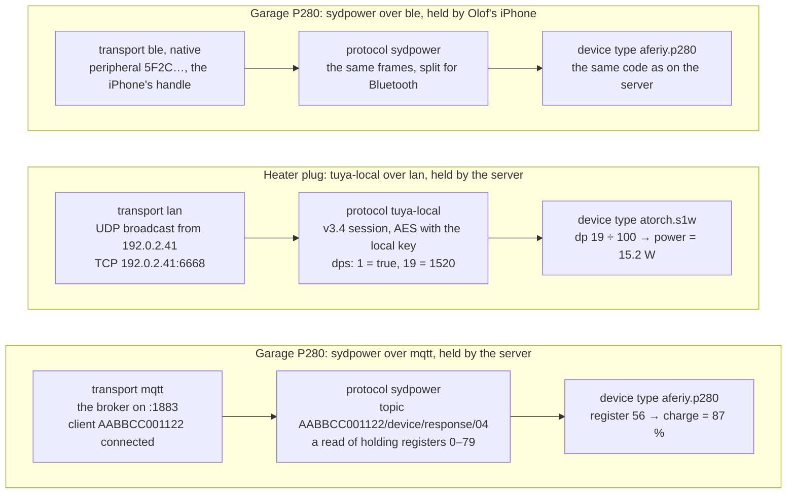
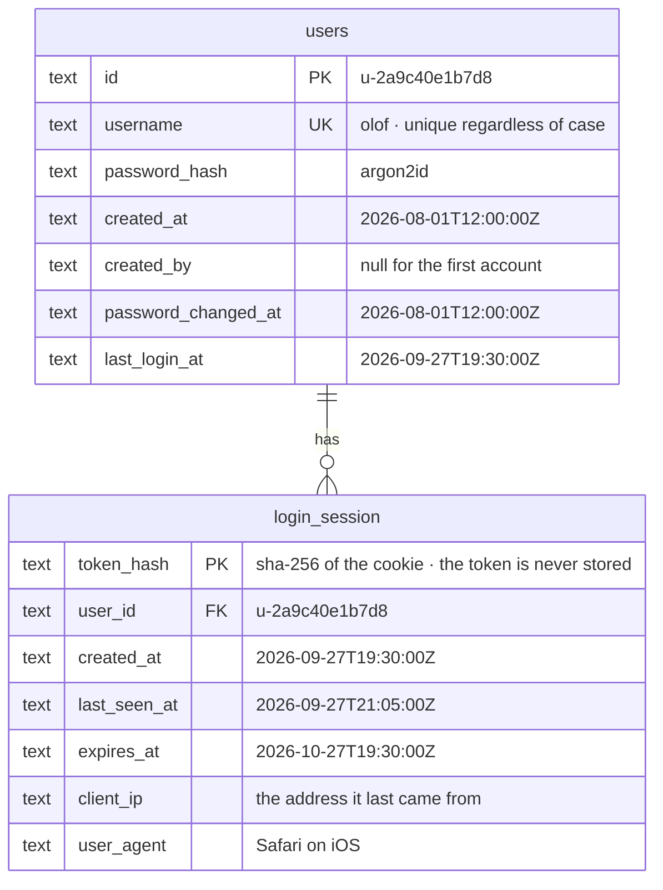

# The data model

**Status:** the authority for everything Kraftverk stores, and for every kind of
thing it knows about. Adopted 2026-09-27; [ARCHITECTURE.md](ARCHITECTURE.md)
points here for the model and §8 there says which step builds each part.
Nothing below is built yet unless ARCHITECTURE.md §8 says so.

The diagrams are Mermaid. GitHub, GitLab and VS Code (with a Mermaid preview)
draw them.

This document starts with a person adding a device, screen by screen, because
each thing that screen needs is a record or a definition. The model is what is
left once the flow is right. Part 1 is the flow. Part 2 is the definitions it
uses. Part 3 is the records it leaves behind. Part 4 covers what happens after
a device is added. Part 5 is today's schema and how it gets here.

Two halves, kept apart:

- **Definitions** live in code, in packages. They say what *can* exist: a
  kind of device, a way of reaching one. Supporting a new product means adding
  a package, never a table.
- **Records** live in the database. They say what *does* exist in this house:
  your station, how it is reached, what it measured. A record names a
  definition by its id, a string such as `aferiy.p280`, and never copies it.

---

## 1. Adding a device, screen by screen

Nothing is stored until step 10. Everything before it is a **draft**. Steps that
run on the server keep their part of the draft there for fifteen minutes,
including any secret a step found. The app sees a placeholder for the secret,
never the secret (see [SECURITY.md](SECURITY.md)).

### 1 · What are you adding?

| | |
|---|---|
| **You see** | Two sections. **Devices** shows *Power stations* and *Smart plugs*. **Services** shows *Weather*: a category is under Services when what is installed in it is services. Each category has its icon and names the products it covers. There is a search box for brand and model ("P280", "ATORCH"). When the server can see something nobody has added, a **Found near you** row sits at the top: "A power station is connected to this server over Wi-Fi". |
| **You choose** | A category, a search result (which goes straight to step 2's item), or something found. |
| **Comes from** | **Category** is a fixed list in the SDK. Each device type names one. **Sightings** come from the server's transports, recognised by a protocol. |
| **Leaves behind** | Nothing. A category is display only, and a sighting is live state. |

A simulator is never listed as a type. A simulator belongs to every device
type, so a device you can add is always a real product or a real service —
and **Simulated** is one of the ways to add it (step 3), beside Wi-Fi or
Bluetooth: its simulator stands in for the hardware, for "try without
hardware", for a demo, for developing. It is a choice per device, not a mode
of the server, so a simulated lamp and a real station sit side by side.

"Found near you" skips steps 2–6: the sighting already says which transport,
which protocol and which address. If more than one installed type speaks that
protocol, step 7 reads the model and chooses the type. If the model can't be
read, step 2 appears, showing only those types.

### 2 · Which one?

| | |
|---|---|
| **You see** | The device types in the category, each with its picture, name, brand, the models it covers and its support level: *Verified on real hardware*, *Reported working by others*, or *Experimental*. At the bottom: *Don't see yours?*, which links to how support gets added. |
| **You choose** | A device type. |
| **Comes from** | **Device types**, from the installed packages. |
| **Leaves behind** | The draft's type. It becomes `device.type_id`. |

This screen is shown even when a category holds one type. It is where you
confirm the product and learn how well it is supported, and that is worth one
tap.

### 3 · How do you want to connect?

| | |
|---|---|
| **You see** | One row per way this type can be reached, *from where you are*. For a P280, in the phone app, with a server that has a Bluetooth radio: • **Wi-Fi, through your server** (*Recommended*). "Always on: history and automations keep running. The station needs to be set to use your server." • **Bluetooth, from your server**. "The station must be within about 10 m of the server." • **Bluetooth, from this phone**. "Only while this phone is near the station. History records while it is connected; automations can reach it only then." A row that can't be used here stays visible, greyed, with the reason: "Your server has no Bluetooth radio", or "Firefox can't use Bluetooth: use Chrome or Edge, or the phone app". |
| **You choose** | A **connection method** and **which node holds it**: your server, or this app's own node — this phone or browser. |
| **Comes from** | The type's **connection methods**. Each is one protocol over one transport, and says nothing about where it runs. **Which node can hold it** is worked out: each node reports the transports it has right now, and a method is offered wherever its transport is. |
| **Leaves behind** | The draft's method and the node that holds it. They become `device_connection.method` and `.held_by`. |

If only one row exists, the screen is skipped and the next one says how it will
connect.

Where a method *runs* is never declared by the device author. MQTT through our
broker is only ever offered on the server, because only the server has the
broker. Bluetooth is offered on the server and in the app because both can have
a radio. The P280's code is the same either way.

### 4 · Get it ready

| | |
|---|---|
| **You see** | What to do to the device first, if anything, with your own values filled in. For Sydpower over MQTT: "In BrightEMS, open the station → Settings → Local MQTT broker, and enter `192.0.2.10`, port `1883`." For Bluetooth: "Turn the station on and stay near it." A button: *Done: find it*. |
| **Comes from** | The **protocol**, for how it rides that transport. The **transport** supplies values such as the broker's address. The **device type** may add its own step. |
| **Leaves behind** | Nothing. |

### 5 · Choose your device

| | |
|---|---|
| **You see** | **Held by the server:** a live list of what the server's transport can see and the protocol recognises. Each row has its advertised name, a short id, how recently it was seen and how it was found. Something already added stays in the list, greyed: "Already added as Garage P280". An empty list says what to try while it keeps waiting ("A sleeping station appears when you press its power button"). *Enter it yourself* takes an IP or MAC address when discovery can't work. **Held by this browser:** a button, *Find my station*, which opens the browser's own Bluetooth chooser. Browsers let only that chooser list devices, and only after a tap. It is filtered to the protocol's Bluetooth service. **Held by the phone app:** the same live list as the server's, from the phone's own scan. |
| **You choose** | One physical device. |
| **Comes from** | The **transport** of the chosen holder does the finding. The **protocol** filters it: which sightings are its devices, and which Bluetooth service to ask the browser for. |
| **Leaves behind** | The draft's address: what the transport knows the device by. That is a MAC, an IP address, or a browser's Bluetooth handle — or, for a device behind a gateway on the home network, the gateway's IP address, `#`, and the device's address there (`192.168.1.20#a4c1380000000001`: a Zigbee plug behind a Tuya gateway). The whole address is the one device, so two devices behind one gateway are two claims. It becomes `device_connection.address`. |

### 6 · Credentials

| | |
|---|---|
| **You see** | Only for protocols that need them. For Tuya local: "Your plug's local key", with *Fetch it with my Tuya account* (the account details are used once and never stored) or *Enter it*. |
| **Comes from** | The **protocol**. |
| **Leaves behind** | The secret, on the node that holds the connection: for one your server holds, in the server's `connection_secret`; for one this app's node holds for it, in the app's own database, sealed with a key the platform keeps — and the server never sees it. |

### 7 · Check it

The device type connects over the chosen method and reads the device once. It
learns two things: the device's **identity** (its own permanent id, read from
the device rather than from the transport) and its **model**. There are five
outcomes:

| Outcome | You see | What happens |
|---|---|---|
| New | "Found it: AFERIY P280. Battery 87 %, charging 120 W." | On to step 8. |
| Already yours | "This is your **Garage P280**. Add *Bluetooth, from this phone* as another way to reach it?" | No second device. The draft becomes a new connection on the existing one, and it is saved. |
| Yours before | "You had this station before: **Garage P280**, removed on 3 August. Bring it back with its history?" *Bring it back* or *Start fresh*. | Bringing it back clears `removed_at` and adds the new connection. Starting fresh makes a new device; the old one stays removed with its history. |
| Different model | "This is a P320, not a P280." *Add it as a P320* if that type is installed, otherwise "Not supported yet". | Back to this step, with the right type. |
| No answer | "It didn't answer." *Try again*. If the type allows it, *Save anyway* too, with the type's reason ("A sleeping station connects when it wakes"). | Saved without an identity. The first successful connection fills it in. If that identity belongs to another device, the connection is refused and the device's page says why. |

The identity is what makes "the same station, found by the server or by your
phone" one device. It can't be the address: a browser's Bluetooth handle is
private to that browser, and phones hide MAC addresses.

### 8 · Name it

Pre-filled from what the device calls itself, or from the model: "AFERIY P280".
If a device already has that name, a number is added: "AFERIY P280 2". Stored
as `device.name`.

### 9 · How is it connected?

Asked only when a **link kind** could join a part of this device to a part
of one you already have. For a smart plug when you own a station: "What is
plugged into this?", with *Garage P280 — Mains* or *None of these*, and what
it changes: "Kraftverk checks the target sees mains come and go whenever the
source is switched." For a station, the question is asked once for each of
its outlets ("AC outlets: what is plugged into this?"), and the other way
round for its mains input. It can be skipped, and changed later on either
device's page. Stored as a `device_link` between the two parts.

### 10 · Save

One transaction writes, or restores, the `device`, its `device_connection` and
its `connection_secret` rows, and its `device_link`. The holder then opens the
session, and the app opens the device's page, which shows the first live
reading.

### A service goes the same way

*Weather* → *Open-Meteo* → step 3: its web API, held by the server (or
Simulated) → no instructions → *Where?* (search a place, or use this phone's
location) → check: fetch one forecast → name → save. The place is
`device.config`; the API is its connection. A weather service that needs a key
keeps it in `connection_secret`, like any other credential.

---

## 2. Definitions: what code declares

| Definition | What it is | Lives in | Examples |
|---|---|---|---|
| **Category** | What a person would call the thing: a shelf on the add screen, with a label and an icon and no prose about any product. For finding things, never for behaviour. Which section it is listed in comes from its types' `kind` (hardware or service). A fixed list, so two types can't spell the same category two ways. | `device-sdk` | `power-station` "Power stations", `smart-plug` "Smart plugs", `weather` "Weather" |
| **Transport** | How bytes or messages reach a device. It does all the I/O and the finding, and has no idea what the bytes mean. It ships one implementation for each place it can run. It is **exclusive** when an address means one physical thing, so only one device may claim it. There are few transports, and they are rarely added. | `packages/transports/*` | `mqtt`: our broker, server only, exclusive. `ble`: server (its radio), web (Web Bluetooth), native (phone); exclusive. `lan`: TCP and UDP on the home network, server and native; exclusive. `https`: the internet; server, web and native; not exclusive. |
| **Protocol** | The language spoken over a transport: framing, encryption, message shapes. It has one **binding** for each transport it rides: the MQTT topic names, the Bluetooth service and how frames are split. It **recognises** its own devices among sightings, and says what instructions and credentials setup needs. Pure code: no I/O, no Node or Bun built-ins, no product knowledge. | `packages/protocols/*` | `sydpower`: MODBUS-style frames, bindings for `mqtt` and `ble`, and the rule that register 68 is never written 0. `tuya-local`: encrypted frames, a binding for `lan`, the local-key credential. |
| **Device type** | One product or product family: what its values *mean*. It **identifies** a device (its identity and model) over any of its connection methods. Models of one family are *profiles*, as data, not separate types. Pure code too, because it runs wherever its connection is held. | `packages/devices/*`, `packages/services/*` | `aferiy.p280`, `atorch.s1w`, `tuya.plug` (one profile per socket), `open-meteo.weather` |
| **Connection method** | One (protocol, transport) pair a type supports, what it **reaches** beyond the home network (`local`, `cloud-at-setup` — the vendor's cloud once, to fetch a key — or `cloud`), an optional *recommended* flag and any extra setup steps of its own. It says nothing about *where* it runs. A type declares pairs, not two separate lists, because not every protocol rides every transport. | inside the device type | P280: `wifi` = sydpower over mqtt, local; `bluetooth` = sydpower over ble, local. ATORCH: `lan` = tuya-local over lan, cloud at setup. Open-Meteo: `api` = open-meteo over https, cloud. |
| **Node** | A kraftverk node: the hub running somewhere — an always-on machine on the network, a phone, a browser — that holds connections. It reports the transports it has *now*, and why one is missing, and declares what it is: **always on** (runs while nobody looks), **reachable** (others connect to it), **trusted** (what must stay put — a vendor account's password — may be kept on it). One node is the home's **master** (`home.master_id`): the one always on and reachable, when there is one; the others follow it, an always-on one too — a Raspberry Pi beside a station, holding its Bluetooth for the master. One master per home; a master per place is a door left open. Setup offers a method wherever a node of the home has its transport. | runtime, and the `node` record | A NAS: `mqtt`, `ble`, `lan`, `https`; always on, reachable, trusted. Chrome on a laptop: `ble`, `https`. Firefox: `https` ("no Bluetooth in Firefox"). |
| **Place** | Where something is, physically, with its position and clock: what weather, sun times and an automation's clock would be read from. Not in the schema: what groups things — a home, or places alone — is still the owner's to decide (PLAN-SHARED-CORE.md, 6j), and a table nothing writes was taken out until it is. A weather service has its own position; an automation its own clock. | — | "Home", 59.33 N 18.07 E, Europe/Stockholm; "The cabin" |
| **Value** | One type system for everything a device reports, is told, answers or asks for: number (unit, range, step, precision), boolean, enum, string, **timestamp**, and a **list** or an **object** of values for structure. `null` is "not known". A config field is a value type with a title and a **presentation** (`secret`, `host`, `multiline`, `slider`). | `device-sdk` (`values.ts`, `schema.ts`) | A forecast: a list of objects `{at: timestamp, temperature: °C, cloudCover: %, …}`; a local key: a string presented as a secret |
| **Description** | What a device is: its **parts** (`main`, and whatever it has several of — each of a curated **kind** with an icon, or one of the type's own, namespaced, and an optional **energy role**), their **attributes** (what they report, and what they remember and can be told), its **events**, and any capabilities of its own. An attribute's key begins with its part (`pack.1.soc`); it says how long a value stays **current** (`currentFor`). A type declares it for a device's config; a session may report its own. | `device-sdk` (`description.ts`) | A P280: `main`, `input.ac` (`input.ac.present`), `input.solar`, `outlet.ac`/`dc`/`usb` (`outlet.ac.on`), and `pack.1` when a pack is plugged in |
| **Capability** | What a part can do or report, declared like a Matter cluster: attributes bound to standard meanings (Matter's names), commands with typed arguments, what each sets and **what makes it consequential**, queries with the **type of their answer**, and events. The library is shared; a package may declare its own, namespaced by its type, in the same shape. | `device-sdk` | `switch` (off while drawing more than the home's `loadWatts` is consequential), `powerMeter`, `battery`, `acInput` (raises `mains.lost`), `weather.forecast` (answers a list of hours) |
| **Tool** | Something a kind of device can do beyond its capabilities — a register dump, a raw frame — **declared as data**: what it asks for, what it answers, whether it writes. The holder checks both ways. | inside the device type | P280: `registers`, `scan`, `raw`; a Tuya plug: `datapoints` |
| **Link kind** | A physical fact between **parts** of two devices: which capability each end needs, what on the target proves a command on the source did something, and whether being its source makes a command consequential. | `device-sdk` | `feeds`: from a part with `switch` to a part with `acInput`, proven by `mainsPresent` following `on`; consequential |

### A method's setup is assembled, not written

A device author declares "sydpower over mqtt" and gets its steps from the layers
underneath. Improving a layer improves every device that uses it.

| Step | Supplied by |
|---|---|
| 4 · Get it ready | the protocol's binding for that transport, filled in with the transport's values, plus any step the type adds |
| 5 · Choose your device | the holder's implementation of the transport, filtered by the protocol |
| 6 · Credentials | the protocol |
| 7 · Check it | the device type's `identify`, then one read |
| 8, 9, 10 | the core |

### One chain, end to end

Each layer talks only to the one next to it. The server and the app import none
of them by name: the server finds them at start-up, and the app's build lists
them. Each holder starts only the transports that its installed device types
need.

---

## 3. Records: what the database holds

```mermaid
erDiagram
  device ||--o{ device_connection : "is reached by"
  device_connection ||--o{ connection_secret : "needs"
  node ||--o{ device_connection : "holds"
  node |o--|| home : "is the master of"
  device ||--o{ device_kv : "remembers"
  device ||--o{ sample : "recorded"
  device ||--o{ sample_hour : "rolled up"
  device ||--o{ sample_change : "changed"
  device ||--o{ device_attribute : "has had"
  device ||--o{ device_event : "raised"
  device ||--o{ device_link : "is the source of"
  device ||--o{ device_link : "is the target of"
  device ||--o{ device_switch : "was switched"
  device ||--o{ device_write : "was written"
  automation ||--o{ automation_role : "is filled by"
  device ||--o{ automation_role : "fills"
  automation ||--o{ automation_role : "is started by"
  automation ||--o{ automation_trigger : "watches with"
  automation ||--o{ automation_run : "ran"
  automation_run |o--o{ automation_run : "started"
  automation_run ||--o{ automation_run_device : "used"
  automation_run_device ||--o{ automation_run_role : "filled"
  automation_run_device ||--o{ automation_run_key : "gave"
  automation_run_key ||--o{ automation_run_reading : "read"
  automation_run_device ||--o{ automation_run_reach : "could be reached"

  device {
    text id PK "d-3f9a2c61b0e43f9a"
    text key "garage-p280 · its name in configuration · one device you have to a key"
    text type_id "aferiy.p280 · a DeviceType id · never changes"
    text identity "sydpower:AABBCC001122 · read from the device · null until first read"
    text name "Garage P280"
    json config "{} · the type's own choices · tuya.plug: {profile: atorch-s1} · Open-Meteo: {lat, lon}"
    json description "{parts: [...], attributes: [...], events: [...]} · the latest, the type's or its own"
    text description_source "type · device · whose word the description is"
    json info "{manufacturer: AFERIY, model: P280, firmware: {...}} · null until it has said"
    text picture "type:1 · own:<id> one day · null: its type's first"
    text added_at "2026-09-27T19:40:00Z"
    text removed_at "null · set by Remove · history kept"
  }
  device_connection {
    text id PK "c-8e1d44a0f2b78e1d"
    text device_id FK "d-3f9a2c61b0e43f9a"
    text method "wifi · a ConnectionMethod id of the device's type"
    text transport "mqtt · copied from the method, for the address rule"
    text held_by FK "n-51d0e7a2c9f351d0 · the node that holds it: the master, or a node that follows it"
    text address "AABBCC001122 · 192.0.2.41 · a browser's Bluetooth handle"
    int priority "0 = preferred · 1 = the fallback"
    json config "{} · the method's own choices · {protocolVersion: 3.4}"
    int secrets_exportable "0 · 1: its secrets may leave in plain text, its owner's choice"
    text created_at "2026-09-27T19:40:00Z"
    text last_connected_at "2026-09-27T21:02:10Z"
  }
  connection_secret {
    text connection_id PK "c-2b7e05d9a1c42b7e"
    text field PK "localKey"
    text value "encrypted with KRAFTVERK_SECRET_KEY"
    int encrypted "1"
  }
  home {
    text id PK "h-7c2e90a14d3b7c2e · made once, with its database"
    text name "Our house · what the people in it call it"
    text master_id FK "n-0e4a7c91b2d50e4a · the node whose database is the home's: the one writer"
    text created_at "2026-10-02T08:00:00Z"
  }
  node {
    text id PK "n-51d0e7a2c9f351d0 · made by the node itself, once: every home's database knows it by it"
    text name "Garage NAS · Chrome on Windows · This iPhone"
    text platform "system · web · native · what its transports' entries are for"
    int always_on "1 · runs while nobody looks"
    int reachable "1 · others connect to it"
    int trusted "1 · what must stay put may be kept on it"
    json transports "[mqtt, ble, lan, https] · what it reaches devices over, as it last said"
    text account_id "u-2a9c40e1b7d8 · the server account it joined for · null: this node, or no accounts"
    int self "1 · the node this database belongs to: one"
    text created_at "2026-09-27T19:30:00Z"
    text last_seen_at "2026-09-27T21:05:00Z"
  }
  device_kv {
    text device_id PK "d-3f9a2c61b0e43f9a"
    text key PK "sim.settings"
    text value "{acChargingWatts: 800}"
  }
  device_link {
    text id PK "l-0c7f3e19a2b80c7f"
    text kind "feeds · a LinkKind id"
    text source_device FK "d-5b2e90c4a1d35b2e · Heater plug"
    text source_part "main"
    text target_device FK "d-3f9a2c61b0e43f9a · Garage P280"
    text target_part "input.ac"
    int one_per_source "1 · as its kind declares: a plug feeds one thing"
    text created_at "2026-09-27T19:45:00Z"
  }
  sample {
    text device_id PK "d-3f9a2c61b0e43f9a"
    text part "main · pack.1 · the part the key begins with"
    text key PK "soc · the type's own key · means charge"
    text at PK "2026-09-27T19:41:00Z"
    real value "87 · a number, or on/off as 1/0"
    text text "charging · an enum or text instead of a value"
  }
  sample_hour {
    text device_id PK "d-3f9a2c61b0e43f9a"
    text part "main"
    text key PK "soc · a numeric attribute"
    text hour PK "2026-09-27T19:00:00Z"
    real min "81"
    real avg "84.5"
    real max "88"
    int n "60 · the samples it was rolled up from"
  }
  sample_change {
    text device_id PK "d-3f9a2c61b0e43f9a"
    text part "outlet.ac"
    text key PK "outlet.ac.on · an on/off or an enum"
    text at PK "2026-09-27T14:02:13Z · when the device observed it"
    real value "0 · on/off as 1/0"
    text text "eco · an enum instead"
  }
  device_attribute {
    text device_id PK "d-3f9a2c61b0e43f9a"
    text key PK "pack.1.soc"
    text part "pack.1"
    json spec "{label: Pack 1 charge, value: {type: number, unit: %}, means: charge}"
    text first_seen "2026-09-27T19:41:00Z"
    text last_seen "2026-09-29T10:02:00Z"
  }
  device_event {
    int id PK "88"
    text device_id FK "d-3f9a2c61b0e43f9a"
    text part "main"
    text event "overload · declared in its description"
    text level "warn"
    json data "{watts: 2400}"
    text at "2026-09-28T18:12:40Z"
  }
  automation {
    text id PK "a-71c2d0e5f9a371c2"
    text key "start-charging-the-scooter · its name in configuration · unique"
    text name "Sunny heater · Start charging the scooter"
    json rule "{roles, params: {fields: {}}, when, if, then, otherwise} · its own, checked before it is kept"
    text made_from "standard.start-charging · the recipe it was copied from · null: built from nothing"
    text time_zone "Europe/Stockholm · the owner's clock"
    text mode "off · watch · act"
    int recheck_minutes "10 · null: never; how often a condition that still holds keeps things so"
    int home_place "0 · its place among the home page's shortcuts · null: not there"
    text looked_at "when it last looked again · null: not yet"
    text created_at "2026-10-15T08:00:00Z"
  }
  automation_role {
    text automation_id PK "a-71c2d0e5f9a371c2"
    text role PK "charger"
    text device_id FK "d-3f9a2c61b0e43f9a · null: another automation fills it"
    text part "main · outlet.ac"
    text starts FK "a-0c9d1e2f3a4b0c9d · the automation a step starts · null: a part fills it"
  }
  automation_trigger {
    text automation_id PK "a-71c2d0e5f9a371c2"
    int trigger PK "0 · its place in its rule's when"
    int holds "1"
    text held_since "2026-10-16T05:00:12Z"
    int fired "1"
  }
  automation_run {
    text id PK "r-5b2e90c4a1d3f7e2"
    text automation_id FK "a-71c2d0e5f9a371c2"
    text started_at "2026-10-16T17:02:00Z"
    text ended_at "2026-10-16T17:03:41Z · null: running now, one at a time"
    text outcome "acted · failed · stopped · interrupted · running · …"
    text started_by "olof · null: its own triggers"
    text started_by_run FK "r-9a8b7c6d5e4f3a2b · the run whose step started it · null: none"
    text why "Started by olof"
    text summary "Scooter plug: Power 238 W, after 2 tries"
    json detail "{saw, conditions, steps: [{kind, depth, within, what, outcome, detail, at, endedAt, until}]}"
  }
  automation_run_device {
    text run_id PK "r-5b2e90c4a1d3f7e2"
    text device_id PK "d-5b2e90c4a1d35b2e · no reference to device: a log outlives its device"
    text name "Garage station · as it was named then"
    text type_id "acme.station"
  }
  automation_run_role {
    text run_id PK "r-5b2e90c4a1d3f7e2"
    text role PK "charger"
    text label "The charger’s plug"
    text device_id FK "d-9a8b7c6d5e4f9a8b"
    text part "main"
  }
  automation_run_key {
    text run_id PK "r-5b2e90c4a1d3f7e2"
    text device_id PK "d-9a8b7c6d5e4f9a8b"
    text key PK "watts · outlet.ac.watts"
    text part "main · outlet.ac"
    text label "Power · AC outlets draw"
    text kind "number · boolean · enum · text"
    text unit "W · null: none"
    text quantity "power · null: none"
    json words "{true, false} · [{value, label}] · null"
  }
  automation_run_reading {
    text run_id FK "r-5b2e90c4a1d3f7e2"
    text device_id FK "d-9a8b7c6d5e4f9a8b"
    text key FK "watts"
    text at "2026-10-16T17:02:07.300Z · when the device took it"
    text heard_at "2026-10-16T17:02:07.302Z · when the run saw it"
    json value "297 · true · null: the device has not said"
  }
  automation_run_reach {
    text run_id FK "r-5b2e90c4a1d3f7e2"
    text device_id FK "d-9a8b7c6d5e4f9a8b"
    text at "2026-10-16T17:02:00.010Z"
    int reachable "0 · 1"
    text detail "Its gateway cannot reach it: is it plugged in?"
  }
  device_switch {
    text device_id PK "d-5b2e90c4a1d35b2e"
    text part PK "main · outlet.ac"
    text switched_at "2026-10-16T17:02:10Z · what the dwell counts from"
    text switched_by "olof · automation:a-71c2d0e5f9a371c2 · who, as the intent said it"
  }
  device_write {
    text device_id PK "d-5b2e90c4a1d35b2e"
    text attribute PK "afterPowerCut"
    text written_at "2026-10-16T17:05:00Z"
    text written_by "automation:a-71c2d0e5f9a371c2"
  }
  audit {
    int id PK "4812"
    text at "2026-09-27T19:51:12Z"
    text kind "device.control"
    text actor "olofdahlbom · automation:a-71c2d0e5f9a371c2 · node:n-51d0e7a2c9f351d0"
    text resource_kind "device · node · automation · account · transport · null with resource"
    text resource "d-3f9a2c61b0e43f9a · not a foreign key: it outlives the device"
    text summary "Switched the AC outlets off"
    json detail "{part: outlet.ac, capability: switch, command: set, args: {on: false}}"
  }
  home_setting {
    text key PK "policy.values · home.moved · home.kept · only these: what this node has settled for the home, nothing about one device or automation"
    text value "{loadWatts: 10, reserveSoc: 20}"
    text updated_at "2026-09-01T10:00:00Z"
  }
  transport_kv {
    text transport PK "ble · matter · mqtt"
    text key PK "bond.AABBCC001122"
    text value "what the transport keeps between runs"
  }
  meta {
    text key PK "schema_hash · created_at · created_by_version"
    text value "1843021779 · 2026-09-29T12:00:00Z · 0.1.0"
  }
```

**A server's own tables.** Accounts are the server's: a phone or a browser
keeping a home has none, so they are not in the schema every node carries.
The server keeps them beside the home's in the same file
([`server/src/auth/schema.ts`](../server/src/auth/schema.ts)), and its
fingerprint covers both; a reset of the home leaves them alone.

A node's `account_id` names one of these where the master is a server — the
account it joined for — and deleting the account forgets the nodes it
joined; elsewhere it is plain text, null.

### What each table is for, traced to the flow

| Table | Why it exists | Filled in at |
|---|---|---|
| `device` | The thing you added, and the key its history hangs on. | step 10 |
| `device.identity` | So the same physical device is recognised however it was found, and so re-adding a removed one can bring its history back. | step 7, or at the first connection after *Save anyway* |
| `device.removed_at` | So Remove doesn't destroy years of history. | Remove |
| `device_connection` | A device can be reached more than one way, from more than one place. Your station over Wi-Fi from the server *and* over Bluetooth from your phone is one device with two connections. | step 10, or *Add another way to reach it* |
| `connection_secret` | Credentials belong to a way of reaching the device (the Tuya local key is part of *tuya-local over lan*), not to the device. | step 6 |
| `home` | The home this database keeps — one: what every node and device here is part of, and what its people call it. | when the database is made |
| `node` | Every kraftverk node of the home — the hub running somewhere: the one this database belongs to (`self`), the home's master, and the nodes that follow it, the always-on machine among them. Each declares what it is — always on, reachable, trusted — which is how the master is chosen, and what a connection's holder names: "Bluetooth, from Olof's iPhone". | when the database is made (its own); when another joins |
| `device_link` | Facts about the house, between parts — which plug feeds which station's mains input, which station's outlet feeds another — that the gateway, the energy view and automations all read. | step 9, or later on the device's page |
| `device_kv` | What a session keeps between runs: a simulator's settings, a plug's detected protocol version. | by the session |
| `device.description`, `device_attribute` | What the device is — so a closed or removed device is still described — and every attribute it ever had, so history keeps its labels after a part is gone. | step 10, then whenever it changes |
| `device.description_source` | Whether the description is the type's, for its config, or the device's own — a station that reports its packs. | step 10, then whenever it changes |
| `sample` | History: every attribute the description says to keep, with its part, while its value is current. | continuously, by the holder |
| `sample_hour` | Each numeric attribute's hours rolled up — lowest, mean, highest and how many — kept for two years, so a chart of a year reads hours, not minutes. | each hour, by the sampler |
| `sample_change` | Every change of an on/off or an enum, when it happened: what a timeline draws ("AC outlets off 14:02–14:19"), where minute samples would blur a switch flicked between them. Two years, and each key's latest beyond. | as readings move, from the server's sessions and from apps' uplinks |
| `last_heard` | In an app with a server: what the server last said, by what was asked — its devices, its automations, the home's values — with when. What the app shows, read only and saying so, while the server cannot be reached. Empty on a server. | as the server answers |
| `send_queue` | In an app holding ways for a server: what it owes the server — readings, events, timeline entries, what a session kept — in order, kept across a restart and gone once the server has it. Empty on a server. | as the app's sessions and gateway work |
| `home_setting` | What this node has settled for the home it keeps, by a name the schema lists: the policy values, and in an app whether its own home moved to a server or a server's copy was brought in. | when set |
| `transport_kv` | What a transport keeps between runs — a Bluetooth bond, a Matter fabric — its own and no other's. | by the transport |
| `meta` | What the database is: the schema it was made with, when, and by which version — what the set-aside message reports. | when the database is made |
| `audit.resource_kind` | What an entry is about, as a kind and an id together, so the timeline can be asked for one device's, one automation's, one account's. | with every entry |
| `device_event` | What devices said happened, beside their history. | when a device raises one |
| `device.picture` | Which picture a device shows: its owner's pick, the same in every app. | on its page |
| `device_switch`, `device_write` | The gateway's memory of each part and setting: when it was last switched or written, and by whom — what the dwell counts from, so a restart is no way around it, and what lets an automation that keeps things so leave what another automation set. A part never switched has no row: its first switch through a consequential link is confirmed. | by the gateway, at each switch and write |
| `automation`, `automation_role` | An automation: its own rule, the recipe it was copied from, its clock, mode and place on the home page; and what fills each role — a part of a device, or another automation a step starts — a row each, so a device's page asks which automations it can start; an automation deleted takes with it the roles that would start it, and those that did say they have nothing to start. | made, changed |
| `automation_trigger` | Each `becomes` trigger's state, so a restart continues a hold and never fires one twice. | as its conditions are looked at |
| `automation_run` | Every run, with each step it took; the unended one is running now, written at every step — one at a time, held by a unique index. A restart ends it as interrupted (docs/SEQUENCES.md). | as it runs |
| `automation_run_device`, `automation_run_role`, `automation_run_key` | A run's log, as the run saw its world: each device it used (its name and type then), which part of which device filled each role, and what each value it kept is (part, label, kind, unit, quantity, the words for on/off and options) — so a log stays whole when a device is renamed, re-described or removed, or a role filled by another. | as a run that takes steps begins, and as a value is first seen |
| `automation_run_reading`, `automation_run_reach` | Every reading each device a run uses gave while it ran — each time its value or time changed, at the time the device took it and the time the run heard it — and each change in whether it could be reached, and why not. Heard as each device says it on the live bus, whenever a step judges or a switch is made, and every second; at most 20 000 readings a run, gone with its run. What a run's log page draws, and what a run is debugged from. | as devices speak while it runs |

### Rules the schema and the code enforce

- **One device per identity.** There is a unique index on `device (identity)`
  where `removed_at IS NULL`. A removed device keeps its identity, so re-adding
  that device finds it (step 7, *Yours before*).
- **One connection per device, method and node.** There is a unique index on
  `(device_id, method, held_by)`.
- **An exclusive address belongs to one device.** For transports that declare
  themselves exclusive (`mqtt`, `ble`, `lan`), two connections the same node
  holds, of different devices, may not share a `(transport, address)`. Step 5 greys such a
  sighting out, and the save refuses it. `https` is not exclusive: two weather
  services can use the same API.
- **`type_id` never changes.** Changing what a device *is* means adding a new
  one, because its history would not mean the same thing.
- **`method` must be one of that type's methods,** checked on write against
  the installed definitions. Each `config` is validated against the schema
  its definition declares: the type's for `device.config`, the method's for
  `device_connection.config`. Neither ever holds a secret.
- **A connection's secrets stay on the node that holds it.** In each
  database, `connection_secret` holds only the secrets of connections its own
  node holds, sealed; a connection another node holds has none there.
- **Links join parts, and a kind may allow one target per source part.**
  `feeds` does — a plug feeds one thing — so a second replaces the first.
  The row says so (`one_per_source`, from its kind), and a partial unique
  index on `(kind, source_device, source_part)` holds it: no concurrent add
  or direct write can give a source part two. The same link twice is refused
  by a unique index on all its ends.
- **What an audit entry is about is a kind and an id together, or neither,**
  checked by the table.
- **The audit log is never cascaded,** so it still says what happened to a
  device after the device is gone.

### What is not stored

| Live state | Example | Held by |
|---|---|---|
| **Sighting**: something a transport sees that no connection claims | the broker has client `AABBCC001122` connected | each holder's transports. It feeds "Found near you" and step 5, and is gone after a restart. The broker also keeps a file of stations it has seen, so they reconnect quickly. That file is the broker's own. |
| **Setup draft** | type, method, holder, address and a placeholder for the key, part-way through the flow | the app, plus the server for server-run steps; fifteen minutes |
| **Active connection**: which of a device's connections is in use | Garage P280 is using `wifi`; `bluetooth` from the iPhone is standing by | the session manager (§4) |
| **Latest reading** | battery 87 % observed at 21:04:58 | the session. `sample` holds history at the sampler's resolution, for as long as each value stays current. |
| **Definitions** | categories, types, methods, protocols, transports, capabilities, link kinds | the installed packages |

---

## 4. After a device is added

### Its connections

Each device's page has a **Connections** section, and it is where
`device_connection` shows on screen:

> **Wi-Fi, through your server**: in use · connected 3 min ago
> **Bluetooth, from Olof's iPhone**: standing by · last connected yesterday
> *Add another way to reach it* · *Make preferred* · *Remove*

- **One connection is in use at a time.** It is the connection with the lowest
  `priority` that can be reached right now. A station takes one Bluetooth
  connection at a time, and two holders writing to one device would race. A
  connection lower in the list takes over only while every one above it is
  unreachable, and gives the device back when they return.
- **Adding another way to reach a device** runs steps 3–7 with the type
  already chosen. Step 7 must find the *same identity*; a different device is
  refused ("That's a different station").
- **The last connection can't be removed.** You remove the device instead.

### When another node holds the connection

- The session runs **on that node** — this app's, for a server — with the
  same device-type and protocol code the master would run.
- **Readings are sent to the master** while that node has it, so history
  records. Anything not yet sent is queued and uploaded later.
- **The same safety rules apply.** The protocol's guards (register 68) and the
  gateway's rules (confirmation, dwell time, verification) are shared code that
  runs in the holder. The audit entry is sent to the master, and queued if
  offline.
- **Automations can reach the device only while that node has it.**
  The device's page says so, and an automation that can't reach it records why.
- The session's store (`device_kv`) stays with the master. The node reaches
  it through the API and keeps a copy for when it is offline.
- **What the app keeps, it keeps in its own database** (docs/PLAN-SHARED-CORE.md,
  phase 6): the device as the server has it, by the server's ids, with the
  way it holds (`held_by` its own node, `self` there); that way's secrets, sealed
  with the app's key; the session's store; the gateway's memory; and what
  it owes the server (`send_queue`). With the server away it still reaches
  the device, and sends what it owes when the server is back.

### Removing a device

| Action | What it does | Undo |
|---|---|---|
| **Remove** | Sets `removed_at`, closes the session, deletes its connections and their secrets (which frees their addresses) and its links. Its history, store and identity stay. | Add the same device again: step 7 offers to bring it back. |
| **Delete history** (on a removed device) | Deletes the row. Its samples and store go with it by `ON DELETE CASCADE`, after typing the device's name to confirm. | The copy the server makes before each migration, and backups. |

### Forgetting a node

Forgetting a node deletes its `node` row and the connections it held.
A device left with no connection shows "Nothing can reach this device" on its
page, with *Add a way to reach it*.

---

## 5. One schema

The database is one definition, `packages/store/src/schema.ts` — not a chain
of migrations (ARCHITECTURE.md §4.5, decision 21: strict version 1 while
kraftverk is in research and development). A database made by any other schema
is set aside beside itself, untouched, and a new one is started; history from
an older schema is not carried over. When there is a production state to
protect, this section becomes the rules for changing a schema that holds it.

---

## 6. Local mode: no server

The app can run with no server at all (ARCHITECTURE.md, decisions 15 and
22): it keeps a home of its own — the same hub, the same schema, every record
above — in its own SQLite: expo-sqlite on a phone, SQLite's WebAssembly build
in a browser's worker (docs/PLAN-SHARED-CORE.md, phase 6). Its connections
are held by its own node — the only node of the home, its master — its
secrets sealed with a key the platform keeps.
It keeps history and runs automations while it is open.

Adding a server offers to move this home to it, as an import the person
sees first: the server takes the devices, links, automations and values,
and holds every way but one over a radio (`nearby`: Bluetooth), which this
app's node holds for it (`held_by` that node), its key staying there. History the app
recorded stays with the app. Leaving a server offers the reverse: the copy
the app kept of the server's home becomes its own, the server's history
staying with the server (docs/PLAN-SHARED-CORE.md, phase 6h).

---

## 7. Later: homes

[`ACCOUNTS.md`](ACCOUNTS.md) plans accounts as members of **homes**. The
`home` row is there already: one per database, naming its master node. When a
database keeps more than one home, `device` and `node` gain a `home_id`. Everything that hangs off a device — its connections and their
secrets, its store, its history, its links — belongs to that home through the
device, so nothing else changes shape. A link never joins devices in two homes.
