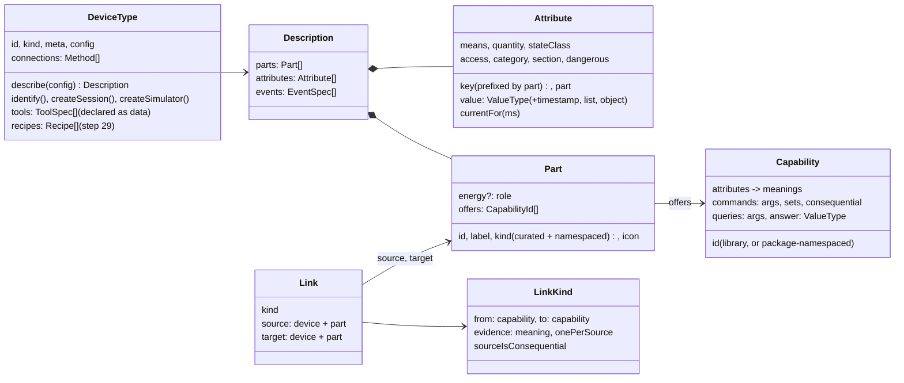

# The next step: kraftverk as a platform

**Status:** a review of the whole system on 2026-09-29, from the data model up
to the screens, and the plan that follows from it. It does not replace
[`ARCHITECTURE.md`](ARCHITECTURE.md), which stays the authority for what is
built; it proposes what §8 there should say next, and why. Where the two
disagree, this document is the proposal and that one is the fact.

Written after reading every shipped source file in `packages/device-sdk`,
`packages/gateway`, `packages/holder`, `packages/api-contract`,
`packages/api-client`, `packages/ui`, `server/src` and `client`, the four
device and service packages, the three protocols and the four transports, and
the documentation; and after running the checks. On that day:

| Check | Result |
|---|---|
| `npm run typecheck` | green, every workspace |
| `npm run check:architecture` | 0 boundary exceptions, 0 product identifiers outside the P280's package, the app's registry current |
| `npm test` | 513 tests in 46 files, all passing |

> **Phase: research and development — strict version 1.** Everything below is
> written for that phase: a change to the model is made everywhere at once,
> nothing is kept compatible, and there is one schema. §11 says what changes
> when the phase ends.

---

## 1. Summary

kraftverk is further along than its README says, and its architecture is the
best thing about it. Three layers that hold in CI, one contract, one holder
core that runs in the server and in the app, one gateway every physical action
passes, a device model borrowed from Matter and projected into Home Assistant:
this is a platform, not an app for one power station. The engineering is
careful to the point of being rare in a hobby-sized project — the comments say
*why*, the dangerous write is refused in three places, and a test suite once
losing the owner's database became a rule with a reason attached.

What holds it back is not the layering. It is that **the model underneath the
layers still carries the shape of the first three devices**, and every layer
above inherits that shape:

- The link library has one kind, `feeds`, which is "an ATORCH plug upstream
  of a P280's AC input" written generically; the gateway names it, and so do
  the server and the app.
- The capability library carries a weather service's answer shape
  (`WeatherHour`) in the core contract, and queries are otherwise untyped.
- A session says who holds it (`owner: 'server'`) — a fact it cannot know, and
  gets wrong in the app.
- A reading's time means "when the device produced it", which makes a
  forecast's readings permanently stale to the sampler: weather history is
  recorded for two minutes of every hour.
- Links join devices, not parts, so a station's outlet cannot feed anything.
- Categories, part kinds, part roles and link kinds are closed lists in the
  SDK with energy-domain prose in them.
- The one deep device draws its own screens from a parallel model
  (`StationStatus`) reached through an untyped tool, not from the description
  — so "the description is what the app draws" is true for the shallow
  devices and false for the deep one.

None of these are boundary violations, which is why `check:architecture`
cannot see them: they are *semantic* leaks, product shapes generalised one
step too little. Fixing them is the next step, and it is mostly work in the
SDK and the schema, done once, with each layer above then simplifying.

The plan (§10) does that first — **the model, part 3** — then the engine
(a live stream, a generic gateway, retry), then the app drawn entirely from
descriptions with the P280 as the proof, then reach and refinement, then the
things that make it a product other people can join: packages from outside
the repository, the Home Assistant bridge, published images, a page you can
try in a browser.

**Rating** (§9): as an engineering artefact, **7.5 / 10**; as a product
someone else could adopt today, **4 / 10**; on trajectory, among the most
promising things in this space, because the hard parts — the contract, the
safety model, the holder that runs anywhere — are done and checked.

---

## 2. What the product is, and the README

### 2.1 What it is

Read cold, the README says: a small home hub where every device gets
first-class support written as code, for reverse-engineered gear and things
you built; local; safe with hardware that can break; runs on its own or next
to Home Assistant. That is right, and the bet behind it — *code is cheap now,
so integrate deeply rather than configure shallowly* — is the strongest idea
in the project. It is also, today, one verified power station, two plugs and
a weather service.

Three audiences, in order of how close they are to installing it:

1. **Someone who owns an AFERIY or Sydpower station** and already runs Home
   Assistant, wants it in Home Assistant, and is afraid of bricking it.
2. **Someone reverse-engineering a device** who wants a workbench with rails:
   simulators, register dumps, a guard, a contract test, an agent that can be
   pointed at the package.
3. **Someone building their own hardware** (ESPHome, a BMS, a DIY controller)
   who wants a hub that treats their device as a first-class product rather
   than a pile of entities.

The README speaks to all three at once, at length, before the quick start.

### 2.2 README improvements

The front door should be scannable in thirty seconds and honest in sixty.
Concretely:

- **Lead with the demo, not the essay.** The four screenshots are good; a
  ten-second GIF of *add a simulated device → its page appears → switch an
  outlet → the confirmation dialog → the timeline entry* would show the whole
  thesis. Put it under the badges, above everything else.
- **Move "Code, not configuration" below the quick start**, and cut it to
  half its length. It is the *why*; the first screen is for *what* and *try
  it*. Keep the two bold lines: "more code, less configuration" and
  "standards are the floor; packages are the ceiling".
- **Say the status plainly, as a feature.** A short "Where it stands" block:
  research phase, one verified device, strict version 1, no upgrade path
  promised yet, database set aside on a schema change. People who install
  research software are the people who will write the next device type;
  they respect candour and are burned by surprises.
- **Generate the supported-devices table** from each package's `meta`
  (`npm run gen:docs`, planned in PRODUCT.md phase A), and add two columns:
  *reach* (local only · cloud once at setup · cloud) and *where it can be
  held* (server · browser · phone). Those are the two questions every visitor
  asks and the model already answers them.
- **Name the three audiences** in three lines under the tagline, each with
  one verb: *own a station → add it and see it in Home Assistant; bringing up
  a device → use the workbench; building hardware → write a package*.
- **Make "built for coding agents" a headline feature**, not a clause. It is
  the one claim nobody else in this space makes credibly, and the repository
  backs it: `AGENTS.md`, a contract test that tells the agent when it is
  wrong, a simulator for every type, an architecture check on every push. A
  section "Write a device type with an agent" with the actual prompt someone
  would give is worth more than another paragraph of philosophy.
- **Shorten "What kraftverk does not do"** to five bullets and keep it open,
  not in a `
`: it is a filter, and filters should be visible.
- **Cut the vocabulary** from the front page. "Holder", "connection method",
  "sighting" and "link" are the architecture's words (ARCHITECTURE.md §2 says
  the app never uses them); the README should not either. "Your phone can be
  the hub" is the right register.
- **One quick start, then "run it for real"**, as now — but the Docker path
  should be two commands against a published image, not a build
  (PRODUCT.md phase B). Until the image exists, say so.
- **Add "Try it in your browser"** the day the static build exists (PRODUCT.md
  phase E); it is the strongest possible call to action for a project whose
  app runs with no server.
- **Add a roadmap link** to a short `ROADMAP.md` (§10 here proposes its
  contents), and a "Help wanted" list: *a register dump from a P210*, *a
  Shelly*, *someone with an iPhone and a dev build*.
- **Keep the Home Assistant comparison table**; it is the best-written part.
  Add one row, *Where the code runs*: "a Python process on the hub" vs "the
  same TypeScript in the server, your browser and your phone".

A suggested outline: badges → GIF → one-line pitch + three audiences → quick
start → supported devices (generated) → what it will not do → how it fits
together (the diagram) → add your own device (with the agent path) → next to
Home Assistant → why code, not configuration → where it stands → docs →
contributing → credits → legal.

---

## 3. How the review was done

Bottom-up, as asked: values → meanings → capabilities → descriptions →
readings → events → links → categories → identity and health → the device-type
contract → connections and setup → storage → holder → session manager →
gateway → sampler and history → automations → API → app runtime → app screens
→ package screens. At each layer: what does the core know that only one
product should; what does a package know that only the core should; what
cannot be said in the model that a real device will need to say; what is
written twice; what will not scale past ten devices.

Findings are numbered **J1–J40** and listed with their fix in §12. They are
graded:

- **model** — the model cannot say something, or says it in a product's
  shape; the fix is in the SDK and the schema, and every layer above follows;
- **leak** — product or holder knowledge in a place that should not have it;
- **bug** — behaviour that is wrong today;
- **debt** — written twice, or an escape hatch carrying load it was not meant
  to carry;
- **scale** — fine for five devices, not for fifty.

---

## 4. The data model

The model is the foundation; ARCHITECTURE.md steps 23–26 say so and built it
that way. This section takes each piece in turn: what it is, what is wrong
with it, and what it should become. The pieces build on each other, which is
why they are changed together (§10, phase 1).

### 4.1 Values (`values.ts`)

**What it is.** One value system: number (unit, range, step, precision,
integer), boolean, enum, string. Used by attributes, command arguments, event
data and config fields; `checkValue` is the one validator. This is right, and
the decision to keep it small is right.

**What it cannot say.**

- **A time.** `Reading.at` is a string, forecast hours are strings, event
  times are strings; nothing declares "this value is an instant". A
  `timestamp` type lets a device report *when* something (last full charge,
  next scheduled run) as an attribute, and lets the app draw it.
- **A structured answer.** A query's answer is `unknown`. `WeatherHour` is
  hand-typed in `capabilities.ts`, and the contract suite only checks the
  answer is not `undefined`. A `list` of `object` — each field a value type —
  gives queries a schema the suite can check and the app can draw
  (`J3`).
- **Config-only presentations** (`secret`, `host`) live in `schema.ts` as
  extra field types. Better as *presentation* on a string value (`{ type:
  'string', presentation: 'secret' }`), so there is one type system and the
  schema language is only values plus titles.

**Target.** `ValueType` gains `timestamp`, `list` (`of: ValueType`) and
`object` (`fields: Record<string, ValueType>`); `ConfigField` becomes a value
type plus `title`, `description`, `required`, `default` and an optional
`presentation` (`secret`, `host`, `multiline`, `slider`). `checkValue`
handles the new types recursively. Nothing else in the SDK changes shape.

### 4.2 Meanings (`meanings.ts`)

**What it is.** Standard meanings — `battery.soc`, `power.draw`,
`grid.present` — each with a unit, quantity and state class an attribute must
keep; type-owned meanings are namespaced. This is the right split between
*what history is stored under* (the key) and *what it is* (the meaning).

**What is off.**

- `weather.temp` and `weather.cloud` are a service's meanings, not the
  quantity's: an outdoor thermometer, a BTHome sensor and a forecast all
  measure air temperature. Name meanings by what they measure —
  `temperature.air`, `temperature.battery`, `sky.cloudCover` — and let the
  part say where (`J9`).
- The quantity `state` stands in for "boolean"; `quantityOf` invents it for
  every boolean. Better to say booleans have no quantity and let the chart
  know a boolean is a band. Minor, but it leaks into `HOME_ASSISTANT_QUANTITIES`.
- There is no `power.in.dc`, `battery.voltage`, `battery.current`,
  `battery.temperature`, `battery.cycles`, `battery.charging` — the meanings
  the next station or a BMS will need. That is by design ("grow only when
  something needs them"), and correct; the plan should add them with the
  first device that has them, not before.

### 4.3 Capabilities (`capabilities.ts`)

**What it is.** Declared like Matter clusters: attributes bound to meanings,
commands with typed arguments and a safety level and what they `sets`,
queries. `capabilitiesOf` derives what a part offers. `switch`, `powerMeter`,
`battery`, `acInput`, `weather.forecast`. Nothing implements a capability by
hand. This is good and should stay.

**What is off.**

- **`WeatherHour` and `QueryAnswers` are in the core contract** (`J3`, leak).
  They are one service's data shape, hand-typed beside the library. With
  structured value types (§4.1), a query declares its `answer` in the value
  system and the type falls out of it; the recipe reads a checked answer
  rather than a cast.
- **`confirm-off-when-critical` bakes "off = an argument that is `false`" and
  "critical = draws more than 5 W or feeds something" into the gateway**
  (`J12`). Both are energy-domain rules written in the one component that
  should know no domain. The capability should say what makes a command
  consequential: `consequential: { when: { arg: 'on', is: false }, if: [{
  means: 'power.draw', above: 5 }] }`, and the link kind should say whether
  being a source makes it consequential. The gateway evaluates declarations.
- **Capabilities are a closed list only the SDK can extend.** That is right
  for the *standard* library — but "packages the ceiling" should apply here
  too. A package may ship its own, namespaced (`sydpower.brightEms`), with
  attributes, commands and queries in the same shape, no projections, and no
  use in cross-type automations until promoted. `capabilitySpec` becomes a
  lookup over the library plus installed packages' declarations, validated
  the same way (`J10`).
- `powerMeter`'s attribute names (`watts`, `volts`, `amps`, `hz`, `kwh`) are
  informal beside Matter's; since new capabilities borrow Matter's names,
  these should be `activePower`, `voltage`, `activeCurrent`, `frequency`,
  `energyImported` before there are three more devices using them.

### 4.4 Descriptions: parts, attributes, events (`description.ts`)

**What it is.** Parts (`main` and what a device has several of), attributes
with key, part, value, meaning, quantity, state class, access, category,
section, dangerous, history; events with level and data; `validateDescription`
checks every rule. A session may report its own. This is the right model and
the review found it sound.

**What is off.**

- **Two addressing schemes** (`J1`, model). Commands are addressed by `(part,
  capability, command)`; readings, history and writes by a flat `key` unique
  per device. The P280 follows a convention — `pack.1.soc` — that the
  validator does not require. When a device reports its own description, keys
  can move between parts; `device_attribute` records the move but `sample`
  does not know. Make the convention a rule: an attribute of a non-main part
  has a key beginning with `<part>.`; `validateDescription` enforces it; and
  `sample` and `sample_hour` gain a `part` column so history can be asked
  per part without parsing keys.
- **Part kinds and roles are a closed energy-domain union** (`J8`):
  `'device' | 'outlet' | 'input' | 'output' | 'battery' | 'sensor' | 'light'
  | 'channel' | 'other'`, roles `source | storage | load`. A thermostat, a
  cover, a valve, a lock, a camera would all be `other`. Kinds are for
  drawing, so they should be a curated list with a namespaced escape
  (`acme.hopper`) and an `icon`; roles stay energy-specific but move under an
  optional `energy?: { role }` so a description of a lock does not have to
  talk about energy.
- **No `expires` on an attribute** (`J2`, model, and the cause of bug `J20`).
  A reading carries `at`, "when the device produced it". A forecast hour's
  `at` is the hour it is *about*; the sampler's two-minute freshness rule then
  discards it, and so would the gateway's. The model needs two facts the
  value system currently conflates: *when a value was observed* and *how long
  it stays current*. Add `AttributeSpec.currentFor?: number` (ms; default
  from the state class: a measurement 2 min, a total 1 h, a forecast 1 h) and
  make the sampler, the gateway and the card's staleness use it. `Reading`
  keeps `at` as the observation time; a value that is *about* a time (a
  forecast hour) says so in its own data, not in `at`.
- **Events have no retention and no consumer** (`J21`, `J22`). The P280
  declares none; nothing prunes `device_event`; the app does not show them;
  automations cannot trigger on them. Declaration is right; the rest is
  §5–§8.
- **Description provenance is not stored.** Whether a device's description is
  its type's, its own, or (later) refined by another package is worth one
  column, because refinement (step 30) and "my device differs" reports will
  need it.

### 4.5 Readings and time

**What it is.** `Reading = { key, value, at }`, from cache, synchronous; null
is unknown. Good.

**What is off.** `at` means two things (§4.4). And there is no reading-level
*quality*: a value the device reported versus one the session derived (a
`state` enum computed from watts), versus one the type defaulted. Not needed
yet; note it for the record so the field is added deliberately when a device
needs it.

### 4.6 Links (`links.ts`)

**What it is.** One kind, `feeds`: from a main part offering `switch` to a
part offering `acInput`, evidence `grid.present`, one target per source.

**What is off** (`J4`, model; `J5`, leak; `J6`, bug).

- A link joins **devices**, and `linkFits` requires the *source's main part*
  to offer `switch`. So a station's AC outlet cannot feed a heater, a strip's
  socket cannot feed anything, and the gateway's `#evidence` takes the *first*
  part of the target that offers `acInput`. Links must join **parts**:
  `device_link (kind, source_device, source_part, target_device, target_part)`.
- The gateway names the kind: `LINK_KINDS.feeds.from === intent.capability`,
  `const kind = LINK_KINDS.feeds`. The server's and the app's gateway deps are
  `feeds: (id) => …`. Every link kind is a rule the gateway should walk
  generically: *for each kind whose `from` is this capability, for each link
  from this part, the target part's evidence attribute must agree after the
  switch*. The dep becomes `linksFrom(deviceId, part)`.
- The app's Links panel offers candidates by `device.capabilities.includes`
  (any part), while the server's `linkFits` requires the main part — so the
  app offers "station A feeds station B" and the server refuses it. With
  part-level links both sides use one function over parts.
- One kind is one too few to know the shape is right. The second kind should
  come with the first device that needs it — `charges` (a charger part to a
  battery part, evidence `battery.charging`) or `measures` (a plug's meter
  stands in for a device with no meter of its own) — but the *shape* (from
  capability, to capability, evidence meaning, cardinality, whether being a
  source is consequential) should be settled now.

### 4.7 Categories and kind (`categories.ts`, `DeviceType.kind`)

**What is off** (`J7`, leak; `J11`, debt).

- Three categories with product prose ("charged from mains or solar", "for
  planning charging around the sun"). A category is a shelf on the add
  screen; the shelf should not describe one product. Keep a curated list —
  that is right — but the prose belongs in each package's `meta.description`,
  and the list should grow with a checklist rather than a review of the
  whole SDK.
- `DeviceType.kind: 'hardware' | 'service'` and `CategorySpec.section:
  'devices' | 'services'` say the same thing twice, and `validateDeviceType`
  checks they agree. One of them should go. Keep `kind` on the type — a
  hardware type could be listed under a service-ish category one day — and
  derive the add screen's sections from the types, not the categories.

### 4.8 Identity and health (`identity.ts`)

**What is off** (`J13`, leak).

`ConnectionHealth` has `owner: 'server' | 'client' | null` and `transport`.
Every session in every package fills them in — `owner: 'server'` in the P280,
the plugs and the weather service — and the app's `HeldSessions.health`
overwrites `owner` to `'client'` afterwards. A session cannot know who holds
it; the contract should not ask. Split the type: a session reports
`SessionHealth = { status, detail, lastReadingAt }`; the holder composes
`ConnectionHealth = SessionHealth & { owner, transport, connectionId }`. The
contract suite then cannot be passed by a session that lies about its holder,
because it cannot say anything about its holder.

`SavedDeviceId` is branded and the reason is well argued; connection, client,
link and automation ids are plain strings for the same reasons the device id
was not allowed to be. Brand them all (`J14`).

### 4.9 The device-type contract (`device-type.ts`)

**What is off.**

- **`AdvancedAction` is an untyped hatch carrying the deep device's whole
  UI** (`J15`, debt). Input `Record<string, unknown>`, output `unknown`. The
  P280's dashboard reads its `state` tool every two seconds and draws
  `StationStatus`, a parallel model of the same device, through
  `actions.tool('state')`. Two consequences: the generic model is not what
  the deep device actually uses, so its gaps stay hidden; and nothing generic
  — audit, the app, a bridge — can draw or reason about a tool. Tools should
  be declared as data: `{ label, description, input: ConfigSchema, answer?:
  ValueType, writes, honoursReadOnly }`, drawn generically as a form and a
  result, with the package's own screen optional on top. The `state` tool
  should disappear as the description grows rich enough to draw the energy
  flow from (§8.3).
- **`DeviceType.setup.saveAnyway`** is a string that doubles as a flag; fine,
  but the type should also be able to say *what the first connection will
  learn* (identity, description) so the app can show "waiting to learn what
  it is" rather than a blank.
- **No `meta.reach`** (H11): whether a method needs the vendor's cloud never,
  once, or always. The README promises the add screen will say; the model
  cannot. One field on `ConnectionMethod`: `reach: 'local' | 'cloud-at-setup'
  | 'cloud'`. The Tuya method is `cloud-at-setup`; the weather service is
  `cloud` by nature and should say so.

### 4.10 Storage (`schema.ts`)

**What it is.** One schema, fingerprinted; `device` with description and
info; `device_attribute`; `device_connection`; `connection_secret`; `client`;
`device_kv`; `device_link`; `sample`; `sample_hour`; `device_event`;
`automation`; `app_state`; `audit`; `users`; `sessions`. Every column that
can be required is. This is clean.

**What should change** (the model changes above, plus):

- `device_link` joins parts (§4.6).
- `sample` and `sample_hour` gain `part` (§4.4).
- **Text and boolean history is lost after 14 days** (`J23`). `sample_hour`
  rolls up numbers only; an enum (a station's state, a fault code) and an
  on/off have no long-term history, and a boolean's hourly *mean* is a duty
  cycle nobody asked for. Add `sample_change (device_id, part, key, at,
  value | text)`: one row per *change* of a boolean or enum, kept two years.
  It is small, exact, and what a timeline wants ("AC outlets off 14:02–14:19").
- **`device_event` is never pruned** (`J21`). Add it to `prune()` with the
  audit's retention, and index by level for "problems" views.
- `audit.resource` is a device id, a client id or an automation id with no
  `resource_kind`; add one, or the timeline cannot filter.
- A `meta` table (`schema_hash`, `created_at`, `created_by_version`) so the
  set-aside rule can say *which* schema a database came from, and so the
  future compatibility rules (§11) have something to read.
- `transport_kv (transport, key, value)` for transport state (H12): a
  Bluetooth bond, a Matter fabric, the broker's own credentials. Not needed by
  today's transports; needed by the first one that is stateful, and cheap to
  add with the rest.
- `device.description_source` (§4.4).

### 4.11 The target model, in one picture

---

## 5. The contract and the packages

### 5.1 Leaks from products into the core

Beyond the model-level ones above, the core carries a few plain leaks that
the ratchet does not count because its regular expression knows only the
P280's words (`J30`):

| Where | What | Fix |
|---|---|---|
| `server/src/config.ts` | `STATION_DRIVER`, `--driver`, `ALLOW_RAW_MODBUS` (G10, still open) | `KRAFTVERK_TRANSPORTS`, `KRAFTVERK_ALLOW_RAW_FRAMES`; delete the aliases; update `docker-compose.yml`, `API.md`, `DOCKER.md` |
| `server/src/auth/store.ts:92`, `client/src/features/auth/SignIn.tsx:190` | "all that stands between the internet and the station" | "…and your devices" |
| `client/app/app-settings.tsx:76` | "change a station's settings or cut its mains" | "change a device's settings or switch its power" |
| `client/app/index.tsx:99` | "A power station, a smart plug, a weather forecast" | generated from the installed categories |
| `server/src/automations/recipes.ts` | the only recipe, hard-wired to `weather.forecast`'s hourly shape and 09:00–17:00 (H7) | recipes from packages, step 29 |
| `packages/api-client/src/api.ts:93`, `packages/ui/src/SchemaForm.tsx:94`, `packages/ui/src/Toggle.tsx:55` | comments naming a relay, Tuya, an outlet | reword; comments are where the next leak is copied from |
| `packages/ui/src/measurement.ts` | "Declared in minutes by convention, which is what the station reports" — a duration is formatted assuming minutes or seconds by unit | format by unit alone; no convention |

**Make the ratchet generic** (`J30`): derive the forbidden words from the
installed packages — every type id, protocol id, brand, model and package
folder name — and count them in the core, with the same baseline discipline.
The P280 regex becomes one entry in a list the script builds, and the next
device cannot leak the way the first one did.

### 5.2 Leaks from the holder into packages

- Sessions declare `owner` and `transport` on health (`J13`, §4.8).
- `DeviceScreenProps.holder` hands a package's screen who holds the
  connection, and the P280's screen branches on it for copy ("Connecting from
  this app…"). The contract's own comment says a screen "never learns who
  holds its connection". Replace `holder` with what a screen actually needs:
  `reachable: boolean`, `readOnly: boolean` and a `waitingFor` sentence the
  app composes (`J16`).
- The Tuya socket's config prose knows about stations ("can strand a flat
  station"); the ATORCH's says it is "the plug kraftverk's reserve feature was
  designed around". Harmless, but the pattern — a package describing itself
  by another product — is what links are for. Reword once links join parts.

### 5.3 Package discovery is tied to the repository

`server/src/runtime/packages.ts` resolves `packages/devices`,
`packages/services`, `packages/protocols`, `packages/transports` from the
server's own location, and the MQTT broker (`packages/transports/mqtt/src/broker/policy.ts`)
finds protocols by walking `../../../../protocols` on its own (`J31`). Both
break the moment a package lives anywhere else (step 32), and the broker's
walk is a transport quietly depending on the protocol layer's layout.

Fix: one tiny shared module — `@kraftverk/packages`, in the shared core —
that reads a manifest (`kraftverk.packages.json`: folders and npm names) and
answers "every installed package of kind X and its entry". The server, the
broker, `gen:devices` and `check:architecture` all use it. The default
manifest lists the repository's folders, so nothing changes for the monorepo
and everything is ready for outside packages.

### 5.4 Purity and the contract suite

The purity rule holds and is checked. The contract suite is good and generic;
it should also check:

- that a session's health carries no holder facts (after §4.8);
- that a query's answer matches its declared `answer` type (after §4.1);
- that a tool's input and answer match their declarations (after §4.9);
- that every attribute of a non-main part is prefixed by its part;
- that `currentFor` is declared for any attribute whose readings' `at` is not
  "now" — caught by opening the simulator and checking readings are not
  already stale by their own declaration.

---

## 6. The engine

### 6.1 The holder (`packages/holder`)

Sound, small, and the same in both holders — the thing G1 asked for.
`openDevice`'s tolerance for "a key its type has since dropped" contradicts
strict version 1 and should go; a device with unknown config keys is a device
whose type changed, and the set-aside rule already covers that.

Health composition moves here (§4.8). `OpenedDevice.health()` returns the
composed `ConnectionHealth`; the server's and the app's managers stop
patching `owner`.

### 6.2 The session manager (`server/src/devices/sessions.ts`)

- **A device refused at open is not retried until the catalog changes**
  (`J24`, likely bug). `sync` opens; `check` (every 15 s) walks only the open
  ones. `openChannel` throwing — a transport that failed to start, a radio
  busy at boot — leaves the device in `#refusals` until a route calls `sync`.
  Add a retry with backoff to `check`: refused devices with status `error`
  are reopened after 30 s, 1 min, 2 min, 5 min, capped, and the refusal
  detail says "trying again at …".
- `#choose` starts transports inside a sync, serially per device; fine.
- Identity mismatch closes the device and audits it; good. It should also
  publish a `health` message on the bus so the app hears without polling.

### 6.3 The gateway (`packages/gateway`)

The best-argued code in the repository. Three changes, all generic:

- **Walk link kinds, do not name one** (`J5`, §4.6).
- **Confirmation should be a nonce, not a constant** (`J17`). `confirmation:
  'confirm'` is a flag any caller can send unprompted. Since every caller is a
  signed-in account it is not a hole, but "a person confirmed *this*" should
  mean this: the gateway's refusal returns `confirmation: <token>` bound to
  `(deviceId, part, command, args, by)` and expiring in a minute; the retry
  presents it. The app already re-sends; it re-sends the token instead. The
  automation route's arming confirmation gets the same treatment.
- **Declared consequence instead of hard-coded "critical"** (`J12`, §4.3).
  `loadWatts` stays a policy default the declaration can reference.
- Writes have no dwell; a slider dragged across five values sends five
  register writes. Give writes the same per-part dwell as commands (short
  for a person), and coalesce a patch's keys.
- Audit entries should carry `resourceKind` (§4.10).

### 6.4 History (`server/src/history/sampler.ts`)

- **The freshness bug** (`J20`, bug): `fresh()` discards a reading older than
  two minutes; a forecast's readings carry the hour they are about, so
  weather is sampled for two minutes in sixty. Fixed by `currentFor` (§4.4),
  with the sampler reading each attribute's own window.
- **The sampler builds every `DeviceView` once a minute** (`J25`, scale) by
  calling `registry.all()` — every device's connections, links, secrets'
  field names and client names, for a job that needs readings and a
  description. Give the session manager a `readingsOf(deviceId)` and sample
  from records plus sessions. With a live bus (§6.6) devices that push are
  sampled on change and only the pollers on the timer.
- State-change log for booleans and enums (`J23`, §4.10).
- `series()` thins by mean in SQL-adjacent code; good. The `hours` query
  parameter accepts 730 days but the route names no `from`; add `from`/`to`
  so a chart can scroll.

### 6.5 The registry (`server/src/devices/registry.ts`)

`all()` runs, per device, `connections.forDevice`, `links.forDevice`,
`secretFields` per connection and `clients.get` per held connection — four
to eight queries a device, every five seconds per open app (`J26`, scale).
Batch them: one query each for connections, secrets' fields, links and
clients, grouped in memory. It is a contained change and makes the poll
cheap enough to survive until the stream replaces it.

### 6.6 Live: the bus and the stream (step 27)

`LiveBus` exists and the session manager publishes on it; nothing consumes it
but tests. The app polls `/devices` and `/devices/removed` every five seconds,
the P280 screen polls its `state` tool every two, the home screen polls
`/found` every ten. The single biggest experience and scale improvement
available is `GET /api/stream` (server-sent events) carrying `readings`,
`health`, `event`, `described`, `catalog` (a device added, renamed, removed)
and `automation` (a run), with the app subscribing once and polling only as a
fallback. Held connections' readings arrive through the uplink and are
re-published on the same bus, so one stream shows everything wherever it is
held.

### 6.7 Setup (`server/src/devices/setup.ts`)

Well built; a few edges:

- `connectionSchema` merges the protocol's credential fields and the method's
  config fields by name; a collision would be silent. Validate at type load.
- A draft's `sightings` are replaced wholesale on each watch callback; with a
  busy Bluetooth environment the list flickers. Merge by address with a
  last-seen, as `Nearby` will need too.
- `HeldSetupInput.identified.config` is `values` — a place a client could
  smuggle a secret field. It is filtered in `startHeld`; keep the test that
  proves it.

### 6.8 Automations (`server/src/automations`)

The engine is generic and the recipe is not (H7). Step 29's `defineRecipe`
in the SDK is the right move; two additions:

- **Triggers from the bus**: a recipe declares `on: { schedule } | { event:
  { capability, event } } | { threshold: { means, above | below, for } }`,
  and the engine subscribes rather than ticks. The forecast recipe is a
  schedule; a "battery below 20 %" alert is a threshold; "overload tripped"
  is an event.
- **Roles bind a capability, not only a part.** `RoleBinding = { device,
  part }` leaves `oneOf` roles ambiguous at run time, and the recipe hard-codes
  `capability: 'switch'` in its decision. Record which capability filled the
  role.
- Keep "observe before arm". It is the product.

### 6.9 Transports and the broker

- The broker's protocol walk (§5.3).
- Transport state (§4.10).
- `SightingFilter` knows services, name prefixes and UDP ports (H11); add
  manufacturer data, mDNS service types, and let `recognise` see them. The
  first BTHome device (step 33) needs manufacturer data; Shelly needs mDNS.
- `Transport.available()` is asked before `start()` in the app registry by
  constructing a throwaway transport; make `available` a static function on
  the factory so no transport is built to be asked.

---

## 7. The API

Shapes are declared once (`packages/api-contract`) and the check refuses a
copy — the right discipline. Changes that follow from the model:

- `DeviceView` gains `events` (the last few), `tools` as declared data,
  `description.source`, and each connection's `reach`.
- `ConnectionView.reachable: boolean | null` and `inUse` are computed by the
  same holder function on both sides; good. Add `since` (when it became
  reachable or not) for the connections list.
- Commands: `POST /devices/:id/parts/:part/commands/:capability/:command`
  stays; the 409 refusal returns a confirmation token (§6.3).
- Links: `POST /links` takes `{ kind, source: { device, part }, target: {
  device, part } }`.
- History: `GET /devices/:id/history?key=&from=&to=&points=`, and `GET
  /devices/:id/changes?key=` for the state-change log.
- `GET /api/stream` (§6.6).
- `GET /api/version` should list the installed type ids and the schema
  fingerprint; the app can then say "this server has a type this app does
  not" without a version handshake — the degrade path G8 wanted, with no
  versions.
- `DeviceView.meta.category` is `string` with a `'unknown'` fallback while the
  SDK has `CategoryId`; make it `CategoryId | null` and let the app draw
  "unknown" itself.

---

## 8. The app

### 8.1 What is right

The generic panels (`client/src/features/devices/panels.tsx`) are the outcome
the model exists for: parts as sections, controls from commands, settings
from writable attributes by section, history from what is kept, connections
and links from the data model, and nothing in them names a product. The
runtime (`client/src/runtime`) runs the same holder core as the server; local
mode is a real mode, not a demo; secrets are sealed. The add flow walks the
same plan whether the server or the app holds the connection.

### 8.2 What is missing (step 28)

- **Events**: a tab or section per device, and a "Problems" view across
  devices for `warn` and `error`.
- **About**: `DeviceInfo` — manufacturer, model, serial, firmware — is stored
  and served and drawn nowhere.
- **Per-part pages** for devices with many parts (a strip with six sockets, a
  station with four packs), and a part's own history.
- **Live**: subscribe to the stream; polling only when it drops.
- **Tools drawn from declarations** (§4.9): a form, a result, a "this writes"
  badge; the P280's register screen becomes optional polish on top.
- **Copy from data**: the add-a-device subtitle from categories, the empty
  state from the installed types.
- **Keyboard-operable toggles** (G12, still open; HANDOFF.md records what was
  tried). This is an accessibility blocker for the web app and deserves a
  small spike with a plain `<button role="switch">` under Tamagui rather than
  another attempt at the Tamagui toggle.
- **Tests**: the app has three; the panels have none. With the model the
  panels are pure functions of a `DeviceView`, which is exactly what is easy
  to test: render `Controls` for a description with two switches and assert
  two toggles and one command per tap.

### 8.3 The deep device on the model

The P280's dashboard is the best screen in the app and the one that proves
the platform — if it is drawn from the description. Today it is drawn from
`StationStatus` through the `state` tool (`J15`). The path:

1. **Make the energy flow generic.** A part with an energy role and a
   `power.*` meaning is a node; links are edges; `main` with `battery` is the
   storage node; the flow's numbers are readings. `packages/ui` gets an
   `EnergyFlow` drawn from `(description, readings, links)`. The P280's
   `energy-flow.tsx` (763 lines) becomes the reference implementation of
   that component, with the station's polish (animation, the light with four
   modes) as options.
2. **Move what only the station knows into attributes.** Everything the
   dashboard shows that the description cannot say today — the light's mode,
   the inverter's frequency, the charge booking, the link state — is either
   an attribute (most of it) or diagnostics (the link). The `p280.*`
   namespace is for exactly this.
3. **Then the package's dashboard is a slot**: it overrides the generic
   dashboard with its own arrangement of generic components fed by
   `DeviceScreenProps`, and the `state` tool goes. Its settings screen is
   already close to what `GenericSettings` draws; the difference is layout
   and the station's grouped controls, which a `settingsLayout` declaration
   on the type could express without a screen at all.

**Done when** the P280 has no reading its description does not declare, and
its dashboard is drawn from readings and links, with the register workbench
as its only tool-backed screen.

### 8.4 Slots and a kit

Step 28's slots — `card`, `dashboard`, `part:<kind>`, `settings`, `tools`,
`recipe:<id>` — with a kit in `packages/ui` that a package composes from:
`PartCard`, `ReadingRow`, `ControlRow`, `EnergyFlow`, `MeasurementChart`,
`EventList`, `SchemaForm`, `ToolPanel`. Each kit component takes model
types only, so it can be tested without the app and used by a package
without importing the app.

---

## 9. Rating

Scored for what matters to long-term success, not for effort.

| Dimension | Score | Why |
|---|---|---|
| Architecture and layering | **8.5** | Three layers held by CI; one contract; one holder core; one gateway; pure packages that run in three places. Deductions: `feeds` named in the gateway, recipes in the core, health owned by sessions, discovery tied to the repository. |
| Data model | **7.5** | Parts, attributes, events, projections — the right shape, adopted early enough. Deductions: time semantics, untyped queries and tools, device-level links, closed kinds and categories, text history lost, no retention for events. |
| Safety | **8.5** | Read-only by default, the guard in every holder and at the broker, confirmation, read-back and link evidence, audit everywhere, secrets sealed. Deductions: a constant confirmation token, "critical" only in energy terms, no write dwell, every account an administrator. |
| Code quality | **8.5** | Consistent voice, comments that say why, small typed modules, errors as sentences. Deductions: three files over 650 lines (`broker.ts`, `energy-flow.tsx`, `setup.ts`), the P280's parallel model. |
| Tests | **7** | 513 green, a generic contract suite over every package, a test that guards the database rule. Deductions: the app's panels and every package screen are untested; no record-and-replay fixtures from hardware; no browser-driven end-to-end. |
| Documentation | **7.5** | Unusually complete and well written. Deductions: `ARCHITECTURE.md` is design, history and plan in one 1 400-line file; the README argues before it shows; the architecture's vocabulary reaches the front door. |
| Experience | **6.5** | Generic pages that work, an add flow that is genuinely one flow, local mode. Deductions: polling at 2–5 s, no events or about, toggles not keyboard-operable, one deep screen that bypasses the model. |
| Scale and performance | **6** | Fine for the owner's five devices. Deductions: N+1 queries per poll, whole views built for sampling, no stream. Fifty devices and three open apps would show it. |
| Extensibility and ecosystem | **5.5** | A package is genuinely one folder; the scaffolds work; the contract tells you when you are wrong. Deductions: packages only from this repository; capabilities, categories, kinds and link kinds extended only by editing the SDK; no published SDK, images or index. |
| Product readiness | **4** | One verified device; clone-and-npm to run; nothing published; no Home Assistant bridge yet; no page to try. All planned, none shipped. |

**Overall: 7.5 as engineering, 4 as a product, and the gap between them is
the plan.** Most projects in this space have the opposite problem.

---

## 10. The plan

Each phase ships on its own and keeps the checks green. Sizes as in
ARCHITECTURE.md §8 (S: a day; M: a few days; L: a week or more). Where a
phase is an existing step, its number is given so §8 there can adopt it
rather than fork.

**The order, and why.** The model first, everywhere at once, because every
layer above is a projection of it and strict version 1 makes that cheap now
and expensive later. Then the engine, because the stream and a generic
gateway are what the app and the bridges are built on. Then the app, with the
P280 as the proof that a deep device fits the model. Then reach and
refinement, which need the model's provenance and links. Then the ecosystem
and the product, which need everything before them to be true before anyone
outside is invited to depend on it.

### Phase 0 — Hygiene and ratchets (S)

- The generic leak ratchet (`J30`): forbidden words derived from installed
  packages; baseline as today.
- Retire `STATION_DRIVER`, `--driver`, `ALLOW_RAW_MODBUS` (G10, `J27`);
  update compose and docs.
- The copy sweep (§5.1).
- Prune `device_event` (`J21`).
- The Links panel and `linkFits` agree (`J6`) — the quick fix, before links
  move to parts.
- Health composed by the holder (`J13`).
- Retry refused devices with backoff (`J24`).
- Batch the registry's queries (`J26`).

**Done when** the ratchet counts Tuya and weather words, every list above is
empty, and a device refused at boot opens by itself when its transport comes
back.

### Phase 1 — The model, part 3 (L) — *proposed step 35*

All at once, per decision 21:

- Values: `timestamp`, `list`, `object`; presentation on strings (`J3`).
- Attributes: `currentFor`; keys prefixed by part, enforced; part in samples
  (`J1`, `J2`).
- Capabilities: queries declare `answer`; `consequential` declared;
  package-namespaced capabilities accepted (`J10`, `J12`); `powerMeter`'s
  attribute names aligned with Matter.
- Meanings: `weather.*` renamed by quantity (`J9`); the quantity `state`
  retired.
- Parts: curated kinds with a namespaced escape and an icon; energy role
  optional (`J8`).
- Links between parts; the gateway walks kinds (`J4`, `J5`).
- Categories without product prose; `kind` or `section`, not both (`J7`,
  `J11`).
- `ConnectionMethod.reach` (H11).
- Tools declared as data (`J15`).
- `DeviceScreenProps.holder` replaced (`J16`).
- Ids branded (`J14`).
- `WeatherHour` and `QueryAnswers` removed from the SDK (`J3`).

Then every package, the holder, the gateway, the server, the API, the app and
`DATA-MODEL.md` follow, and the schema is one new definition.

**Done when** the contract suite checks query answers and tool answers
against declarations, a P280 outlet can `feed` a device, weather history is
continuous, and `check:architecture` stays at zero.

### Phase 2 — Storage (M) — *with phase 1*

- `sample_change` for booleans and enums (`J23`); `/changes`.
- `meta`, `transport_kv`, `audit.resource_kind`, `device.description_source`.
- History routes with `from`/`to`.

**Done when** "when was the AC outlet off last month" is one query.

### Phase 3 — The engine (M–L) — *step 27, and more*

- `GET /api/stream` from the bus; the app subscribes; polling is the fallback
  (`J25`).
- The sampler samples on change for pushing devices, on the timer for the
  rest, from sessions rather than views.
- Confirmation nonces (`J17`); write dwell.
- `@kraftverk/packages` for discovery; the broker uses it (`J31`).
- `SightingFilter` with manufacturer data and mDNS.

**Done when** a reading on the server appears in an open app without a poll,
and a broker started against a package folder outside the repository loads
that folder's policies.

### Phase 4 — Automations from packages (M) — *step 29*

- `defineRecipe` in the SDK; recipes shipped by packages; triggers by
  schedule, event and threshold from the bus; roles record the capability.
- The forecast recipe moves to the weather package; a threshold recipe
  ("below 20 %, turn the charger plug on") ships with the station; the P280
  declares its first events (overload, over-temperature, low battery) so
  there is something to trigger on (`J22`).

**Done when** the core has no recipe, and an event raised by the simulator
runs an automation observe → act with an audit trail.

### Phase 5 — The app on the model (L) — *step 28*

- Events, About, per-part pages, tools from declarations, copy from data.
- The generic energy flow in the kit; the P280's dashboard on readings and
  links; the `state` tool gone (§8.3).
- Slots and the kit; panel tests.
- Keyboard-operable toggles.

**Done when** the ATORCH has a full page with no screen code, the P280
overrides only what it draws better, and every P280 reading is a declared
attribute.

### Phase 6 — Reach, refinement and transport state (M) — *step 30*

As planned there, on the model of phase 1: `refines`, the Tuya profiles as
refinements, `reach` shown on the add screen, transport state in
`transport_kv`.

### Phase 7 — The ecosystem (L) — *steps 31, 32, 33*

- Packages from outside the repository through the manifest; the SDK on npm;
  `npm create kraftverk-device`; one command builds an image with your
  packages; a diagnostics bundle; `AGENTS.md` for device packages.
- The Home Assistant bridge from the projections, off by default, per
  device, commands through the gateway as `home-assistant`.
- The first standard floor: BTHome, then Shelly, then ESPHome.
- A recording tool that turns a session's bytes into a fixture and a
  replaying simulator, so a contributor with hardware can send evidence and a
  contributor without it can reproduce.

**Done when** a package outside the repository builds into an image, passes
the checks, appears in Home Assistant, and a BTHome sensor works with no
package of its own.

### Phase 8 — The product (M, ongoing) — *PRODUCT.md A, B, E*

- The README as proposed in §2.2; `ROADMAP.md`; the generated device table.
- Published multi-arch images; a `compose.yaml` that pulls; a Home Assistant
  add-on repository.
- "Try it now": the static build in local mode with simulated devices, and a
  real device over Web Bluetooth from the page.
- Notifications from events and automation outcomes (ntfy, web push).
- Homes and roles (ACCOUNTS.md): `home_id` on `device` and `client`; roles
  that the gateway reads (a viewer cannot command).
- Split `ARCHITECTURE.md` into the design (timeless), `ROADMAP.md` (the
  steps) and `DECISIONS.md` (the numbered decisions as a log), so the
  authority stays readable as the history grows.

**Done when** someone who has never seen the repository adds a simulated
device from a web page, installs it on a Raspberry Pi with two commands, and
sees their device in Home Assistant the same afternoon.

### Phase 9 — A Matter spike (M) — *step 34*

As planned there. Not before phase 6: it needs descriptions from the device,
refinement, and transport state.

---

## 11. When strict version 1 ends

The phase ends when someone other than the owner has data worth keeping. The
plan above assumes it ends after phase 7, when packages from outside exist.
On that day:

- `AGENTS.md`'s "strict version 1" section is replaced by compatibility
  rules; decision 21 is superseded by a decision 22 that says so.
- The `meta` table (phase 2) is what a migration reads. The schema stops
  being one string and becomes a base plus migrations from the *first
  released* fingerprint only; nothing before it is ever migrated.
- Device types gain `version` and `migrate(config, store, fromVersion)`
  (H8); the contract suite runs every migration against fixtures.
- Attribute keys, part ids, capability ids, meaning ids, method ids and type
  ids become what the documentation already calls them: stable forever.
  Renames after that day are additions plus deprecations, never edits.
- The API keeps one version, but adds fields only; a removed field is a
  release note and a year.

Nothing in this document requires that day to be soon, and the plan is
cheaper if it is not.

---

## 12. Findings

Grades as in §3. "Fix" names the phase in §10.

| # | Grade | Where | Finding | Fix |
|---|---|---|---|---|
| J1 | model | `description.ts`, `schema.ts` | Two addressing schemes: commands by part, history by flat key; part prefix is a convention, not a rule; samples have no part | 1, 2 |
| J2 | model | `description.ts`, `sampler.ts`, `gateway.ts` | A reading's `at` conflates observation time and validity; no per-attribute freshness | 1 |
| J3 | leak | `capabilities.ts` | `WeatherHour` and `QueryAnswers` — one service's answer shape — in the core contract; queries otherwise untyped | 1 |
| J4 | model | `links.ts`, `schema.ts` | Links join devices; the source must be the main part; a station's outlet cannot feed anything; the gateway takes the first matching target part | 1 |
| J5 | leak | `gateway.ts:275,379`, `server/src/index.ts:189`, `client/src/runtime/runtime.ts:134` | The gateway, the server and the app name the link kind `feeds` | 1 |
| J6 | bug | `client/src/features/devices/panels.tsx` (Links), `links.ts` (`linkFits`) | The app offers link candidates by any part's capabilities; the server requires the main part; the app offers what the server refuses | 0, then 1 |
| J7 | leak | `categories.ts` | Product prose in the category list | 1 |
| J8 | model | `description.ts` | Part kinds and roles are a closed energy-domain union | 1 |
| J9 | leak | `meanings.ts` | `weather.temp`, `weather.cloud` name a service, not a quantity | 1 |
| J10 | model | `capabilities.ts` | Capabilities extend only by editing the SDK; no package-namespaced capability | 1 |
| J11 | debt | `device-type.ts`, `categories.ts` | `kind` and `section` say the same thing twice | 1 |
| J12 | leak | `capabilities.ts`, `gateway.ts` | "Critical" is hard-coded as energy: `power.draw` above 5 W or a `feeds` link; "off" is an argument that is `false` | 1 |
| J13 | leak | `identity.ts`; every package's `health()` | Sessions declare `owner: 'server'`; the app overwrites it | 0 |
| J14 | debt | `connections.ts`, `clients.ts`, `links.ts`, `store.ts` | Connection, client, link and automation ids are plain strings | 1 |
| J15 | debt | `device-type.ts` (`AdvancedAction`), `aferiy-p280/src/station.ts` (`state`), `aferiy-p280/ui/station.ts` | The deep device's UI runs on a parallel model through an untyped tool; tools cannot be drawn or reasoned about generically | 1, 5 |
| J16 | leak | `api-client/src/screens.ts` | `DeviceScreenProps.holder` tells a package's screen who holds the connection | 1 |
| J17 | safety | `gateway.ts` (`CONFIRMATION`), `routes/automations.ts` | Confirmation is a constant any caller can send unprompted | 3 |
| J18 | safety | `gateway.ts` | Writes have no dwell; a dragged slider is several register writes | 3 |
| J19 | model | `connection.ts` | No `reach` on a method (H11); the add screen cannot say "needs the cloud once" | 1 |
| J20 | bug | `history/sampler.ts` (`STALE_MS`), `services/open-meteo/src/type.ts` (`readings`) | Forecast readings carry the hour they are about; the sampler discards anything older than two minutes; weather is sampled two minutes in sixty | 1 (via J2) |
| J21 | bug | `history/sampler.ts` (`prune`) | `device_event` is never pruned | 0 |
| J22 | model | `aferiy-p280/src/index.ts` (`events: []`) | The verified device declares no events, so nothing can trigger on a fault | 4 |
| J23 | model | `schema.ts` (`sample_hour`) | Boolean and enum history is lost after 14 days; a boolean's hourly mean is meaningless | 2 |
| J24 | bug (likely) | `devices/sessions.ts` (`check`) | A device refused at open is not retried until the catalog changes | 0 |
| J25 | scale | `history/sampler.ts`, `client/src/state/DevicesProvider.tsx`, `aferiy-p280/ui/station.ts` | Whole views built once a minute for sampling; the app polls at 5 s and 2 s; the bus has no consumer | 0, 3 |
| J26 | scale | `devices/registry.ts` (`all`) | Four to eight queries per device per poll | 0 |
| J27 | leak | `server/src/config.ts`, `docker-compose.yml`, `API.md`, `DOCKER.md` | `STATION_DRIVER`, `--driver`, `ALLOW_RAW_MODBUS` (G10) | 0 |
| J28 | leak | `auth/store.ts:92`, `SignIn.tsx:190`, `app-settings.tsx:76`, `index.tsx:99` | Product words in shell copy | 0 |
| J29 | leak | `api-client/src/api.ts:93`, `ui/src/SchemaForm.tsx:94`, `ui/src/Toggle.tsx:55`, `ui/src/measurement.ts` | Product words in core comments; a duration convention from the station | 0 |
| J30 | tooling | `scripts/architecture.mjs` (`LEAK`) | The ratchet knows only the P280's words | 0 |
| J31 | debt | `runtime/packages.ts`, `transports/mqtt/src/broker/policy.ts` | Discovery resolves repository folders; the broker walks the protocols folder itself | 3 |
| J32 | debt | `holder/src/open.ts` | Unknown config keys tolerated "from an older version", against decision 21 | 0 |
| J33 | model | `schema.ts` (`audit`) | No `resource_kind` on audit entries | 2 |
| J34 | model | `schema.ts` | No `meta` table, no transport state, no description provenance | 2 |
| J35 | debt | `devices/setup.ts` (`connectionSchema`) | Credential and method config fields merged by name; a collision is silent | 3 |
| J36 | ux | `client/src/components`, HANDOFF.md | Toggles cannot be operated from a keyboard (G12) | 5 |
| J37 | ux | app | No events, no About, no per-part page, tools only through a package screen | 5 |
| J38 | tests | `client`, every `ui/` | Panels and package screens untested; no record-and-replay fixtures | 5, 7 |
| J39 | docs | `ARCHITECTURE.md`, `README.md` | Design, history and plan in one file; the README argues before it shows | 8 |
| J40 | model | `automations/recipes.ts`, `api-contract` (`RoleBinding`) | A role binds a part but not the capability that filled it; `oneOf` is ambiguous at run time | 4 |

---

## 13. What was not found

For the record, because absence of findings is a finding too:

- No boundary violation, no product identifier in the core, no duplicated API
  shape. The ratchets work.
- No path around the gateway: every command route, the app's own sessions
  and the automation engine go through `ActionGateway`; the P280's raw-frame
  tool checks read-only itself and is refused by the guard and the broker.
- No secret in config, in a view, in a log line, or in the app's plaintext
  storage (`SecretVault`, `connection_secret`, placeholders in setup).
- No test that touches the owner's database: `db()` refuses the default path
  under a test runner.
- No reading invented: null is unknown everywhere it was checked, from the
  P280's `readings()` returning nothing before the first frame, to the
  gateway refusing to switch blind, to the card drawing a dash.

Those are the things that are hard to add later and were done first. The
rest of this document is about making the model as good as the rails
around it.
