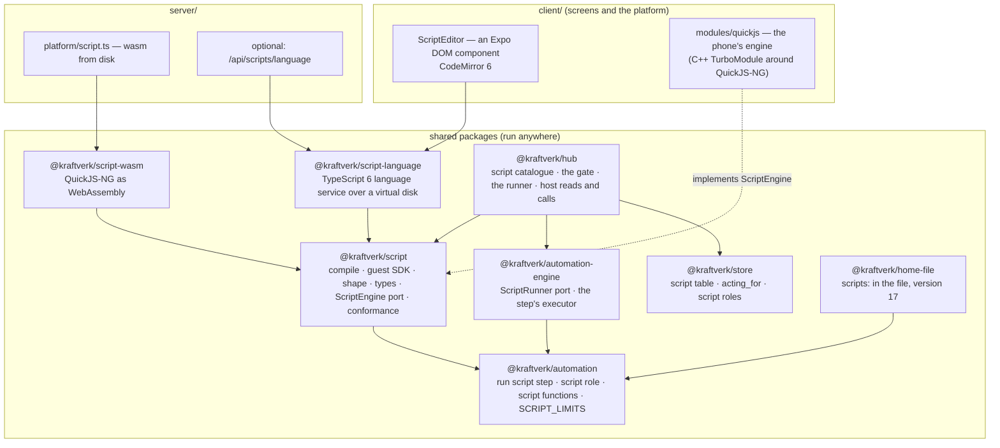
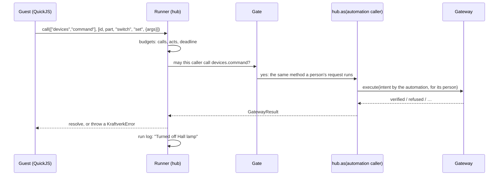
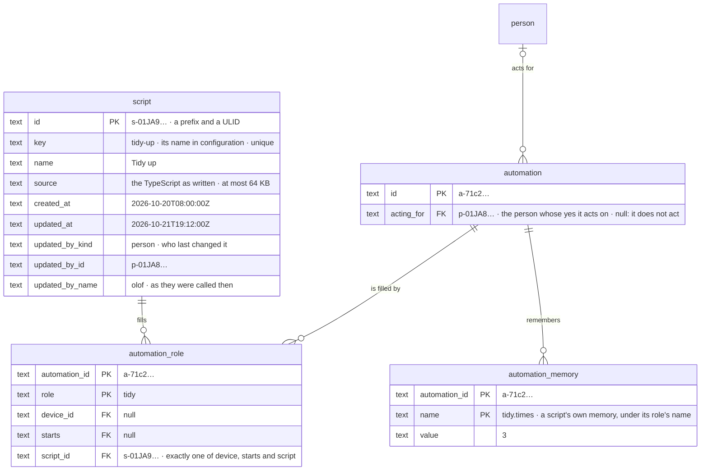
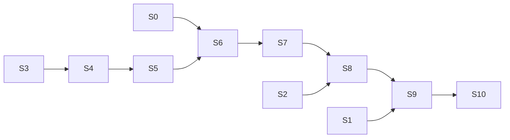

# Building scripts: the design, the data model and the work

How [RESEARCH-SCRIPTS.md](RESEARCH-SCRIPTS.md) gets built: TypeScript
scripts that can do anything a person in kraftverk can, edited in the app
with completion and type checking, and run wherever a home runs — Bun on a
server, the hub in a browser's worker, and the phone's own app. 2026-10-09.

The research is the why; this is the how — every package, table, port and
screen, and the work cut into slices that are each green. The first slices
are planned to the file; the later ones to the package, cut finer when they
are reached.

## Contents

1. [The answers this guide takes](#1-the-answers-this-guide-takes)
2. [Where it departs from the research](#2-where-it-departs-from-the-research)
3. [The architecture](#3-the-architecture)
4. [The data model: how a script is stored](#4-the-data-model-how-a-script-is-stored)
5. [A script, as written](#5-a-script-as-written)
6. [The guest: the SDK inside the sandbox](#6-the-guest-the-sdk-inside-the-sandbox)
7. [The host: a script as a caller of the hub](#7-the-host-a-script-as-a-caller-of-the-hub)
8. [The sandbox: one port, two engines](#8-the-sandbox-one-port-two-engines)
9. [The language: the script step, the script role, script functions](#9-the-language)
10. [The automation engine](#10-the-automation-engine)
11. [Types and the editor](#11-types-and-the-editor)
12. [The slices](#12-the-slices)
13. [Tests](#13-tests)
14. [Risks](#14-risks)

---

## 1. The answers this guide takes

The research ends with five decisions for the owner. This guide is written
to the recommended answers. Where another answer changes the work, it says
which slices change.

| # | Decision | Taken as | Another answer changes |
| --- | --- | --- | --- |
| 1 | Scripts as steps and functions, or whole automations | **Steps and functions** inside automations; triggers stay declarative | §9, S6: a whole-automation script would need its own triggers API |
| 2 | The script surface | **All of `KraftverkApi`** but what §7.3 lists | §7.3's table only |
| 3 | Who a script acts as | **The person who let its automation act**, with their role | §4 (`acting_for`), §7.1 |
| 4 | A native QuickJS module | **Owned now** | S9: without it, the phone runs no scripts and says so |
| 5 | Scripts the family's, by key | **Yes**, shared, named through a role | §4, §9 |

## 2. Where it departs from the research

Reading the code for this guide changed five things:

1. **A script declares its shape in code, not only in types.** The hub has
   no TypeScript compiler — on a phone it could not run one — yet it must
   know a script's inputs, answer and functions to check the automations
   that use it. So a script declares them with small builders (`step`,
   `fn`, `t.number('W')`), which TypeScript infers types from (as zod does)
   and which the hub reads by running the module's top level in the
   sandbox, with nothing reachable. One source; no compiler needed to read
   it (§5, §8.4).
2. **Scripts are named through roles.** An automation names another
   automation it starts through a role (`charging: { automation:
   start-charging }`), filled by id in `automation_role`. A script is named
   the same way (`tidy: { script: tidy-up }`). That makes it rename-safe,
   held by a foreign key, and askable ("which automations use this?") (§4,
   §9).
3. **Reads are live, synchronous host calls.** The research had a snapshot
   refreshed after each `await`. QuickJS runs a slice of a script
   synchronously on the hub's own thread, and nothing in the hub changes
   during a slice. So a read that asks the hub is consistent within the
   slice and never stale after an `await`, with no snapshot to build (§6.2).
4. **Script functions are pure over their arguments.** A function that read
   the home would read things its automation's triggers do not watch, and a
   `becomes` would go stale. Functions take the language's values and give
   one back. They are deterministic, so watch mode and rehearsal run them as
   they are. What needs the home is a step, which can `remember` an answer
   for conditions to read (§9.3).
5. **A gate for every call comes first.** The search found that a member's
   role is checked only in `people`: a child may do anything else. It also
   found that a `needs-yes` token is bound to the actor that asked, so a
   caller that is not a person could answer its own. "A script acts with
   its person's role" means nothing until one table decides, for every
   method, who may call it. S0 builds that table, and it is worth having
   before scripts.

And one finding outside scripts: every timeline line about a mode was being
dropped (the audit table's check did not list `mode`, and `INSERT OR
IGNORE` hid it). Fixed separately; a convention test holds the table to
`RESOURCE_KINDS`.

---

## 3. The architecture



### 3.1 The packages

| Package | Holds | May import (`MAY_IMPORT`) | Runs on |
| --- | --- | --- | --- |
| `packages/script` (new) | Compiling (sucrase), the guest SDK as JavaScript, the host protocol, reading a script's shape, the type generator, the `ScriptEngine` port and its conformance cases | `device-sdk`, `api-contract`, `automation` | everywhere |
| `packages/script-wasm` (new) | `ScriptEngine` over QuickJS-NG as WebAssembly; the `.wasm` given to it by the place | `script` | Bun, a browser's worker |
| `packages/script-language` (new) | The editor's language service: TypeScript 6 over `@typescript/vfs`, the lib declarations, the SDK's declarations | `script` | a browser worker, a WebView, Bun (the fallback) |
| `packages/automation` | `run script` step, `script` role, the script-call expression, `ScriptShape`, `SCRIPT_LIMITS` | as now | everywhere |
| `packages/automation-engine` | The `ScriptRunner` port and the step's executor | as now | everywhere |
| `packages/hub` | The script catalogue, the gate (S0), the runner: caller, host reads and calls, watch mode, budgets | adds `script` | everywhere |
| `client/modules/quickjs` (new) | The phone's engine: QuickJS-NG in C++, one source for iOS and Android | — | the phone |

Why three new packages rather than one:

- **The hub must never carry the compiler.** TypeScript 6 is about 9 MB.
  `script-language` holds it, and only the editor imports it.
- **The WebAssembly engine is one platform's choice.** The phone uses
  another engine behind the same port, so `script-wasm` is kept apart from
  the port it implements.

Each new package's README gets its four headings. `scripts/architecture.mjs`
gets their `MAY_IMPORT` entries, and `script` joins the `CONTRACT_USERS`
pattern.

### 3.2 Which node runs a script

Scripts run where automations run: on the **family's master**. That is the
server when there is one, or the app's own hub in local mode (the browser's
worker, or the phone in-process). A follower's app edits scripts through
the master's API and runs none. A place with no engine — a phone build
without the native module — leaves `HubOptions.scripts` empty. Every
automation there that uses a script then has a problem: "This place runs no
scripts". Nothing is silently skipped.

### 3.3 One call path



---

## 4. The data model: how a script is stored

### 4.1 The tables



**`script`** — new, one row per script, the family's.
- `key` is unique and matches the automation key's pattern. It is how a
  file names the script.
- `source` is the TypeScript as written: the one thing kept. Its length is
  limited by a check (`length(source) <= 65536`).
- `updated_by_*` is an actor, as the store's convention test requires. It
  is who last changed the script, which §7.2 needs and the script's screen
  shows.
- The schema's comment says what the row is for, as every table's does.

**`automation.acting_for`** — new, a reference to `person`.
- It names the person whose yes the automation acts on: the one who last
  let it act, or who last changed what an acting automation does (its rule,
  or a script it uses).
- It is null exactly when the automation does not act
  (`CHECK ((mode = 'act') = (acting_for IS NOT NULL))`). That null means
  something; it is not a gap.
- Forgetting the person sets the automation to watch, and the timeline says
  so. This needs care in `PeopleStore.claim`/`erase`, which re-point
  references by reading `pragma_foreign_key_list`.

**`automation_role.script_id`** — new, a reference to `script` with `ON
DELETE CASCADE`.
- The check "exactly one of device, starts and script" replaces today's two.
- When a script is deleted, the roles it filled go with it, and their
  automations say "nothing to run" — just as when an automation another
  starts is deleted.
- A script's page asks this table which automations use it.

**`automation_memory`** — unchanged.
- A script's own memory (declared in its `step({ memory })`) is kept under
  `<role>.<name>`, so two automations sharing a script each remember their
  own.
- The automation's own `memory:` names cannot contain a dot, so the two
  never meet.

**`audit`** — `RESOURCE_KINDS` gains `'script'`.
- The table's check follows, and the new convention test fails until it
  does.
- Lines are `script.added`, `script.changed`, `script.removed` and
  `script.renamed`.
- A run's acts are the automation's lines, as now.

**`automation_run.detail`** — no new table. A `run script` step's entry and
its sub-entries (§10.4) live in the run's existing `steps` list.

### 4.2 What is not stored

| Not stored | Why | Instead |
| --- | --- | --- |
| The compiled JavaScript | Derived from `source` by sucrase in milliseconds | Compiled at save and when the hub starts, kept in memory by the script catalogue |
| The shape (inputs, answer, memory, functions) | Derived by running the module's top level | Read at save and at start (§8.4), kept in memory beside the compiled code |
| The generated types | Derived from the home, and the app's alone | Generated in the app as the editor opens (§11.1) |
| Earlier sources | Strict version 1: no history of a row's past | The timeline says when and by whom it changed; the file kept beside the database is the copy |
| A sandbox's heap | Lives for one run, or one evaluation | Memory a script keeps is `automation_memory`, declared and typed |

### 4.3 In the hub's memory: the script catalogue

`packages/hub/src/scripts/catalogue.ts` keeps, per script id:
`{ key, name, compiled, shape, problems }`.

- It is built when the hub starts, by compiling and describing every
  script. A script that no longer compiles keeps its problem, and every
  automation using it shows it.
- It is rebuilt for one script when that script changes, and says
  `{ kind: 'scripts' }` on the bus. The engine then rechecks the
  automations that use the script (`roleProblems`).
- It is what the runner, the checker's vocabulary (`scriptOf(role)`) and the
  API's `scripts.get` read.

### 4.4 In the configuration file: version 17

```yaml
kraftverk: 17
scripts:
  tidy-up:
    name: Tidy up
    source: |
      import { step, t, home, log } from 'kraftverk';

      export const tidyUp = step({ inputs: { after: t.duration() } }, async ({ after }) => {
        // …
      });
automations:
  evening-tidy:
    name: Evening tidy
    mode: act
    acts for: olof
    uses:
      tidy: { script: tidy-up }
    when:
      - at: "22:00"
    do:
      - run script: tidy
        with: { after: 10 min }
```

- **`scripts:`** is a new top-level map by key, each entry `{ name, source }`.
  `document.ts` adds it to the allowed top-level keys, reading and writing,
  and `emptyDocument`.
- **`acts for:`** is a person's key (`PersonView.fileKey`), written by the
  export when the automation acts.
  - An import from a person who is that person, or an admin, keeps it.
    Anyone else's import sets it to the importer, and the plan says so.
  - A restore after a database reset keeps it. That is why it is in the
    file: without it, every acting script would stop at every reset.
- **`{ script: key }`** is a new role kind in `uses:` (`ROLE_KEYS`).
- **The version:** `CURRENT_VERSION` becomes 17, with the identity migration
  `16: (document) => document` and a kept `fixtures/v17.yaml` that has a
  script, a script role and `acts for`. CONFIG.md's version table and its
  section on scripts follow.
- **The JSON Schema** gets `scripts` (source as a string) and the role kind.
- **The import** plans scripts before automations, since automations name
  them.
  - Each script in the file is compiled and described in the hub's
    sandbox; a script that fails either is a problem, and nothing is
    applied.
  - Automations are then checked against the shapes just read. The pure
    `checkDocument` cannot run a sandbox, so it checks a script role
    against `Vocabulary.scripts` when the script is already there, and
    otherwise leaves it to the import.
  - A script missing from the file is removed in a full import, which asks
    for a yes, as for automations.
- **The vocabulary** (`home-file/src/vocabulary.ts`) gains
  `scripts: { id, key, name, shape }[]`.

### 4.5 A script's life

```mermaid
stateDiagram-v2
  [*] --> Written: the editor (types checked there)
  Written --> Compiled: scripts.create / update — sucrase
  Compiled --> Described: top level run in the sandbox, nothing reachable
  Described --> Kept: the row written; catalogue and bus told
  Kept --> Checked: every automation using it rechecked
  Checked --> Running: a run reaches "run script", or a condition calls a function
  Compiled --> Refused: does not compile
  Described --> Refused: throws, takes too long, or declares nothing
  Refused --> Written
```



- **Saving a script used by acting automations is a yes to what they do.**
  If the saver is not each one's `acting_for`, the save answers `needs-yes`:
  "Evening tidy acts for Olof; changing its script makes it act for you."
  The yes moves `acting_for` to the saver.
  - This is the same yes `automations.update` asks before letting an
    automation act.
  - It closes the way round: a child writing what an admin's automation
    runs.

---

## 5. A script, as written

```ts
import { step, fn, t, home, log } from 'kraftverk';

/** Turns off every lamp left on in an empty room, and says which. */
export const tidyUp = step(
  {
    inputs: { after: t.duration({ title: 'Empty for at least', min: 60 }) },
    answer: t.text(),
    memory: { times: t.count() },
  },
  async ({ after }, { memory }) => {
    const off: string[] = [];
    for (const room of home.rooms) {
      if (room.occupied !== false || room.emptyFor < after) continue;
      for (const lamp of room.devices.with('switch')) {
        if (!lamp.switch.on) continue;
        await lamp.switch.set({ on: false }); // through the gateway, as the automation
        off.push(lamp.name);
      }
    }
    memory.times += 1;
    log(off.length ? `Turned off ${off.join(', ')}` : 'Nothing was left on');
    return off.join(', ');
  }
);

/** How warm it feels: pure, so a condition may call it on every reading. */
export const feelsLike = fn({ args: [t.number({ unit: '°C' }), t.number({ unit: '%' })], returns: t.number({ unit: '°C' }) }, (temp, humidity) => temp - (100 - humidity) / 5);
```

The rules of a module:

- **Imports:** only `kraftverk` and `kraftverk/api`. Any other import is a
  problem at save.
- **Exports:**
  - named `step(…)` and `fn(…)` values, each named as a role-local verb
    (`tidyUp`, `feelsLike`), camelCase as recipe names are;
  - nothing else: other exports are a problem, and a module that exports
    neither is one too.
- **`t`, the builders:**
  - They write the same `ConfigField`s the language's `inputs:`,
    `memory:` and `result:` already use (`device-sdk/src/schema.ts`):
    - `t.number({ unit, min, max })`
    - `t.duration()`, a number in seconds, as the language keeps durations
    - `t.count()`, a whole number from 0
    - `t.flag()`, a boolean
    - `t.text()`
    - `t.choice([...])`
    - `t.time()`
  - TypeScript infers each argument's type from them.
- **The top level** runs once per sandbox. It may compute constants. It
  cannot reach the home: `home` and the API refuse until a step or a
  function is running.

---

## 6. The guest: the SDK inside the sandbox

### 6.1 Two layers, one bundle

The guest SDK is TypeScript in `packages/script/src/guest/`. At build time
it is bundled into one JavaScript string,
`packages/script/src/generated/guest.ts`, which `npm run check:architecture`
keeps current (`--check`), as it does REFERENCE.md. That string is evaluated
first in every sandbox. It defines:

- **`kraftverk/api`** — `KraftverkApi` as a proxy: each property one more
  step of a path, calling it `call(path, args)`. This is the same shape as
  `apiOver` in `@kraftverk/message-port`.
  - The resolving side is factored out of `serveApi` into
    `@kraftverk/api-contract` as `callByPath(api, path, args)`, with its
    rules: own properties only, never `__proto__`, `constructor` or
    `prototype`, and `live` not a call.
  - `message-port` and the script runner then share it: one way to call
    the API by path.
- **`kraftverk`** — the home as objects, built on the first layer and the
  synchronous reads below:
  - `home.devices`, by key, each with its parts, readings by meaning,
    commands by capability, and events;
  - `home.rooms`, `home.homes`, `home.modes`, `home.people`;
  - also `run`, `clock`, `sleep`, `log`, `notify`, `setMode`, `start`,
    `step`, `fn`, `t`, and `KraftverkError`.

A `require` shim maps the two names. sucrase turns `import` into `require`,
so no module loader is needed, on either engine.

### 6.2 The host functions: four, and nothing else

| Function | Sync | In a step | In a function | Does |
| --- | --- | --- | --- | --- |
| `__read(query)` | yes | yes | **no** | Answers from the hub's own state, at once. `query`: `{ devices }`, `{ reading: [id, part, key] }`, `{ reachable: id }`, `{ mode: [homeId, axis] }`, `{ occupied: placeId }`, `{ whoAt: placeId }`, `{ now }`. People's whereabouts are filtered as the acting person sees them (`whereabouts.ts`) |
| `__call(path, args)` | no: a promise | yes | **no** | One `KraftverkApi` call through the gate, as the automation's caller |
| `__wait(ms)` | no: a promise | yes | **no** | A pause on the hub's `Clock` (so the fast-clock server and the virtual clock keep it), cut short when the run is stopped, never past the deadline |
| `__log(text)` | yes | yes | yes | A line in the run's log, or the trace of the expression |

**Values crossing.**
- Everything crosses as JSON text, never a handle, so nothing of the host
  can be reached from the guest.
- Numbers are in the field's unit, durations in seconds, times of day as
  `"HH:MM"`, and instants as ISO text.
- Unknown is `null`. An argument the language does not know means the
  function is not called: its answer is unknown, as Kleene's logic has it.

**Refusals.**
- An `ApiError` crosses as a `KraftverkError` with its `kind`, `message`
  and `problems`.
- A command's `GatewayResult` with `refused` or `failed` is thrown as one;
  `verified` and `unverified` resolve.
- A script catches what it wants to go on after. A refusal it does not
  catch fails the step, which then fails as a command step would: with
  `if a step fails` after it.

---

## 7. The host: a script as a caller of the hub

### 7.1 A new caller and actor

- **`packages/api-contract/src/api.ts`:** `Caller` gains
  `{ kind: 'automation'; id: string; name: string; for: string; run: string }`.
  - `for` is the person it acts for: the run's asker if a person started
    it, otherwise `automation.acting_for`.
  - `run` is the run's id.
- **`packages/hub/src/api/caller.ts`:**
  - `actorOf` of that caller is `actor('automation', name, id)`.
  - `intentOf` carries `run: { id }`, so the gateway counts the run's
    switches and ends them with it, as it does for a command step.
  - `readerOf` is `for`: a script reads presence as its person may.
- **`hub.as(caller)`** looks up `for`'s role for the gate. A `for` that names
  nobody the family knows is refused.

### 7.2 S0: one gate for every call (prerequisite)

`packages/hub/src/api/gate.ts`:

```ts
type Least = 'child' | 'member' | 'admin';
type Gate = {
  /** Reads leave everything as it was: allowed in watch mode, and counted apart. */
  reads: boolean;
  /** The least role of the person a caller acts for. */
  least: Least;
  /** Who may call it at all. */
  callers: readonly Caller['kind'][];
};

/** Every method of the API, by its path: a new one does not compile until it is decided here. */
export const GATES = {
  'devices.list': read('child', ANYONE),
  'devices.command': act('child', ANYONE),
  'people.invite': act('admin', PEOPLE),
  // …
} as const satisfies { [P in ApiPath<KraftverkApi>]: Gate };
```

- `ApiPath<T>` is a type in `api-contract`: every path to a function,
  `'devices.command'` and so on.
- `familyApi` wraps every method by its gate before `hub.as` returns it.
  - The scattered `caller.kind === 'agent'` refusals that cover a whole
    method move into the table.
  - Those that depend on an argument stay where they are.
- **Behaviour first:** S0 writes today's rules into the table and nothing
  stricter, so it changes nothing a person sees. `least` is `child`
  everywhere but where `people.ts` asks an admin today. Tightening roles is
  then a one-line change each, for the owner to decide.
- **A yes is a person's.** For a caller that is not a person:
  - a `confirmation` argument is refused;
  - an `ApiError` of kind `needs-yes` becomes `refused`: "Only a person can
    say yes to this";
  - a `GatewayResult.needsConfirmation` becomes an `outcome: 'refused'`.

  This closes what the search found: today an agent could answer a
  `needs-yes` it was given. It is safe only because the assistant's tools
  do not reach those methods.
- **The assistant's MCP tools** stay as they are. The gate is a floor under
  them, not a replacement.

### 7.3 What a script may call

Every method of `KraftverkApi` is open to `'automation'` callers, except:

| Never a script's | Why |
| --- | --- |
| `live` | A stream; a script reads through `__read` |
| `setup.*`, `integrations.forget`, `connections.setSecrets`, `connections.setExportable` | Credentials, choosers that need a person's tap, secrets |
| `configuration.export`, `configuration.apply`, `configuration.plan` | A whole family's file, with its secrets; changing everything at once |
| `nodes.*`, `held.*` | A node's keys and what nodes send the master |
| `people.invite`, `invitations`, `approve`, `revokeInvitation`, `erase`, `myChain`, `setSharing` | Who is in the family, their keys, and what they share |
| `devices.remove`, `devices.deleteHistory`, `devices.setPeople` | What cannot be undone, and who carries what |
| `scripts.create`, `scripts.update`, `scripts.remove` | A script writing what an acting automation runs is the way round §4.5 closes |
| `notifications.pushKey`, `keepPushEndpoint`, `forgetPushEndpoint` | A person's own apps |

Everything else is open: devices (command, write, query, update, place,
pause, track), automations (start, stop, create and change in watch mode —
letting one act asks a yes, so it is refused), modes, notifications,
homes, zones, spaces, openings, labels, presence, occupancy, history and
the timeline.

`ServerApi` — accounts, sign-in, reset, snapshots — is not `KraftverkApi`,
and so is out of reach by construction. A test calls every path in
`GATES` as an automation caller and holds the list above, so a new method
is a decision.

### 7.4 Notifying people

There is no API method to tell another person: `notify` exists only inside
the hub, for automations. So the SDK's `notify(people, message)` goes
through the engine's own port (`EngineWorld.notify`). It is reached by
`__call` on a path the runner answers itself rather than the API:
`['run', 'notify']`. The same goes for `['run', 'setMode']` and
`['run', 'start']`, so a script's mode changes and starts carry the run's
`cause` (the loop guard), as a step's do. `run` is not a namespace of
`KraftverkApi`, so the two never meet.

### 7.5 Watch mode

The runner wraps the gated API with a recorder:

- calls whose gate says `reads` go through;
- every other call is refused with `outcome: 'would'`: a `GatewayResult`
  of its own, typed in the SDK, which the script may test
  (`if (result.outcome === 'would')`);
- the run's log says "would turn off Hall lamp".

A script that branches on a result will take the would-path. The log says
the run was watched, as for any automation.

---

## 8. The sandbox: one port, two engines

### 8.1 The port (`packages/script/src/engine.ts`)

```ts
export type SandboxLimits = {
  memoryBytes: number;
  stackBytes: number;
  /** The longest the guest may run without returning to the host. */
  sliceMs: number;
};

export interface ScriptEngine {
  /** A sandbox with its own heap; disposed after one run, or one look. */
  open(limits: SandboxLimits, host: HostFunctions): Sandbox;
}

export type HostFunctions = {
  read?(query: string): string;                   // sync, JSON in and out
  call?(path: string, args: string): Promise<string>;
  wait?(ms: number): Promise<void>;
  log(text: string): void;
};

export interface Sandbox {
  /** Evaluates JavaScript at the top level, within one slice. Throws a `ScriptFault`. */
  evaluate(code: string, filename: string): void;
  /** Calls an export synchronously (a function): JSON in, JSON out, within one slice. */
  callSync(name: string, args: string): string;
  /** Calls an export that may await the host (a step); host promises settle as they come. */
  callAsync(name: string, args: string, signal: AbortSignal): Promise<string>;
  /** CPU used so far, for the run's budget. */
  readonly cpuMs: number;
  dispose(): void;
}

/** Why a script stopped: said in the run's log as it is. */
export type ScriptFault = { kind: 'threw' | 'time' | 'memory' | 'stack' | 'stopped' | 'syntax'; message: string; line?: number; column?: number };
```

- **The model.** A sandbox runs one slice at a time on the caller's thread:
  - the top level, or a call up to its first `await` of the host;
  - each time a host promise settles, the next slice up to the next
    `await`.
- **The slice budget** is QuickJS's interrupt handler, checked by the
  engine. Between slices nothing of the guest runs, so no worker is needed
  to kill it. Rejecting the pending host promises and disposing is a stop.
- **The run's CPU budget** is the sum of slices, counted by the runner.

### 8.2 `packages/script-wasm`

- **Libraries:** `quickjs-emscripten-core` with the
  `@jitl/quickjs-ng-wasmfile-release-sync` variant, pinned. The release's
  QuickJS-NG version is written in the README, since the native module
  vendors the same.
- **One WebAssembly module per hub**, made once with `newVariant(variant,
  { wasmLocation | wasmBinary })`. A runtime per sandbox:
  - `setMemoryLimit` and `setMaxStackSize`;
  - `setInterruptHandler` against the slice's deadline;
  - one context.
- **Host promises:** `ctx.newPromise()`, settled by the host, followed by
  `runtime.executePendingJobs()` as a new slice.
- **The `.wasm` is the place's to give:**
  - `server/src/platform/script.ts` reads it from `node_modules` with Bun;
  - `client/scripts/build-home-worker.mjs` copies it beside the home
    worker, as it copies `sqlite3.wasm`, and the worker passes its URL.
- **Memory.** A WebAssembly memory grows to its high mark and never
  shrinks. So the hub runs at most `SCRIPT_LIMITS.sandboxes` at once (a
  queue beyond that), and its README says the high mark is about that
  times `memoryBytes`.

### 8.3 `client/modules/quickjs` (the phone)

- **A C++ TurboModule**, the New Architecture's way to one native source
  for both platforms (`newArchEnabled: true` already). It vendors
  QuickJS-NG at the WebAssembly build's version.
- **Its JavaScript face** mirrors the port: `open(limits, host)` returns a
  handle with `evaluate`, `callSync`, `callAsync`, `cpuMs` and `dispose`.
  It runs on the JS thread, synchronously, as the WebAssembly engine does
  in its worker.
- **Host functions** are JSI functions the module calls back; host promises
  settle through a `resolve(id, json)` the module exposes, followed by
  `JS_ExecutePendingJob` until none are left.
- **Limits:** `JS_SetMemoryLimit`, `JS_SetMaxStackSize`, and
  `JS_SetInterruptHandler` against a monotonic clock.
- **The wrapper** `client/src/platform/script.ts` adapts it to
  `ScriptEngine`. `client/src/platform/home/open.ts` passes it to
  `createHub` as `scripts`.
- **Builds:** this needs a development build (`expo-dev-client`, `npx expo
  prebuild`). That build is already what Bluetooth needs (docs/RUNNING.md).

### 8.4 Reading a script (`packages/script/src/read.ts`)

`readScript(source, engine)` returns `{ compiled, shape, problems }`:

1. **Size.** At most `SCRIPT_LIMITS.sourceBytes`.
2. **Compile.** `sucrase.transform(source, { transforms: ['typescript',
   'imports'], disableESTransforms: true })`. A syntax error is a problem at
   its line and column.
3. **Imports.** sucrase's output names every `require`. Anything but the
   SDK's two names is a problem.
4. **Describe.** In a fresh sandbox, with no `read`, `call` or `wait`, the
   guest SDK and then the module are evaluated within one slice of
   `SCRIPT_LIMITS.describeMs`. The SDK's `step` and `fn` record what they
   are given. The exports are read back as the `ScriptShape`:
   ```ts
   // packages/automation/src/script.ts — the language owns what it checks
   export type ScriptShape = {
     steps: Record<string, { inputs: ConfigSchema; answer: ConfigField | null; memory: ConfigSchema }>;
     functions: Record<string, { args: readonly ConfigField[]; returns: ConfigField }>;
   };
   ```
5. **Check the shape.** Names are camelCase, fields valid, and memory names
   have no dot. At least one export.

The same function runs in the hub (save, start, import) and in the app
(to show the shape beside the editor), on whichever engine the place has.

### 8.5 The limits (`packages/automation/src/rule.ts`, beside `SEQUENCE_LIMITS`)

| `SCRIPT_LIMITS` | Value | For |
| --- | --- | --- |
| `sourceBytes` | 65 536 | a script |
| `describeMs` | 50 | reading its shape |
| `stepMemoryBytes`, `stepStackBytes` | 32 MB, 512 KB | a step's sandbox |
| `sliceMs` | 100 | the longest a step runs without awaiting |
| `stepCpuMs` | 2 000 | a step's whole run |
| `calls` | 500 | `__call`s in one step's run |
| `acts` | 50 | calls whose gate is not `reads` |
| `logLines` | 100 | kept; the rest counted |
| `answerBytes` | 16 384 | a step's answer, as JSON |
| `functionMemoryBytes`, `functionMs` | 8 MB, 5 | a function's sandbox and one call |
| `sandboxes` | 8 | at once, per hub |

- **Deadlines.** A step's deadline is the run's, at most
  `SEQUENCE_LIMITS.waitSeconds`. A wait never outlives it.
- **The gateway** keeps its dwell, reserve and freshness rules, as for any
  caller.
- **CPU and clocks.** CPU limits are real time, not the clock's: a fast
  clock scales waits, not work.
- **The log.** Each limit reached is said in the run's log in words: "The
  script ran for 2 s of work and was stopped."

---

## 9. The language

### 9.1 The script role

- **`rule.ts`:** `ScriptRole = { script: true; label?: string }`, beside
  `AutomationRole`. `ROLE_FIELDS` and `roleKind` gain it.
- **In the file:** `tidy: { script: tidy-up }` names it. In the store, its
  filler is `automation_role.script_id`.
- **Names:** a script role may not be named as an installed type's id,
  because §9.3's syntax would read it as a package function.

### 9.2 The `run script` step

| | |
| --- | --- |
| Kind | `script` (`StepKind`, `STEP_KINDS`, `STEP_KIND_ORDER`) |
| YAML | `run script: tidy` · `step: tidyUp` (when the script has several) · `with: { after: 10 min }` · `remember as: lastTidy` |
| Fields | `role` (a script role), `name` (the step's export), `args`, `memory` |
| `atOnce` | false: a run that takes steps |
| `kept` | false: what it does cannot be looked at again and put back |
| `waits` | false: it is bounded by its deadline, so it may sit in a retry or `otherwise` |
| Icon | `code`: a new `KindIcon`, and the app's `IconName` too |
| Words | line "Run the script Tidy up, after 10 min"; brief "run Tidy up" |
| Docs | summary, and examples the kinds test can read: its `doing()` fixture gains a script role whose shape the test vocabulary gives |

- **Checks** (`check.ts`, with the binding: `RuleVocabulary.script?(role)`
  gives the bound script's shape, as `attribute?(role, target)` gives a
  part's):
  - the role is a script role;
  - the step's name is one of its steps, required when it has several;
  - `with:` against its inputs, as `checkStarted` checks a start's;
  - `remember as:` against the automation's memory and the step's answer.
- **Unbound:** with no binding, only the role's kind is checked. An
  unfilled role is a role problem, as for any role.
- **`ruleUses`:** gains `scripts` (role names), so the engine and the
  catalogue know who uses what.

### 9.3 Script functions in expressions

- **Syntax:** `feel.feelsLike(kitchen.temperature, kitchen.humidity)`,
  where `feel` is a script role and the arguments are positional.
- **The parser** is given the rule's script roles (`parseExpr(text, {
  scripts })`). `a.b(` where `a` is one becomes the new kind, and anything
  else stays a package call. Reading a rule always reads `uses:` first, so
  the round trip holds.
- **Expression kind:** `{ script: string; fn: string; args: readonly Expr[] }`.
  It is added to `Expr`, `EXPR_KINDS` and `EXPR_KIND_ORDER`, the printer,
  `describe.ts`, `inlineParams`, the reference's expressions table and the
  `EXPRESSIONS` map in `reference.test.ts`.
- **Type:**
  - from the bound script's `functions[fn]`: arity, then each argument
    against its `ConfigField`, as a setting's value is checked;
  - the result is `shapeOf(returns)`;
  - unbound, its type is unknown and nothing is said.
- **Allowed everywhere `apply` is** — in `becomes`, waits, watches and
  durations too — because a function is pure and synchronous.
  `{ calls: false }` keeps refusing package calls, which may ask a device;
  a script call is not refused by it.
- **Evaluation:**
  - `measureNow` asks `scope.script?.(role, fn, args)`, synchronously.
  - An unknown argument gives unknown without calling.
  - A fault gives unknown, and the trace says why.
  - No `scope.script` (the rehearsal before S10, a place without an
    engine) gives unknown, said once.
- **Words:** "how warm it feels by Feel (Kitchen temperature, Kitchen humidity)",
  from the function's export name in words.

### 9.4 The rest the registry asks

The agent's map of what a new step kind needs (kinds.test, reference.test,
`ruleShape`) is the checklist:
- `ruleShape` changes, so the database resets on that deploy;
- the client's `Blocks.tsx` gets a field editor for `run script`: the
  script's steps as a choice, and its inputs as fields, as `start` has;
- `ACTS` and `pastOf` in the engine's words get the step.

---

## 10. The automation engine

### 10.1 The port (`packages/automation-engine/src/model.ts`)

```ts
export type ScriptRunner = {
  /** Runs one of a script's steps for a run; resolves with its answer, or how it ended. */
  step(request: {
    automation: Automation;
    run: { id: string; askedBy: Asker | null; acts: boolean; cause: readonly string[] };
    role: string;
    name: string;
    inputs: Record<string, Value>;
    memory: { read(): Record<string, Value>; write(name: string, value: Value): void };
    deadline: number;
    signal: AbortSignal;
    say(entry: ScriptEntry): void;
  }): Promise<{ answer: Value | null } | { fault: ScriptFault }>;
  /** Calls one of a script's functions for an evaluation: synchronous and pure. */
  fn(automation: Automation, role: string, name: string, args: readonly Value[]): Value | null;
};
```

`AutomationEngineDeps.scripts?: ScriptRunner`. The engine knows nothing of
QuickJS, the hub or the API, and the hub implements the runner
(`packages/hub/src/scripts/runner.ts`). With no runner, a script step fails
with "This place runs no scripts", and a function is unknown.

### 10.2 The executor (`runs.ts`)

- **The walk:** a `'script' in step` branch in `#walk`, before the `never`
  guard, calls `#script(live, here, step, depth, within, what)`.
- **The run's own steps:**
  - `#script` adds the step's entry, then evaluates `with:` (async, as a
    start's args are);
  - it asks the runner, with `signal` aborted by `#stopLive` and the
    deadline from `SEQUENCE_LIMITS.waitSeconds`;
  - it writes the answer with `remember as:`, as `#startStep` does.
- **Outcomes:** `done`, `would` (watch mode), `failed` (a fault or an
  uncaught refusal, said in its words) and `stopped`.
- **Acting:** a step acts as the run does (`acts`). In watch mode the
  runner's recorder answers acts with `would`.
- **Functions:** the engine's `RuleContext.scope` gets
  `script: (role, fn, args) => runner.fn(automation, role, fn, args)`.
- **The function's sandbox** is kept by the runner for one look (one
  evaluation pass of one automation), then disposed. A function cannot
  keep anything between looks, even by a module-level `let`: it is pure
  in fact, not only by rule.

### 10.3 Stopping, waiting, budgets

- **Stop.** `#stopLive` aborts `signal`. The runner rejects the pending host
  promises with `stopped`, sets the interrupt flag for a slice in progress,
  and disposes. The step's outcome is `stopped`, and `otherwise` runs as it
  does now.
- **Waits.** The SDK's `sleep` is `__wait` on the hub's clock, so the
  virtual clock and the fast-clock server keep it. The deadline caps it.
- **Steps.** One `run script` counts as one step of the run's
  `SEQUENCE_LIMITS.steps`. Its own calls are counted by `SCRIPT_LIMITS`.

### 10.4 The run's log

- **Sub-entries.** The step's entry has sub-entries at `depth + 1`, with
  `within` the step:
  - one for each act: "Turned off Hall lamp", with the gateway's outcome;
  - one for each `log()` line;
  - one when a limit is reached.
- **Reads** are not entries; the readings of devices the script used are
  kept by `listen()` as for roles. That needs `listen` to take device ids
  as they are first read, not only the roles' parts.
- **After `logLines`**, one entry says how many more there were.
- **Sharing a script** shows in the log: "Evening tidy ran Tidy up".

### 10.5 Rehearsal

- **Before S10:** a `run script` ends a rehearsal as any step but a command
  does now: "then take its steps, which history cannot show". Functions
  work in rehearsal, being pure.
- **In S10:** a rehearsal may run the step with `__read` answered from
  history at the step's time (`EngineHistory.at`) and every act answered
  `would`.

---

## 11. Types and the editor

### 11.1 The types a script is checked against

- **What the editor loads.** Three sets of declarations go into the
  language service's virtual disk:
  1. **The lib:** `lib.es2022.*.d.ts` from TypeScript 6, with no DOM.
     They are bundled, never fetched from a CDN: the app works offline
     and asks nobody.
  2. **The SDK** (`kraftverk`, `kraftverk/api`): declarations emitted from
     `packages/script/src/guest/` and from `api-contract` at build time,
     with `tsgo --declaration --emitDeclarationOnly` (TypeScript 7 emits
     declarations; it is only the JavaScript API it lacks). They are
     bundled into `packages/script-language/src/generated/sdk.ts` as
     strings and kept current by `--check`. They are generic: `Device`,
     `Part`, `Reading<'W'>`.
  3. **The home:** generated in the app as the editor opens, by
     `typesOf(home)` in `packages/script/src/types.ts` (pure), as
     `home.d.ts`. It declares each device's key with its parts,
     capabilities with their commands' arguments
     (`device-sdk/src/capabilities.ts`), readings by meaning with their
     units (`meanings.ts`, `units.ts`), and events; then the homes, rooms,
     zones, people and modes by key.
- **What `typesOf` reads** (`scriptHomeOf` in `packages/api-client`):
  `configuration.vocabulary()` and `devices.list()`, which the app already
  has.
- **Types follow the home.** A device renamed or removed changes the
  types. A script that names it gets a type error the next time it is
  opened, and the hub, which cannot type-check, finds out at run time (a
  `not-found` refusal). S10 adds a save-time look for device keys written
  as literals, and a problem on the automation when one is gone.

### 11.2 `packages/script-language`

```ts
export interface ScriptLanguage {
  open(files: Record<string, string>): void;             // home.d.ts, the script
  change(path: string, text: string): void;
  problems(path: string): TextProblem[];
  complete(path: string, at: number): Completion[];
  hover(path: string, at: number): Hover | null;
  signature(path: string, at: number): Signature | null;
}
```

- **The service:** `@typescript/typescript6` and `@typescript/vfs`
  (`createSystem`, `createVirtualTypeScriptEnvironment`). The compiler
  options are fixed: `strict`, `target: ES2022`, `module: ESNext`,
  `noEmit`, `lib: ['es2022']`.
- **How it is reached.** It is served by `serveApi(language, end,
  'language')` from `@kraftverk/message-port` — "another interface of
  calls", which `serveApi` was made to carry — and reached by
  `apiOver<ScriptLanguage>(end, 'language')`. One protocol for all three
  places it runs:

| Where the editor is | Where the language service runs | The end |
| --- | --- | --- |
| The web app | A worker, `public/script/language.js`, built by esbuild beside the home worker | the `Worker` |
| The phone | Inside the DOM component's WebView, with its own JavaScript thread apart from the app's; a worker there if the spike finds one works, else the WebView's main thread | a `MessageChannel`, or a direct object |
| Either, when the above cannot (the fallback) | The server, on Bun: `/api/scripts/language`, a WebSocket signed in as `/api/live` is | a `MessageEnd` over the socket |

- **The server fallback** costs a round trip per keystroke and the
  server's memory per open editor. So it is used only where the place
  cannot run the service itself, and only when there is a server. Without
  one, the editor still colours (CodeMirror's own grammar), and the hub
  still checks a script's shape at save and every call at run time; only
  completion, hover and the marks are missing.

### 11.3 The editor component

- **Where:** `client/src/features/scripts/ScriptEditor.tsx`, which begins
  `'use dom'`: on the web it renders as a component, and on the phone
  inside a WebView, the same file.
  - The phone needs `react-native-webview`, or `@expo/dom-webview`, which
    Expo 57 already carries (spike 2 chooses).
- **Props:** all serialisable, as a DOM component's must be:
  - `value`;
  - `onChange(text)`, an async callback;
  - `homeTypes` (`home.d.ts` as text);
  - `problems`, the hub's, as `TextProblem[]`;
  - `readOnly`, `label` and `theme`.
- **Inside:**
  - CodeMirror 6 with `@codemirror/lang-javascript` (TypeScript), and the
    YAML editor's look, problem marks and keymaps from
    `YamlEditor.web.tsx`, moved to a shared `client/src/components/code/`;
  - completions, hover, signature help and lint from the language service,
    debounced at 200 ms, as the YAML is read.
- **On the phone,** a strip of keys above the keyboard (`{ } ( ) ; . =>`
  and Tab) and a larger tap target for completions.
- **The YAML editor** may move into the same DOM component later. That
  would give the phone completion in YAML too, which it lacks today (a
  plain text box).

### 11.4 The screens

| Route | What it shows |
| --- | --- |
| `client/app/scripts/index.tsx` | The family's scripts: name, key, what uses each, problems. From Automations, as a second tab "Scripts" |
| `client/app/scripts/[id].tsx` | The editor, with above it the shape the hub read: its steps with their inputs and answer, its functions with their arguments. Then Save, its problems, and the automations that use it, with who each acts for |
| `client/app/scripts/new.tsx` | A key and a name, then the editor with a starting script |
| The automation editor | A `script` role in `uses:` picks a script. The `run script` block picks its step and shows its inputs as fields. An expression's completions include the script roles' functions |

Save is enabled when the hub's check has no problems. Type problems from
the language service are shown, and Save says "Save with 2 type problems".
The hub cannot see types, and a file may carry a script no editor checked,
so the run-time checks are the safety. Types are the help.

### 11.5 The API

`KraftverkApi.scripts`:

| Method | |
| --- | --- |
| `list()` | `ScriptView[]`: id, key, name, shape, problems, usedBy (automation ids), updatedAt, updatedBy |
| `get(id)` | the view with `source` |
| `check(source)` | `{ shape, problems }`: `readScript` on the hub's engine, without keeping anything |
| `create({ key, name, source })` | the view; refused with the problems if any |
| `update(id, patch, confirmation?)` | `needs-yes` when it changes acting automations of other people (§4.5) |
| `remove(id, confirmation?)` | `needs-yes` naming the automations that lose it |

- **The rest of the wiring:** the server routes (`server/src/routes/scripts.ts`,
  zod-checked), the HTTP client, the follower, the gate's entries, and the
  contract's `ScriptView`. API.md and DATA-MODEL.md follow.

---

## 12. The slices

How every slice is done is as in
[PLAN-WORLD-MODEL-WORK.md](PLAN-WORLD-MODEL-WORK.md#how-every-slice-is-done):
- green on every commit (`npm run typecheck`, `npm test`,
  `npm run check:architecture`, `npm run knip`);
- strict version 1;
- one push per schema change, said before;
- the layout check for a slice that changes a screen;
- docs with the code;
- only our own files staged.

### Browser first (decided 2026-10-09)

There is no running app environment on a phone yet, so scripts are built
for the browser end to end first, and the phone follows. The browser covers
both ways a home runs:
- **with a server:** the hub on Bun, the app on the web;
- **with none:** the hub in the browser's own worker (`e2e/local.e2e.ts`
  already tests a home kept that way).

Each step from B2 on ends with an end-to-end test in both.

| Step | Slices | Ends with |
| --- | --- | --- |
| B1 | S3 | The sandbox on Bun, and bundled into the browser's home worker with its `.wasm` beside it; the conformance cases green in `bun test` |
| B2 | S4 | Scripts kept, exported and restored; e2e: a script written in the app, with a server and without one; saving reads its shape in the worker's sandbox |
| B3 | S5, S6 | Functions and the step; e2e: a script step turns a simulated plug off, and the run's log says so, with a server and without one |
| B4 | S7, S8 | The typed SDK and the editor; e2e: a completion and a marked type error, then a run |
| later | S1, S2, S9, S10 | The phone, and what is left |

**B1 built, 2026-10-09.** What building it changed:
- **QuickJS for WebAssembly cannot count its memory.** It has no
  `malloc_usable_size` there, and counts 8 bytes a block, so a runtime
  limited to 2 MB held 24 MB. A runtime's own limit stops only one
  allocation larger than it. So `@kraftverk/script-wasm` holds memory
  itself:
  - The engine's WebAssembly memory is made there, with a maximum (320 MB
    unless the place says less); an allocation past it fails inside as
    "out of memory".
  - A sandbox is charged with what that memory grows by while it runs, and
    stopped past its own limit.

  The phone's module, in C, can count properly and should.
- **The port is generic.** `HostFunctions` is `{ sync, async }`, global
  functions of one text argument, and a `Sandbox` evaluates, calls and
  calls-and-waits by a global's name. The four names of §6.2 are the guest
  SDK's, not the engine's, so the phone's module has nothing of kraftverk
  to know.
- **For now a script imports `kraftverk` alone.** `kraftverk/api` comes with
  the script step (B3). An import used only as a type is erased, and so is
  no import.
- **`t.instant()`, not `t.time()`.** The language's fields have an instant
  (`timestamp`) and no time of day.
- **sucrase in a browser bundle.** sucrase writes `from "module"` into its
  ESM output as text, which the architecture check's browser bundle took
  for an import. The check now names that one text as known (`KNOWN_TEXT`),
  and excuses nothing else.
- **Proof in the browser, until B2's.** The home worker makes the engine
  before it opens a home, and says so when it cannot. `e2e/local.e2e.ts`
  holds that it never says so.

**B2 built, 2026-10-09.** What building it changed:
- **Scripts first, then their use.** B2 keeps scripts themselves: the
  `script` table, `scripts.list/get/create/update/remove/check`, the
  file's `scripts:`, and the screens. What only an automation that uses a
  script needs moves to B3, where automations first use scripts, so no
  column waits for its first writer:
  - `automation_role.script_id`;
  - `automation.acting_for`, and the yes of §4.5;
  - `acts for:` in the file;
  - the vocabulary's scripts.

  Version 17 of the file therefore has `scripts:` alone; B3's additions
  are version 18.
- **The id is `sc-`**: `s-` is a space's.
- **A script that does not read is not kept** (400 with each problem), as
  §11.5 says. A file is gentler when restoring: one that does not read
  where it is restored — another engine, or none — is kept as written, and
  the restore says so.
- **The hub's tests read scripts with a stand-in.** The hub may not import
  the WebAssembly engine, not even in a test, so `packages/hub/test/script-engine.ts`
  implements the port over `node:vm`. It is no sandbox, and is for the
  tests' own scripts. The engine is tested where it is, and end to end.
- **The page** keeps a script under its name. The Automations page lists
  the family's scripts beneath the automations, each with its steps and
  functions counted.

**B3 built, 2026-10-09.** Scripts run, end to end in the browser: an
automation's `run script` step turns a simulated plug off through the
gateway, as the automation, with a server and in a browser's own home
(`e2e/scripts.e2e.ts`); a script's function decides a `becomes`. What
building it changed:
- **Watch mode does not run a script.** It says the step it would take, as
  for every step. A script run against a recorder that only pretends to act
  (§7.5) is left for later.
- **The guest SDK, as it is now:**
  - `home.devices`, by key, each with `reading(key)` and `readings()`,
    its main part's capabilities as objects (`plug.switch.set({ on: false })`),
    and `part(id)` for another part;
  - `kraftverk/api`, the whole API;
  - `sleep(seconds)`, `notify(title, { text, to })`, `setMode(mode, home)`
    and `KraftverkError`.

  A command refused or failed is thrown. Rooms, modes and people as objects,
  and types for all of it, are B4's.
- **What a script may not call** (§7.3) is the gate's: `noScript` entries,
  and `live`. `automations.start` and `stop` are among them for now: the
  engine's asker is a person or an assistant.
- **`acting_for` is nullable, with no check against `mode`.** An account
  that names no person may still let an automation act; its scripts then act
  for nobody, and are refused what needs a role. The person who gives the yes
  becomes `acting_for`. An import keeps the person `acts for:` names, when
  they are here, or else takes the importer.
- **A role is named `tidy`, not `off`:** a role may not be a word of the
  language.
- **A script's function gets a sandbox of its own for each call**, not one
  for each look (§10.2). That is simpler, and pure by construction; its cost
  is to be measured.
- **The file's version 18:** `{ script: key }` under `uses`, `run script:`,
  script calls, and `acts for:`.

What browser first changes in the slices:
- **The editor is a web component of its own**, `ScriptEditor.web.tsx`,
  beside `YamlEditor.web.tsx`. It is not yet an Expo DOM component; the
  phone gets a plain text box, as YAML has on a phone today.
  - Turning it into a DOM component later wraps the same code: a
    `'use dom'` file renders as web.
- **The language service** runs in a web worker built by esbuild beside the
  home worker (`client/scripts/build-home-worker.mjs`). The server's
  language socket is not needed.
- **QuickJS's `.wasm`** is copied beside the home worker, as `sqlite3.wasm`
  is, and loaded by URL there. The server loads it from `node_modules`.
- **A phone build** runs no scripts until S9, and says so: `HubOptions.scripts`
  is left empty in `client/src/platform/home/open.ts`.

### S0. One gate for every call

**Built, 2026-10-09.** What building it changed:
- **Three kinds, not a flag.** A gate's `kind` is `read`, `act` or
  `stream`, not `reads: boolean`. `live` keeps answering synchronously, so
  its refusal is thrown, not a rejected promise.
- **Roles bind persons only.** An assistant's `for` is an account's name,
  not a person, so a method with a least role is a person's alone. S6 gives
  the automation caller a person in `for`, and roles bind it too.
- **What stayed in the methods:** `people.present` and `people.erase` for
  someone else, and `setSharing` for a child or another adult, depend on
  their arguments. So do `notifications.*` (the caller's own inbox) and a
  node's calls (the caller's own node).
- **Test:** `packages/hub/test/gate.test.ts`.

- `api-contract`: `ApiPath<T>`.
- `hub/src/api/gate.ts`: `GATES` for every method, holding today's rules
  only, and the yes rule for callers that are not a person.
- `familyApi` wraps; the whole-method `caller.kind === 'agent'` checks move
  into the table.
- **Tests:**
  - every path in `GATES` and nothing else (the type does this; a test
    walks a built API to make sure the runtime agrees);
  - an agent's `confirmation` refused;
  - `needs-yes` to an agent is a refusal;
  - a person sees no change (the existing suites).
- *Done when* every call passes one table, and a new method does not
  compile until it is in it.

### S1. Spike: QuickJS on the phone

- `client/modules/quickjs` as a C++ TurboModule around QuickJS-NG, built in
  a development build on iOS and Android.
- It runs the conformance cases of S3 (copied in until S3 lands), with:
  - time, memory and stack limits;
  - one async host function;
  - a stop mid-slice.
- `typeof WebAssembly` on Hermes is written down.
- *Done when* both phones pass, or the finding is written into this guide
  and the research's risks.

### S2. Spike: the editor in a DOM component

- A `'use dom'` component with CodeMirror and TypeScript 6 over the virtual
  disk, completing against a hand-written `home.d.ts`, on iOS and Android.
  It tries a worker, then the WebView's main thread.
- It measures:
  - the bundle's size;
  - the first completion's time;
  - typing latency on a mid-range Android.
- *Done when* the table in §11.2 is filled with what works.

### S3. The sandbox, on Bun and in the browser

- `packages/script`:
  - `engine.ts` (the port);
  - `compile.ts` (sucrase);
  - `guest/` with the bundling script and its `--check`;
  - `read.ts` (§8.4);
  - `conformance.ts`, the cases every engine passes: arithmetic and
    strings, a limit of each kind, host calls sync and async, a stop,
    JSON both ways, `Date` and `Math.random` as the guest's own, no
    `globalThis` of the host.
- `packages/script-wasm`, and its tests running the conformance cases.
- `packages/automation/src/script.ts`: `ScriptShape`, `SCRIPT_LIMITS`.
- The architecture check: `MAY_IMPORT` entries, READMEs, `CONTRACT_USERS`.
- *Done when* `readScript` gives the shape of §5's example on Bun and in
  a browser bundle (the architecture check's browser bundling covers the
  second).

### S4. Scripts as data

- `store`: the `script` table, `automation_role.script_id`,
  `automation.acting_for`, `RESOURCE_KINDS` with `script`.
  - **This resets the database.**
- `hub`:
  - the catalogue;
  - `scripts.*` with the gate;
  - `acting_for` written where an automation is let act;
  - the yes of §4.5;
  - forgetting a person sets their automations to watch.
- `home-file` version 17 (§4.4), export and import.
- Server routes, HTTP client, follower.
- App: the Scripts list and a script's page, with the YAML-style plain
  editor until S8.
- **Tests:**
  - store round trips and the checks;
  - a script used by two automations, deleted;
  - `acting_for` across let-act, change, forget;
  - v17 fixture round trip;
  - an import that carries a script and an automation using it;
  - an e2e that adds a script in the app and sees it in the YAML.
- *Done when* a script can be written, kept, exported and restored, and
  runs nowhere yet.

### S5. Script functions

- `automation`: the script role, the expression kind, the parser option,
  checks, words, the reference.
- `automation-engine`: `ScriptRunner.fn`, the scope's `script`.
- `hub`: the runner's `fn` with a sandbox per look.
- **Tests:**
  - parse, print and round trip;
  - types and units of the arguments;
  - unknown in, unknown out;
  - a fault is unknown with its reason;
  - a `becomes` on a function, on the virtual clock;
  - a module-level counter that does not survive a look.
- *Done when* `feel.feelsLike(...) > 25 °C` starts an automation.

### S6. The script step

- `api-contract`: the automation caller.
- `hub`:
  - `as` for it, the gate's script surface (§7.3);
  - the runner's `step`: the four host functions, budgets, the watch
    recorder, `run.notify`, `run.setMode` and `run.start`.
- `automation`: the `run script` step, complete by the registry's tests.
- `automation-engine`: `#script`, stop, the log's sub-entries, `listen` by
  device.
- **Tests:**
  - every limit reached, in words;
  - a stop mid-sleep and mid-slice;
  - a refusal caught and uncaught;
  - every path of §7.3 refused to a script and open to a person;
  - acts through the gateway with the automation's dwell;
  - watch mode;
  - `remember as:`;
  - a script's memory under its role;
  - an e2e on the fast-clock server where a script turns a simulated plug
    off and the run's log says so, within 15 s.
- *Done when* §5's `tidyUp` runs on a server and in the browser's local
  home.

### S7. The SDK, typed

- `packages/script/src/types.ts` (`typesOf`);
- `api-client`'s `scriptHomeOf`;
- the generated SDK declarations and their `--check`;
- the guest's `kraftverk` module complete (devices by key, parts, readings,
  commands, events, rooms, modes, people).
- **Tests:**
  - `typesOf` over the test home, type-checked by TypeScript 6 in a test
    (it runs on Bun);
  - every capability's commands appear with their arguments;
  - a reading carries its unit.
- *Done when* §5's script type-checks against a generated home, and a
  misspelled key does not.

### S8. The editor on the web

- `packages/script-language`;
- the worker build;
- `ScriptEditor` as a DOM component, used on the web first;
- the shared code look;
- the automation editor's script blocks.
- **Tests:**
  - the language service in Bun: problems, completions and hover on a
    sample;
  - an e2e: type a script, see a completion and a marked type error, save,
    run it.
- *Done when* writing a script in the web app completes and marks as an
  IDE does.

### S9. The phone

- The native engine (from S1) behind `ScriptEngine` in `open.ts`.
- `ScriptEditor` in its WebView (from S2).
- The keyboard strip.
- A hidden screen, Settings › About › Scripts, runs the conformance cases
  on the phone and shows the result, for each Expo upgrade.
- *Done when* a script is written, saved and run on a phone with no
  server.

### S10. What is left

- The server's language fallback (§11.2).
- Rehearsing a script step on history.
- Device keys written as literals, looked at on save and on rename.
- The YAML editor in the DOM component.
- Lists in the language (PLAN-AUTOMATION-LANGUAGE.md, phase B), so
  functions take them.

### Order, and why



- **S0 first:** it is worth having alone, and S6 rests on it.
- **The spikes in parallel with S3–S5,** since they decide only S8 and S9.
- **Functions (S5) before steps (S6):** they are the safest first use,
  pure, and they prove the sandbox, the catalogue and the language before
  anything acts.
- **Two pushes reset the database:** S4 (tables, file v17) and S5–S6
  (`ruleShape`). The owner is told before each.

---

## 13. Tests

- **The conformance cases** (`packages/script/src/conformance.ts`) are the
  contract between engines: the WebAssembly one runs them in `bun test`,
  and the phone's on its hidden screen. A script that passes one passes
  the other, because the cases cover what differs between builds: limits,
  faults and their words, JSON, promises.
- **The virtual clock** drives every timing test: sleeps, deadlines, a stop
  in a sleep. CPU limits use loops that never end, so they finish at the
  limit, not at a wall-clock guess.
- **The gate's test** builds an API as each kind of caller and calls every
  path. It is the list of §7.3 as data, so the guide and the code agree.
- **End to end,** under the 15 s rule:
  - S4: a script added and seen in the file;
  - S6: a script step run on the fast server;
  - S8: the editor's completion and a marked problem, then a run.

---

## 14. Risks

| Risk | Met by |
| --- | --- |
| A QuickJS bug is a sandbox escape | Four host functions, JSON only, every call through the gate and the API's own checks, the gateway behind; QuickJS-NG pinned and kept current, in both engines together |
| A slice that never yields blocks the hub's thread | The interrupt handler at `sliceMs`; a fault in QuickJS's own C code that ignores it is a QuickJS bug, met as above. A worker per sandbox stays possible behind the port if one is ever found |
| The two engines drift | One QuickJS-NG version in both, written in both READMEs; the conformance cases on both |
| A script with an admin's power does an admin's harm | The gate's surface; its person's role; the yes when its code changes under someone else's automation; budgets; every act on the timeline as the automation's |
| A child writes what an admin's automation runs | §4.5: a change that moves who an automation acts for asks a yes, and the yes makes the saver its person |
| Types say one home, the hub has another | Types are help; the hub checks the shape at save and every call at run time; a removed device is a refusal in words, and later a problem on save |
| TypeScript 6 is the last JavaScript compiler | Only the editor's; the declarations it reads are plain and any later checker reads them; the server fallback can move to TypeScript 7's API process |
| A worker inside a DOM component may not exist on a phone | The WebView has its own thread; the service runs on it, debounced. Failing that, the server fallback |
| The phone's development build is a new burden | Bluetooth needs it already; spike 1 settles the module's build on both platforms before anything depends on it |
| WebAssembly memory that only grows | At most `sandboxes` at once; the README says the high mark |
| A script floods the timeline or the log | `acts` and `logLines`; the gateway's dwell |
