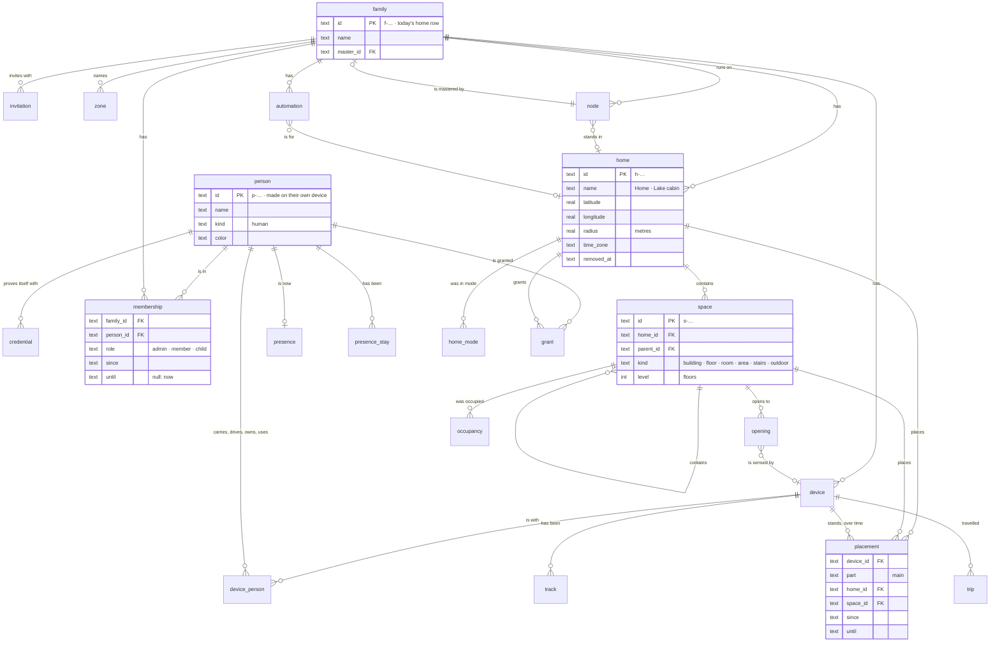

# The world model: people, families, homes, rooms, and things that move

The plan for what kraftverk knows about the world beyond its devices, and
how the database holds it. Devices, integrations and services are there
today. A home automation suite for families also needs the people, the
families they make, the homes they live in, the rooms and floors inside
those homes, and the things that move between them. 2026-10-08.

This is discovery and design. Nothing below is built. It decides the shape
first, because the data model is the expensive thing to change later.
[DATA-MODEL.md](DATA-MODEL.md) stays the authority for what is built, and
takes each part in as it is built.

## 1. What changes, and what it decides

kraftverk has been a hub for devices. It becomes a home automation suite
for families: people who live in one home or several, share their devices,
see where each other is when they choose to, and automate their days. That
puts five new kinds of thing in the model:

- **People.** A person signs up on their own phone and is a person from then on. That
  happens with no server.
- **Families.** A group of people who share devices, nodes and homes. A
  person may be in more than one.
- **Homes.** A family may have several: a house, a cabin. Each has a place
  on the map, a time zone, and its own rooms.
- **Spaces.** Floors, rooms, stairs, a garden, a garage, and the doors
  and stairs between them. These are what room-to-room presence is worked
  out from.
- **Things that move.** A phone, a car, a scooter. They have no room. They
  have a position over time, a person who carries or drives them, and a
  home they come back to.

It closes a question left open since 2026-10-02: a home, or places alone?
**The family is the root, and homes are inside it.** What bounds one
database, one master node and one configuration file today is the `home`
row. It becomes the family. A home becomes a property inside the family,
and a family has as many as it needs.

## 2. Where it stands today

- **One database, one root.** The `home` table holds one row: the root
  every device and node belongs to, naming the master node, with an
  optional latitude and longitude for the sun's times. "Home" is also the
  word for the root throughout the code (`KraftverkApi` is "everything a
  home answers", the hub is "a home, running").
- **Devices are flat.** A device has no room and no home of its own. Where
  it is is a `position` reading, if it reports one, and its track if its
  owner keeps it ([PLAN-MAPS.md](PLAN-MAPS.md)).
- **Nodes** are the hub running somewhere: a server, a phone, a browser.
  One is the master and the others follow it
  ([PLAN-SHARED-CORE.md](PLAN-SHARED-CORE.md), phase 6).
- **Accounts belong to a server** (`users`, `login_session` in
  `server/src/auth/schema.ts`): a username and a password hash, nothing
  more. They are not people, they are not in the home's schema, and a phone
  keeping a home of its own has none.
  [ACCOUNTS.md](ACCOUNTS.md) plans accounts, identities, homes with owners
  and members, and an operator. Its "home" is what this plan calls the family.
- **The timeline** (`audit`) records an actor as a name and a resource as a
  device, a node, an automation, an account or a transport.
- **Automations** keep their own time zone. "When Sam's phone gets home"
  measures distance from the home's one location.

Most of the plumbing is right for this. Nodes already make their own ids, so
the same id holds in every database that knows them. The master and
follower roles already exist. The configuration file already carries a home
across a database reset. What's missing is the entities above, not the
machinery.

## 3. What others model, and what to take

| | What it models | Take | Leave |
| --- | --- | --- | --- |
| **Home Assistant** | Persons with the device trackers that place them; zones as circles, the home zone among them; areas, and floors above them; labels | A person placed by the devices they carry; zones; floors grouping areas | A person and an account blurred together; zones as circles only; presence as one state string; no history of where a device was installed |
| **Apple Home** | Homes, rooms, room groups ("zones"); people invited with permissions; "when the first person arrives, when the last person leaves" | Several homes per person; invitations; first-arrives and last-leaves as built-in ideas | Rooms with no geometry; people only as Apple IDs |
| **Google Home** | Structures (homes), rooms, household members | A household that is the sharing boundary | |
| **SmartThings** | Locations with a geofence, rooms, members, modes (home, away, night) | Modes as state with a history; a geofence per home | |
| **Brick Schema, IFC** | Buildings, storeys, spaces, zones, what is part of what, what feeds what; doors and stairs as elements | A hierarchy of spaces with kinds; openings that connect spaces; elevation per floor | A full building ontology: more than a home needs |
| **Matter** | Fabrics (who administers a device); service areas for robot cleaners | One device, several controllers; areas a device knows itself | |

What none of them does well, and kraftverk should:

- **People are not accounts.** A child without a phone, or a person still to
  be invited, is still a person.
- **Location is the person's to share,** at the detail they choose, and the
  model says so.
- **Where a device was installed is history,** so a temperature recorded in
  the kitchen stays the kitchen's after the sensor moves.
- **It works with no server.** A person is made on their phone, and a family can live on
  phones alone.

## 4. Principles

1. **Definitions in code, records in the database.** As now. A kind of
   space, a mobility, a role are words the code declares. Which rooms your
   home has is a record.
2. **A person is not an account.** A person is someone in the world. How
   they prove it at a node (a key on their phone, a passkey, a password) is
   a credential. A person may have several credentials, or none.
3. **Every fact is kept the way it changes** (§7). Configuration is
   overwritten and audited. Current state is replaced. A series is
   appended and pruned. An event is appended. A stay, a placement or a
   membership is kept as an interval with a start and an end. Each fact
   gets exactly one of these, chosen on purpose.
4. **Data lives with whoever it belongs to** (§9). The family's things are
   in the family's database. A person's own things are in their personal
   store on their phone. What crosses from one to the other is what the
   person shares.
5. **Privacy is modelled, not bolted on.** Where a person is is shared at
   the level they chose (§10), and a node that is told less never holds
   more.
6. **Made where it is born.** Ids and keys are made by whoever creates the
   thing, as node ids are now. No central server hands them out, so it all
   works on phones alone.
7. **Strict version 1, still.** One schema, changed everywhere at once. The
   configuration file is the one thing versioned, and it carries a family
   across a reset.
8. **Every change has a person behind it.** The timeline names who did it,
   through which node, or which automation did it for whom.

## 5. The entities

Each entity says what it is, what it holds, how it relates to the others,
and who changes it. Ids stay opaque and prefixed, as `d-` and `n-` are now.

### 5.1 Person

Someone in the world: a member of a family, a child, someone invited and not
yet joined. `p-…`.

- **Holds:** a display name, a picture, a colour for the map, a kind
  (`human` now, maybe `pet` later, §13), and when they were made.
- **Made by** the person themselves, on their own device, when they sign
  up. An admin can also make a person who has no device, such as a small
  child, and hand them a device later.
- **The same id in every family** the person is in, the way a node's id is
  its own. The person's public key travels with it (§5.2).
- **Changes:** name, picture and colour are overwritten, and the timeline
  records it.

### 5.2 Credential

How a person proves they are that person. `c-…`.

| Kind | What is kept | Where |
| --- | --- | --- |
| `device-key` | A public key (P-256). The private key never leaves the person's device: non-extractable Web Crypto in a browser, the platform's keystore on a phone | Every family database the person is in, and every node they sign in at |
| `passkey` | A WebAuthn credential id and public key | The node it was registered with |
| `password` | An argon2id hash. Today's `users.password_hash` | The node it was set at |
| `apple`, `google` | The provider's stable subject, never the email | The node, when sign-up is open (ACCOUNTS.md) |

- **Signing in** at a node means a challenge signed with a device key, or
  a passkey, or a password. A node knows a person through a credential.
  It has no "users" of its own.
- **Operator** (whoever runs a node) is a flag on the node's record of a
  person, as ACCOUNTS.md says, not on any family.
- **Changes:** added and revoked, never edited. A revoked credential keeps
  its row and when it was revoked, so old sign-ins can still be read.

### 5.3 Family

The people who share devices, nodes and homes: a family, a household,
flatmates. `f-…`. **This is today's `home` row**, the root of one
database, renamed for what it is.

- **Holds:** a name, the master node (as `home.master_id` does now), and
  when it was made.
- **Owns** everything shared: its homes, devices, nodes, automations,
  zones and timeline.
- **One family is one database is one master is one configuration file.** A
  person in two families (their own, and a cabin shared with siblings) has
  two. Their phone follows both.
- **Changes:** the name is overwritten and audited. The master moves by the
  rules that already exist (phase 6h).

### 5.4 Membership and invitation

A person in a family, with a role, from a time to a time.

- **Membership** `(family, person, role, since, until)`. Roles: `admin`
  (manages people, homes and nodes; at least one at all times), `member`
  (uses and automates everything), `child` (uses what is allowed; an admin
  sets what their location shares). A **guest** is not a member: see
  grants (§5.17).
- **Kept as intervals.** Joining opens one; a role change closes it and
  opens the next; leaving closes it. So a timeline from last year can still
  say who was in the family then, and in what role.
- **Invitation** `(id, family, role, made by, expires, used)`. A one-time
  secret is shown as a QR code or a link. The person who opens it presents
  their device key. An admin may require approval before the membership
  opens. The invitation also names the master's addresses, so the
  invited phone knows where to follow.

### 5.5 Home

A property: where the family lives, or spends time. `h-…` (the prefix the
root uses now).

- **Holds:** a name ("Home", "Lake cabin"), a location (latitude, longitude),
  a geofence (a radius in metres, 150 by default, or a polygon), an optional
  address as the person writes it, a time zone, and its country (what Maps
  offers to download).
- **Its settings**, which are today's per-database values, become per home:
  the energy policy (`loadWatts`, `reserveSoc`), the electricity price
  area, and the weather's place.
- **Its frame:** an origin and a bearing. That is what a floor plan's
  metres are measured from (§5.6), so a plan drawn once lines up with the
  map.
- **Contains** spaces, the devices placed in it, and nodes that stand in it.
- **Changes:** overwritten and audited. **Moving house is a new home**, and
  the old one is archived (`removed_at`). History recorded at the old house
  stays the old house's.

### 5.6 Space

A part of a home: a building, a floor, a room, an area within a room, the
garden, the stairs. `s-…`. One table, a tree by `parent`.

| Kind | What | Parent |
| --- | --- | --- |
| `building` | A house, a garage, a guest cottage on the same land | The home |
| `floor` | A storey: its level (0 ground, 1 up, -1 a basement) and elevation in metres | A building |
| `room` | A kitchen, a bedroom, a hallway | A floor |
| `area` | Part of a room: the sofa corner, the desk | A room |
| `stairs` | A stairwell, joining floors | A building, spanning floors |
| `outdoor` | The garden, the driveway, a terrace | The home |

- **Holds:** a name, a kind, a parent, an icon. Optionally an outline (a
  polygon in metres, in the home's frame) and a height. Rooms without
  geometry are fine: most people will name rooms long before they draw
  them.
- **Openings** connect spaces: `(from, to, kind, device)`, where `to` may
  be "outside". Kinds: `door`, `opening`, `stairs`, `window`, `gate`,
  `garage-door`, `elevator`. An opening may name its device: a door's
  contact sensor or lock, a window's sensor. **The openings are the graph
  presence moves along.** Someone seen in the hallway and then the kitchen
  moved through the door between them. A window is open while the heating
  is on.
- **Changes:** overwritten and audited. A space with history (placements,
  occupancy) is archived when removed, not deleted.

### 5.7 Zone

A named place beyond a home: school, work, the gym, grandparents'.
`z-…`. A family's, shared by all its members.

- **Holds:** a name, an icon, and a circle (centre and radius) or a
  polygon. A home is a zone too: its geofence. Presence asks both the same
  way.
- **A person's private zones** ("my therapist") live only in their
  personal store, and never reach the family (§9).

### 5.8 Device, again

What changes for a device:

- **It belongs to the family** because it is in the family's database, as
  now.
- **Its mobility is its type's to declare** (a definition, in `meta`):

  | Mobility | Examples | Where it is |
  | --- | --- | --- |
  | `fixed` | A plug, a thermostat, a station | Its placement |
  | `portable` | A sensor moved now and then, a lamp on a cable | Its placement, which changes |
  | `carried` | A phone, a watch, earbuds, a tag | Its position, and the person who carries it |
  | `vehicle` | A car, a scooter, a bike | Its position, and its trips; a home it is based at |
  | `service` | A weather forecast, electricity prices | No place, only the home its values are for |

- **A home it is for.** A service such as weather or prices needs a home
  for its place (§5.5). Placing it in that home says so.

### 5.9 Placement

Where a device stands: in which home, and in which space.

- **Holds** `(device, part, home, space, position, since, until)`:
  - `space` may be empty ("in the cabin, room not said");
  - `position` is optional: x, y, z in metres in the home's frame, a sensor's
    height on the wall;
  - `part` is `main` unless a part stands elsewhere (an outdoor probe on an
    indoor station).
- **Kept as intervals.** Moving the sensor from the bedroom to the kitchen
  closes one placement and opens the next. Its readings are the kitchen's
  from then on, and the bedroom's before. Charts, room views and
  automations ask what the placement was at the time.
- **A vehicle's placement** is where it is based (the garage), not where it
  is now.
- **Carried devices** have no placement. They follow the person.

### 5.10 A device and its people

Who a device is with. `(device, person, role, since, until)`:

| Role | Means | What it gives |
| --- | --- | --- |
| `carries` | It goes where they go: a phone, a watch | Its position is the person's (§5.13) |
| `drives` | Its usual driver: a car | Trips are theirs by default |
| `owns` | It is theirs: an e-bike, a laptop | Shown as theirs; a later policy may limit others |
| `uses` | Theirs to use, not to carry: a bedside lamp | Personal shortcuts, "my lamp" |

Kept as intervals. A phone handed down to a child closes one row and opens
another.

### 5.11 Node, again

As now: the hub running somewhere, with its traits. Two additions:

- **The home it stands in**, if it is fixed: the server in the house, a
  node at the cabin. A phone stands in none, because it moves.
- **Several homes need several nodes.** The master in the house cannot reach the
  cabin's local network. A node at the cabin holds the cabin's ways and
  lends them to the master, as phones lend Bluetooth now (phase 6f). Whether
  the cabin's node may also run the cabin's automations while the link is
  down is decision 9 (§13).

### 5.12 Things that move: trips

A trip is a vehicle's journey from where it stopped to where it next
stopped. It is derived from its track: started and ended at, from and to (a
home, a zone, or coordinates), distance, the driver, and, for an electric
vehicle, the energy used. `trip`, kept two years by default. The same
detection serves any `vehicle`. A person's own journeys come from their
carried devices and are theirs (§9), not the family's.

### 5.13 Presence: where a person is

The question a family asks most often: where is everyone?

- **Geographic presence** comes from the devices a person `carries`. The
  freshest, most certain position among them wins (a watch seen a minute ago
  beats a phone seen an hour ago). From it: which home or zone they are in,
  and, only if they share at that level, the coordinates.
- **Room presence** comes from a home's sensors: motion, mmWave, a door
  opening. When a person can be told apart (their watch over BLE, a phone
  on UWB), it is theirs. Otherwise it is anonymous occupancy (§5.14).
- **Current state** `(person, home, zone, space, latitude, longitude,
  accuracy, at, source, confidence)` is replaced as it changes. Coordinates
  are written only when the person shares precisely.
- **Stays** `(person, scope, since, until, source)` are intervals: at home
  from 17:42 to 08:10, at work, in the kitchen. They answer "who is home",
  "when did Sam get home", "the last person left".
- **What counts as "at home"** has hysteresis: arriving needs a fix inside
  the geofence, leaving needs fixes outside it for a few minutes, so a GPS
  wobble at the edge is not a departure. That is the rule's to say, and is
  tuned per home.

### 5.14 Occupancy: whether a space has someone in it

Anonymous: whether a room is occupied, perhaps how many, since when, and
from what evidence. `(space, since, until, count, evidence)` as intervals.
Rooms with a person-level signal also feed presence (§5.13). Rooms without
one stay anonymous, which is often all an automation needs ("the bathroom is
empty, turn the fan off").

### 5.15 Home mode

The state a home is in: `home`, `away`, `night`, `vacation`, or one the
family adds. Set by a person, an automation, or presence ("the last person
left"). Kept as intervals, so "how long were we away" and "vacation since
the 3rd" are answers, not guesses. One mode per home at a time.

### 5.16 Automations, again

- **An automation belongs to the family**, and **may be for one home**. If
  it is, its clock and its "home" are that home's. "Home page" shortcuts
  become per home.
- **Roles can be filled by** a person, a group of people ("anyone in the
  family"), a home, a space, a zone, and devices as now. Triggers and
  conditions follow: arrives, leaves, the first arrives, the last leaves, a
  space becomes empty, a mode changes. These wait on the automation
  language, paused since 2026-10-06
  ([AUTOMATION-LANGUAGE-STATUS.md](AUTOMATION-LANGUAGE-STATUS.md)). The
  model is ready for them before the language is.
- **"For whom":** an automation acting on a person's behalf ("my morning")
  names them, and the timeline says so.

### 5.17 Grants

Access for someone who is not a member: the dog-sitter for a week, a
neighbour with a key. `(person, home, what, since, until)`. What it gives:
see, use the devices of one home, open its locks. It is time-bound,
audited, and gives no location of anyone. A device shared on its own with
another family is the same idea, later (§13).

## 6. One picture



## 7. Time: what changes, and how each is kept

| Fact | Kept as | Where | Retention | In the configuration file |
| --- | --- | --- | --- | --- |
| A person's name, picture, colour | Overwritten, audited | `person` | Always | Yes |
| A credential | Added, revoked | `credential` | Always, revoked kept | Public keys yes; hashes never |
| Who is in the family, in what role | Intervals | `membership` | Always | The current ones |
| What each person shares | Overwritten, audited | `sharing` | Always | No: each person's own, given again on joining |
| A home's name, place, geofence, zone | Overwritten, audited | `home` | Always; archived when left | Yes |
| Rooms, floors, openings | Overwritten, audited | `space`, `opening` | Archived when removed | Yes |
| Where a device stands | Intervals | `placement` | Always | The current one |
| Who a device is with | Intervals | `device_person` | Always | The current ones |
| What a device reads | Series | `sample`, `sample_hour`, `sample_change` (as now) | 14 days, 2 years (as now) | No |
| What a device last said | Current state | `device_reading` (as now) | Replaced | No |
| Where a device has been | Series | `track` (as now) | Its owner's days | Only "kept, for so long" |
| Where a person is now | Current state | `presence` | Replaced | No |
| Where a person has been: home, zone, room | Intervals | `presence_stay` | 90 days, the family's to change; less if the person says so | No |
| Whether a room is occupied | Intervals | `occupancy` | 30 days | No |
| A home's mode | Intervals | `home_mode` | 2 years | No |
| A vehicle's trips | Derived intervals | `trip` | 2 years | No |
| What a device said happened | Events | `device_event` (as now) | 1 year | No |
| Who did what | Events | `audit` (§8) | 1 year | No |
| Automations, their memory and runs | As now | `automation…` | As now | The automations |

The interval pattern is the same everywhere: `since` and `until`, with
`until` null for what is true now, and a partial unique index allowing at
most one open row per subject. Asking "what was true at t" is
`since <= t AND (until IS NULL OR until > t)`.

## 8. Logs

Five logs, each with one job:

| Log | Says | Who sees it | Kept |
| --- | --- | --- | --- |
| **The timeline** (`audit`) | Who changed what: a device switched, a room renamed, a person invited | Admins and members. A child sees what concerns them | 1 year |
| **Device events** (`device_event`) | What a device said happened: a trip, a button | Everyone in the family | 1 year |
| **Presence** (`presence_stay`, `occupancy`) | Arrived, left, which room | Per the person's sharing (§10). Never in the timeline | §7 |
| **Automation runs** (`automation_run…`) | Each run, its steps and the values it saw | Everyone in the family | As now |
| **The node's own log** (files, the broker's journal) | What the process did: connections, errors | The node's operator | 2 weeks (as now) |

The timeline needs more than it has:

- **The actor**, as a reference rather than a name: `(actor_kind, actor_id)`.
  The kind is `person`, `automation`, `node`, `integration` or `system`.
  Also `on_behalf_of`: the person an automation acted for. And `via_node`:
  where it was done (the phone in someone's hand, the server).
- **More resources:** `family`, `home`, `space`, `zone`, `person`,
  `membership`, `grant`, beside today's.
- **Scope:** the home an entry is about, if any, so a home's timeline is
  one query, and a guest with a grant sees only that home's entries.
- **No presence on the timeline.** "Sam arrived home" is presence, kept
  and shown by its own rules. The timeline records "Sam changed what Sam
  shares", not where Sam went.

## 9. Where each thing lives

Two kinds of store, and what may cross between them:

- **The family's database:** one per family, on its master, copied to every
  node that follows it (as now). It holds the family, its members and
  their public keys, homes, spaces, zones, devices, placements, automations,
  the timeline, and the presence each member shares at the level they share it.
- **A person's personal store:** on their own phone, and in their browser if
  they sign in there. It holds:
  - their private key (sealed by the platform);
  - which families they are in, and the masters' addresses;
  - their own settings;
  - their private zones;
  - their own location history, if they keep it for themselves;
  - invitations they have been sent.

  It is a small database of its own, with a schema of its own, beside the
  family copies a phone already keeps.

What crosses:

- **Person to family:** the person record and public key when joining; then
  presence, at the level shared. **Nothing more precise than they share ever
  leaves their phone.** The level is applied on the phone, before sending,
  not by the master after receiving.
- **Family to person:** the family's copy, as followers get now.
- **Across a reset:** the configuration file carries the family, its
  members (ids, names, roles, public keys), homes, spaces, openings, zones,
  current placements and who carries what. It never carries presence, tracks,
  passwords or private keys. Server passwords are carried as accounts now
  are: copied from the set-aside database (DATA-MODEL.md §5).

**A phone alone is a whole kraftverk.** Someone with no server signs up on
their phone, makes a family of one, adds their home, and their phone is the
master. When a partner joins with their phone, the more fitting node stays
master (phase 6j). Adding a server later moves the master to it, as now.

## 10. Access and privacy

**Roles** (membership) say what someone may do:

| | Admin | Member | Child | Guest (a grant) |
| --- | --- | --- | --- | --- |
| Use devices | All | All | What admins allow | One home's, as granted |
| Change devices, rooms, automations | Yes | Yes | No | No |
| Invite, remove people; nodes; homes | Yes | No | No | No |
| See the timeline | All | All | What concerns them | One home's |
| See where others are | As each shares | As each shares | As each shares | Never |

**Location sharing** is the person's, per family, at one of four levels:

| Level | The family sees |
| --- | --- |
| `precise` | The position on the map, and their trail if kept |
| `places` | Which home, zone or room they are in, never coordinates |
| `home-away` | Only whether they are at one of the family's homes |
| `off` | Nothing. Automations cannot see them either |

- The person chooses when they join, and can change it at any time. Changing it is
  on the timeline, and the switch is shown to them where they would expect it.
- For a child, an admin sets the level, and the child's own screen says
  what is shared and with whom.
- Pausing ("don't share for the next 2 hours") is a level with an end.
- An automation sees a person at their level. "When Sam gets home" works
  with `home-away`. "When Sam is 10 minutes away" needs `precise`, and
  says so when written.

## 11. From today's schema

| Today | Becomes |
| --- | --- |
| `home` (the root: id, name, master, location) | `family` (id, name, master). Its location moves to the first `home` |
| — | `home` (properties), `space`, `opening`, `zone`, `placement`, `device_person` |
| `users`, `login_session` (the server's) | `credential` of kind `password`, of a `person`; `login_session` names the person. Operator a flag on the node's record of a person |
| — | `person`, `membership`, `sharing`, `invitation`, `grant` |
| `node` (account_id) | `node` (person_id: whose phone it is, null for the family's own nodes; home_id: where it stands) |
| `home_setting` (policy, moved, kept) | Policy and price area per home; moved and kept stay the node's |
| `automation` (time_zone, home_place) | Adds `home_id`; the time zone is the home's unless said; shortcuts per home |
| `audit` (actor as a name) | Actor kind and id, on behalf of, via node, home scope, more resource kinds |
| `track` | As built. Read alongside who carries the device |
| — | `presence`, `presence_stay`, `occupancy`, `home_mode`, `trip` |
| The configuration file, version 9 | Version 10: `family:`, `people:`, `homes:` each with `spaces:` and `openings:`, `zones:`, and on each device `home:`, `space:` and `people:` |

And in the code, at once (strict version 1): "home" as the root becomes
"family" in the store, the hub, `KraftverkApi`, the configuration
document, the app and the docs. "Home" from then on always means a
property. It is a large rename, but a mechanical one, and leaving it would
mean two meanings of the most common word in the code.

## 12. The order of work

Each step is green and pushed. The schema changes each time, so each sets
the database aside and restores from the configuration file.

1. **W1. The root is the family.** The rename (§11). `family` and `home`
   tables. Today's location becomes the first home. The policy goes per
   home. Configuration version 10 with `family:` and `homes:`. In the app:
   the home's settings become Homes (one, for now) under the family.
   *Done when* nothing names the root a home, and a family has a home with
   a place and a time zone.
2. **W2. Rooms and where devices stand.** `space`, `opening`, `placement`.
   In the configuration, and through the API. In the app: rooms and floors
   of a home, a device's room in its settings, the home page grouped by
   room, readings asked by where the device stood at the time. *Done when*
   moving a sensor between rooms keeps each room's history right.
3. **W3. People** (the next step the owner named): `person`, `credential`,
   `membership`, `invitation`, and a person's personal store with a key made
   on their device. Signing up makes a person. A person makes a family and
   its first home. A node's users become people's credentials. The timeline
   names people. *Done when* someone signs up on a phone with no server,
   makes a family and a home, and invites a second person who joins from
   theirs.
4. **W4. Who carries what, and where everyone is.** `device_person`, zones,
   presence and stays, sharing levels applied on the person's phone. In the
   app: a family map, "where everyone is", and each person's page. *Done
   when* a phone's owner chooses `places` and the family sees "at work"
   and never the coordinates, on every node.
5. **W5. Things that move.** Mobility in the type's `meta`. A vehicle's base
   home. Trips from tracks. *Done when* a car's trips are listed with their
   driver and distance.
6. **W6. Rooms and presence.** Occupancy from sensors, presence moving
   along openings, a person's room when it can be told. *Done when* a
   home's map shows which rooms are occupied, from real sensors.
7. **W7. Automating people and places.** Home modes. Roles filled by
   people, homes, spaces and zones. Arrives, leaves, first and last,
   room empty. This waits on the automation language resuming. *Done
   when* "when the last person leaves, set away" is a recipe.
8. **W8. Several homes, several nodes.** A node per home holding that
   home's ways. Whether a home's automations run on its own node is
   decision 9. *Done when* the cabin's devices work from the house's
   master through the cabin's node.

## 13. Decisions for the owner

Each has a recommendation. The ones marked *before W1* shape the rename
and the first schema.

1. **The root is called the family** *(before W1)*. The screens may say
   "Family" and mean flatmates too. Recommended. The alternative,
   "household", is more exact and colder.
2. **One family, one database, one master** *(before W1)*. A person in two
   families has two, side by side on their phone. Recommended: it keeps
   every rule that holds today (one writer, one file) and makes sharing a
   cabin with siblings a second family, not a special case.
3. **A person's identity is a key made on their device** *(before W3)*.
   Passwords and passkeys are other ways to sign in at a node. Recommended:
   it is the only identity that works with no server, and the one a
   passkey already is.
4. **A device belongs to one family** *(before W2)*. Showing it to
   another family is a grant, later. Recommended.
5. **The default sharing level for an adult** *(before W4)*.
   Recommended: asked when joining, with `places` offered first.
6. **Children's location** *(before W4)*. Recommended: an admin sets it,
   and the child's screen says so.
7. **A person without a device; pets** *(before W3)*. Recommended: a
   person may have no credentials (a small child), and `kind: pet` comes
   later for a tag on a dog's collar.
8. **Moving house is a new home** *(before W1)*, the old one archived.
   Recommended.
9. **A home's own automations on its own node** *(before W8)*. Two writers
   in one family, one per home. Recommended: not yet. Keep one master, and
   revisit when a cabin's link is actually seen to drop.
10. **ACCOUNTS.md's "home" becomes "family"** *(with W1)*. Its owner,
    members and operator map onto §5.3, §5.4 and §5.2, and it is updated
    with W1.

## Appendix: a first sketch of the new tables

A sketch to argue over, not the schema: the tables W1 to W4 need. `trip`,
`grant` and `invitation` come with their steps. The real schema is written
in `packages/store/src/schema.ts` as each step is built.

```sql
CREATE TABLE family (
  id         TEXT PRIMARY KEY,                  -- f-…
  name       TEXT NOT NULL,
  master_id  TEXT NOT NULL REFERENCES node (id),
  created_at TEXT NOT NULL
);

CREATE TABLE person (
  id         TEXT PRIMARY KEY,                  -- p-…, made on the person's device
  name       TEXT NOT NULL,
  kind       TEXT NOT NULL DEFAULT 'human' CHECK (kind IN ('human')),
  color      TEXT,
  picture    TEXT,
  created_at TEXT NOT NULL
);

CREATE TABLE credential (
  id         TEXT PRIMARY KEY,                  -- c-…
  person_id  TEXT NOT NULL REFERENCES person (id),
  kind       TEXT NOT NULL CHECK (kind IN ('device-key', 'passkey', 'password', 'apple', 'google')),
  subject    TEXT NOT NULL,                     -- a public key, a credential id, a username, a provider's sub
  secret     TEXT,                              -- a password's hash; null for the rest
  added_at   TEXT NOT NULL,
  revoked_at TEXT,
  UNIQUE (kind, subject)
);

-- In the family's database: the family is the database, so no family_id.
CREATE TABLE membership (
  person_id TEXT NOT NULL REFERENCES person (id),
  role      TEXT NOT NULL CHECK (role IN ('admin', 'member', 'child')),
  since     TEXT NOT NULL,
  until     TEXT,
  PRIMARY KEY (person_id, since)
);
CREATE UNIQUE INDEX membership_now ON membership (person_id) WHERE until IS NULL;

-- What each person shares with this family: overwritten and audited, not an
-- interval, since a two-hour pause is not a change of membership.
CREATE TABLE sharing (
  person_id    TEXT PRIMARY KEY REFERENCES person (id),
  level        TEXT NOT NULL CHECK (level IN ('precise', 'places', 'home-away', 'off')),
  paused_until TEXT,                            -- 'off' until then, and back after
  set_by       TEXT NOT NULL,                   -- the person, or an admin for a child
  changed_at   TEXT NOT NULL
);

CREATE TABLE home (
  id          TEXT PRIMARY KEY,                 -- h-…
  name        TEXT NOT NULL,
  latitude    REAL CHECK (latitude BETWEEN -90 AND 90),
  longitude   REAL CHECK (longitude BETWEEN -180 AND 180),
  radius      REAL NOT NULL DEFAULT 150,        -- the geofence, in metres
  outline     TEXT,                             -- a GeoJSON polygon, when drawn
  address     TEXT,
  time_zone   TEXT NOT NULL,
  country     TEXT,
  bearing     REAL NOT NULL DEFAULT 0,          -- the floor plan's frame: north is 0
  created_at  TEXT NOT NULL,
  removed_at  TEXT,
  CHECK ((latitude IS NULL) = (longitude IS NULL))
);

CREATE TABLE space (
  id         TEXT PRIMARY KEY,                  -- s-…
  home_id    TEXT NOT NULL REFERENCES home (id),
  parent_id  TEXT REFERENCES space (id),
  kind       TEXT NOT NULL CHECK (kind IN ('building', 'floor', 'room', 'area', 'stairs', 'outdoor')),
  name       TEXT NOT NULL,
  level      INTEGER,                           -- floors: 0 ground, -1 below
  elevation  REAL,                              -- metres above the home's ground
  outline    TEXT,                              -- a polygon in metres, in the home's frame
  icon       TEXT,
  removed_at TEXT
);

CREATE TABLE opening (
  id        TEXT PRIMARY KEY,
  from_id   TEXT NOT NULL REFERENCES space (id),
  to_id     TEXT REFERENCES space (id),         -- null: outside
  kind      TEXT NOT NULL CHECK (kind IN ('door', 'opening', 'stairs', 'window', 'gate', 'garage-door', 'elevator')),
  device_id TEXT REFERENCES device (id)         -- what senses or locks it
);

CREATE TABLE zone (
  id        TEXT PRIMARY KEY,                   -- z-…
  name      TEXT NOT NULL,
  latitude  REAL NOT NULL,
  longitude REAL NOT NULL,
  radius    REAL NOT NULL,
  outline   TEXT,
  icon      TEXT
);

CREATE TABLE placement (
  device_id TEXT NOT NULL REFERENCES device (id),
  part      TEXT NOT NULL DEFAULT 'main',
  home_id   TEXT NOT NULL REFERENCES home (id),
  space_id  TEXT REFERENCES space (id),
  x REAL, y REAL, z REAL,                       -- metres, in the home's frame
  since     TEXT NOT NULL,
  until     TEXT,
  PRIMARY KEY (device_id, part, since)
);
CREATE UNIQUE INDEX placement_now ON placement (device_id, part) WHERE until IS NULL;

CREATE TABLE device_person (
  device_id TEXT NOT NULL REFERENCES device (id),
  person_id TEXT NOT NULL REFERENCES person (id),
  role      TEXT NOT NULL CHECK (role IN ('carries', 'drives', 'owns', 'uses')),
  since     TEXT NOT NULL,
  until     TEXT,
  PRIMARY KEY (device_id, person_id, role, since)
);

CREATE TABLE presence (
  person_id  TEXT PRIMARY KEY REFERENCES person (id),
  home_id    TEXT REFERENCES home (id),
  zone_id    TEXT REFERENCES zone (id),
  space_id   TEXT REFERENCES space (id),
  latitude   REAL, longitude REAL, accuracy REAL, -- only when shared precisely
  at         TEXT NOT NULL,
  source     TEXT,                               -- the device it came from
  confidence REAL
);

CREATE TABLE presence_stay (
  person_id  TEXT NOT NULL REFERENCES person (id),
  scope_kind TEXT NOT NULL CHECK (scope_kind IN ('home', 'zone', 'space')),
  scope_id   TEXT NOT NULL,
  since      TEXT NOT NULL,
  until      TEXT,
  source     TEXT,
  PRIMARY KEY (person_id, scope_kind, scope_id, since)
);

CREATE TABLE occupancy (
  space_id TEXT NOT NULL REFERENCES space (id),
  since    TEXT NOT NULL,
  until    TEXT,
  count    INTEGER,
  evidence TEXT,                                -- which devices said so
  PRIMARY KEY (space_id, since)
);

CREATE TABLE home_mode (
  home_id TEXT NOT NULL REFERENCES home (id),
  mode    TEXT NOT NULL,
  since   TEXT NOT NULL,
  until   TEXT,
  set_by  TEXT NOT NULL,                        -- an actor, as the timeline names one
  PRIMARY KEY (home_id, since)
);
CREATE UNIQUE INDEX home_mode_now ON home_mode (home_id) WHERE until IS NULL;
```
