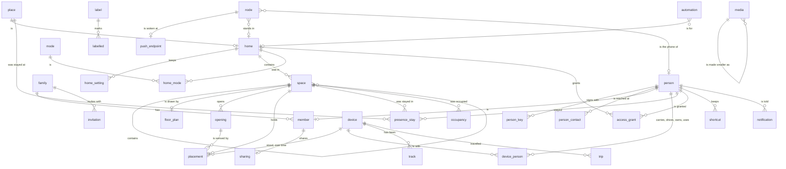

# The world model: people, families, homes, rooms, and where things are

The plan for what kraftverk knows about the world beyond its devices, and
how its databases hold it. Devices, integrations and services are there
today. A home automation suite for families also needs the people, the
families they make, the homes they live in, the rooms and floors inside
those homes, and where every device and person is. 2026-10-08, revised the
same day after a review of the first draft (§20).

This is discovery and design. Nothing below is built. It decides the shape
first, because the data model is the expensive thing to change later.
[DATA-MODEL.md](DATA-MODEL.md) stays the authority for what is built, and
takes each part in as it is built. Every table here is written out field
by field. The SQL is the design, to argue over, not yet the schema.

## 1. What changes, and what it decides

kraftverk has been a hub for devices. It becomes a home automation suite
for families: people who live in one home or several, share their devices,
see where each other is when they choose to, and automate their days. That
puts new kinds of thing in the model:

- **People.** A person signs up on their own phone, and is a person from
  then on. No server is needed.
- **Families.** The people who share devices, nodes and homes: a family,
  a household, friends with a cabin. A person may be in more than one.
- **Homes.** A family may have several, such as a house and a cabin. Each
  has a place on the map, a time zone, and its own spaces.
- **Spaces.** Buildings, floors, rooms, the stairs, the garden, and the
  doors and windows between them. Room-to-room presence is worked out
  from them.
- **Where things are.** Any device can have a position. It may report
  one: a phone, a car, a robot cleaner on its own map. Or a person may
  mark where it stands: a plug in the kitchen, a sensor on the front
  door. Both are kept over time, and both can be coordinates: on the
  globe, or in metres within a room.

It closes a question left open since 2026-10-02: a home, or places alone?
**The family is the root, and homes are inside it.** The `home` row that
bounds one database, one master node and one configuration file today
becomes the family. A home becomes a property inside it, and a family has
as many as it needs.

## 2. Where it stands today

- **One database, one root.** The `home` table holds one row: the root
  every device and node belongs to. It names the master node, and has an
  optional latitude and longitude for the sun's times. "Home" is also the
  word for the root throughout the code (`KraftverkApi` is "everything a
  home answers").
- **One writer.** The master's database is the family's. A follower keeps
  what the master's API answered, as JSON by question (`last_heard`,
  `packages/hub/src/follower/heard.ts`), and a copy of the configuration
  file. It mirrors in its own database only the devices it holds ways for.
  Nothing is replicated row by row, and nothing is ever merged
  ([PLAN-SHARED-CORE.md](PLAN-SHARED-CORE.md)).
- **Devices are flat.** A device has no room and no home. Where it is, is
  a `position` reading if it reports one, and its track if its track is
  kept ([PLAN-MAPS.md](PLAN-MAPS.md)).
- **Accounts belong to a server** (`users`, `login_session`,
  `server/src/auth/schema.ts`): a username and a password hash. They are
  not people, and a phone keeping a home of its own has none.
  [ACCOUNTS.md](ACCOUNTS.md) plans owners, members and an operator. Its
  "home" is this plan's family.
- **Who did something** is free text in several places: the timeline's
  `actor`, `device_switch.switched_by`, `device_write.written_by`,
  `automation_run.started_by`.
- **Ids** are a prefix and 64 random bits in hex (`d-3f9a2c61b0e43f9a`),
  made where the thing is made (`newId`).
- **The configuration file** names everything by a key, and keeps no ids
  (CONFIG.md, "Keys").

## 3. What others model, and what to take

| | What it models | Take | Leave |
| --- | --- | --- | --- |
| **Home Assistant** | Persons placed by their device trackers; zones as circles; areas, floors above them; labels | A person placed by what they carry; zones; floors; labels across everything | A person and an account blurred; presence as one state string; no history of where a device was installed |
| **Apple Home** | Several homes; rooms; people with permissions; "the first arrives, the last leaves" | Several homes per person; invitations; first and last as built-in ideas | Rooms with no geometry; people only as Apple IDs |
| **Google Home** | Structures, rooms, household members | The household as the sharing boundary | |
| **SmartThings** | Locations with a geofence; rooms; members; modes | Modes as state with a history; a geofence per home | One mode at a time |
| **Life360** | Circles: a family, or friends, sharing where each is | That the group sharing location is not always a family | Location shared with a company |
| **Brick, IFC** | Site, building, storey, space; doors and stairs; what is part of what | A tree of spaces with kinds; openings between spaces; floors with elevations | A whole building ontology |
| **Robot cleaners, Matter service areas** | A device's own map of a home, its areas, its position on that map | Coordinates within a home, in a frame of its own (§8.7) | A map only one device understands |

What none of them does well, and kraftverk should:

- **A person is not an account.** A small child, or someone not yet
  invited, is still a person.
- **Location is the person's to share,** and the model enforces it.
- **Where a device stood is history.** A temperature recorded in the
  kitchen stays the kitchen's after the sensor moves.
- **It works with no server.** A person is made on their phone, and a
  family can live on phones alone.

## 4. The word: family

The root needs one word, in code and on screen. The candidates:

| Word | For | Against |
| --- | --- | --- |
| **family** | Warm; what most people are in; what was asked for | Strained for flatmates or a group of friends |
| household | Exact for people living together | Wrong for friends sharing a cabin; colder |
| group | Neutral | Already taken: a group of parts in the automation language (`GroupRole`, "for each"), Zigbee groups, Home Assistant's groups. Three meanings is two too many |
| circle | Neutral; Life360's word for the same thing | Unfamiliar; says nothing about a home |

**Recommended: `family` in code, with a kind that changes only the words on
screen.** A family's kind is `family`, `household`, `friends` or `other`,
and the app says "your family", "your household", "your friends" or "your
group". A group of friends can be a family in the model and never see the
word. The code keeps one noun, and nothing in it depends on the kind.

## 5. Principles

1. **Definitions in code, records in the database.** As now. The kinds of
   space, the roles, the sharing levels are words the code declares. Your
   rooms are records.
2. **A person is not an account.** A person is someone in the world. A key
   on their device says they are that person. A password or passkey at a
   server is another way to sign in there.
3. **One writer per family.** The master writes the family's database.
   Everyone else asks it. Nothing is merged. This rule is what makes the
   rest tractable, and the plan keeps it.
4. **Every fact is kept the way it changes** (§12). Configuration is
   overwritten and audited. Current state is replaced. A series is
   appended and pruned. An event is appended. A stay, a placement or a
   carrier is an interval. Each fact gets exactly one of these, on purpose.
5. **Normalised to the third normal form, with every exception named.**
   A fact is stored once. What can be derived is derived, unless it is
   kept on purpose as current state, and then it is called that (§6).
6. **Data lives with whoever it belongs to** (§7). The family's things go
   in the family's database. A person's own things go in their personal
   store. What crosses between them is what the person shares.
7. **Privacy is enforced where the data is.** The master answers each
   reader at what each person shares. A phone that is the source sends no
   more than that (§11).
8. **Ask for no more than a feature needs.** No field is added "in case".
   §16 lists what was considered and left out until something needs it.
9. **Made where it is born.** Ids and keys are made by whoever creates the
   thing, as node ids are now, so it all works on phones alone.
10. **Strict version 1, still.** One schema per kind of database, changed
    everywhere at once. The configuration file is the one thing
    versioned, and it carries a family across a reset.

## 6. How every table is kept

The rules every table follows, so that each field below needs no special
explanation.

**Ids.**
- New ids are a prefix and a ULID: `p-01JA8ZK3Q4R7T9V2W5X6Y8Z0AB`. That is
  128 bits, sortable by when it was made, and made anywhere with no
  coordination.
- Today's 64-bit hex ids change to the same form everywhere at once
  (decision 11). A family's ids then stay unique in a hosted service with
  millions of families, and the newest rows sit together in an index.
- Prefixes: `f` family, `p` person, `i` invitation, `g` grant, `h` home,
  `z` zone, `s` space, `o` opening, `l` label, `t` trip, `a` automation,
  `d` device, `n` node. A mode is a word (`away`) or `m-…`.
- Two ids are derived, not random:
  - a key's id is its RFC 7638 thumbprint, so the same key always has the
    same id;
  - a picture's id is the SHA-256 of its bytes, so the same picture is
    kept once.

**Times.**
- An instant is ISO 8601 text in UTC, to the millisecond:
  `2026-10-08T11:10:41.123Z`. Text of that shape sorts by time.
- A calendar date is `YYYY-MM-DD`, with no time zone: a warranty's end.
- A length of time is whole seconds.

**Quantities.**
- One unit per kind of quantity, in the column's comment: metres, degrees,
  watt-hours, seconds.
- Money is an integer in the currency's minor unit, with its ISO 4217 code
  beside it.

**Words and codes.**
- A language is BCP 47 (`sv-SE`), a country ISO 3166-1 alpha-2 (`SE`), a
  time zone IANA (`Europe/Stockholm`), a colour `#rrggbb`.
- A vocabulary is text with a CHECK naming every value. A new value is a
  schema change, as everything is under strict version 1.
- Names are trimmed text, with a length the CHECK states.

**Geometry.**
- On the globe it is WGS 84. Latitude and longitude are columns for a
  point, and GeoJSON (longitude first) for a shape.
- Within a home it is metres in a frame (§8.7): x east and y north when
  the frame is unrotated, z up.

**Null.** Null means "not said" or "does not apply", and the comment says
which. It never means "an older row".

**Intervals.** A fact true for a while has `since` and `until`, with
`until` null while it is true now and `CHECK (until IS NULL OR until >
since)`. A partial unique index allows one open row where only one may be
true at a time. "True at t" is `since <= t AND (until IS NULL OR until >
t)`. Overlapping closed rows cannot be stopped by SQLite. The store closes
the open row in the same transaction that opens the next, and a test holds
it to that.

**Who did it** — the actor — is the same three fields everywhere:
`actor_kind` (`person`, `automation`, `node`, `integration`, `system`),
`actor_id`, and `actor_name` as it was called then. That covers the
timeline, `device_switch`, `device_write`, `automation_run`,
`placement`, `home_mode` and the rest.

**References.**
- A live relation is a foreign key.
- A record of what happened (the timeline, run logs) keeps ids and names
  as they were, with no foreign key, so renaming or removing something
  never rewrites history.
- Where two references must agree, a composite foreign key makes them: a
  space's parent in the same home, a stay's place of the kind it says.

**Removing.**
- Something history points at is archived, with `removed_at`: a device, a
  place, a space, an opening.
- Details that mean nothing without their owner go with it, by
  `ON DELETE CASCADE`.
- A person is never deleted from a family's database while history names
  them. Erasing a person anonymises them (§11.6).

**Derived state.**
- Kept only where reading it must be cheap, and named "current state":
  `device_reading` now, nothing new.
- Everything else derived is computed:
  - which home a placement is in comes from its space;
  - where a person is comes from their open stays;
  - a person's position comes from what they carry.

## 7. Three kinds of database

Today there is one kind: a home's, the server's accounts beside it. The
plan has three, each with one schema, and each set aside and started afresh
when its schema changes. The family's and the person's live in
`packages/store`, since every node runs them. The node's is the server's,
in `server/src/auth` as now, because only a node with an HTTP entrance has
sign-ins (AGENTS.md: accounts are the server's). It moves into a file of
its own, so resetting a family's database never touches who may sign in.

| Database | Holds | Where | Written by |
| --- | --- | --- | --- |
| **The family's** | Everything the family shares: people as the family knows them, homes, spaces, devices, automations, history, presence at each person's level | On the master. A follower keeps what the master answered, as now | The master only |
| **A node's** | What one machine is: its sign-ins (passwords, passkeys), its operator, which families it serves and in which role | On every node with an HTTP entrance: a server. Today these are `users` and `login_session` beside the home's tables | The node |
| **A person's** | The person's own: their private key's handle, which families they are in and where each master is, their private places, their own settings, their own history if they keep it | On each of the person's devices | That device |

- **A phone in two families** keeps two follower caches. It holds two live
  streams, one to each master, and has one personal store. A phone that
  is a family's master keeps that family's database too.
- **A node serving several families** opens a database for each. A hosted
  service is that at scale: every family is its own database, so no query
  can forget to scope itself to one.
- **The personal store** is in `packages/store`, with its own schema and
  fingerprint. The hub opens it beside the family's. It runs on a phone
  and in a browser like everything else.
- **The node's database** is `node.db` beside the family's on a server,
  holding `login`, `login_session` and `operator`. It is set aside only
  when its own schema changes.

## 8. The family's database, table by table

### 8.1 The family

```sql
CREATE TABLE family (
  id          TEXT PRIMARY KEY,               -- f-…, made with it
  name        TEXT NOT NULL CHECK (length(name) BETWEEN 1 AND 60),
  kind        TEXT NOT NULL DEFAULT 'family' CHECK (kind IN ('family', 'household', 'friends', 'other')),
                                              -- only the words on screen (§4)
  picture_id  TEXT REFERENCES media (id),
  locale      TEXT NOT NULL,                  -- BCP 47: what is said to all of it (an announcement, a speaker)
  master_id   TEXT NOT NULL REFERENCES node (id) DEFERRABLE INITIALLY DEFERRED,
  created_at  TEXT NOT NULL,
  created_by  TEXT NOT NULL REFERENCES person (id) DEFERRABLE INITIALLY DEFERRED
);
-- One row: the database is the family.
```

Today's `home` row becomes this one. Its location moves to the first home.

### 8.2 People

A person as this family knows them. The person owns their profile. The
family keeps a copy, and the newest copy wins. A person an admin keeps for
someone who has no device yet, such as a small child, is `managed_by` that
admin.

```sql
CREATE TABLE person (
  id          TEXT PRIMARY KEY,               -- p-…, made where they signed up; the same in every family (§10)
  kind        TEXT NOT NULL DEFAULT 'human' CHECK (kind IN ('human')),  -- 'pet' when a tag on a collar needs it
  name        TEXT NOT NULL CHECK (length(name) BETWEEN 1 AND 100),
                                              -- whole, as they write it: no given or family name split
  short_name  TEXT CHECK (length(short_name) BETWEEN 1 AND 30),
                                              -- what screens and speakers call them; null: the name
  picture_id  TEXT REFERENCES media (id),
  locale      TEXT,                           -- BCP 47: the language they are told things in; null: the family's
  managed_by  TEXT REFERENCES person (id),    -- the admin who keeps them; null: they keep themselves
  updated_at  TEXT NOT NULL,                  -- the profile's own time: a newer copy replaces an older
  erased_at   TEXT                            -- erased (§11.6): name and picture gone, the row kept for history
);

-- How to reach them outside kraftverk, when they choose to give it.
CREATE TABLE person_contact (
  person_id   TEXT NOT NULL REFERENCES person (id) ON DELETE CASCADE,
  kind        TEXT NOT NULL CHECK (kind IN ('email', 'phone')),
  value       TEXT NOT NULL,                  -- lower-case email; a phone number in E.164
  label       TEXT CHECK (length(label) <= 30),   -- "work"
  verified_at TEXT,
  PRIMARY KEY (person_id, kind, value)
);

-- The public keys a person signs with (§10). The private halves never leave their devices.
CREATE TABLE person_key (
  id          TEXT PRIMARY KEY,               -- the key's thumbprint
  person_id   TEXT NOT NULL REFERENCES person (id),
  kind        TEXT NOT NULL CHECK (kind IN ('device', 'recovery')),
  public_key  TEXT NOT NULL,                  -- a JWK, P-256
  device_name TEXT,                           -- "Anna's phone": which device holds it; null for a recovery key
  added_at    TEXT NOT NULL,
  added_with  TEXT REFERENCES person_key (id),-- the key that signed it in; null for their first
  revoked_at  TEXT
);
CREATE INDEX person_key_person ON person_key (person_id) WHERE revoked_at IS NULL;
```

### 8.3 Members, what each shares, invitations, guests

Being in the family is a row, with a role. What a person calls themselves
belongs to them. What this family calls them, and their colour on its
map, belongs to the family.

```sql
CREATE TABLE member (
  person_id   TEXT PRIMARY KEY REFERENCES person (id),
  role        TEXT NOT NULL CHECK (role IN ('admin', 'member', 'child')),
                                              -- changes are on the timeline; at least one admin, always (the store's rule)
  nickname    TEXT CHECK (length(nickname) <= 30),   -- what this family calls them: "Mum"
  color       TEXT NOT NULL CHECK (color GLOB '#[0-9a-f][0-9a-f][0-9a-f][0-9a-f][0-9a-f][0-9a-f]'),
  joined_at   TEXT NOT NULL,
  invited_by  TEXT REFERENCES person (id),
  left_at     TEXT                            -- left, or was removed; the row stays for the history that names them
);
CREATE UNIQUE INDEX member_color ON member (color) WHERE left_at IS NULL;

-- What each member shares with the family (§11), and for how long their stays are kept.
CREATE TABLE sharing (
  person_id    TEXT PRIMARY KEY REFERENCES member (person_id),
  level        TEXT NOT NULL CHECK (level IN ('precise', 'places', 'home-away', 'off')),
  paused_until TEXT,                          -- 'off' until then, and the level after
  keep_days    INTEGER NOT NULL DEFAULT 90 CHECK (keep_days BETWEEN 1 AND 366),
                                              -- how long their stays are kept; the family may keep less, never more
  set_by       TEXT NOT NULL REFERENCES person (id),  -- themselves, or an admin for a child
  changed_at   TEXT NOT NULL
);

CREATE TABLE invitation (
  id             TEXT PRIMARY KEY,            -- i-…
  offers         TEXT NOT NULL CHECK (offers IN ('member', 'guest')),
  role           TEXT CHECK (role IN ('admin', 'member', 'child')),  -- for a member
  grant_id       TEXT REFERENCES access_grant (id),                  -- for a guest: the grant it hands over
  for_person     TEXT REFERENCES person (id), -- a managed person it lets claim their record (§10.4); null: anyone
  for_name       TEXT CHECK (length(for_name) <= 60),   -- who it is meant for, as the inviter said
  secret_hash    TEXT NOT NULL,               -- SHA-256 of the one-time secret in the link
  needs_approval INTEGER NOT NULL CHECK (needs_approval IN (0, 1)),
  made_by        TEXT NOT NULL REFERENCES person (id),
  made_at        TEXT NOT NULL,
  expires_at     TEXT NOT NULL,
  used_by        TEXT REFERENCES person (id),
  used_at        TEXT,
  approved_by    TEXT REFERENCES person (id),
  revoked_at     TEXT,
  CHECK ((offers = 'member') = (role IS NOT NULL)),
  CHECK ((offers = 'guest') = (grant_id IS NOT NULL))
);

-- Access for someone who is not a member: the dog-sitter for a week. (GRANT is SQL's word, so access_grant.)
CREATE TABLE access_grant (
  id          TEXT PRIMARY KEY,               -- g-…
  person_id   TEXT REFERENCES person (id),    -- null until an invitation is taken
  home_id     TEXT NOT NULL REFERENCES home (id),
  may         TEXT NOT NULL CHECK (may IN ('see', 'use', 'unlock')),  -- each allows the one before
  since       TEXT NOT NULL,
  until       TEXT,
  made_by     TEXT NOT NULL REFERENCES person (id),
  revoked_at  TEXT,
  CHECK (until IS NULL OR until > since)
);
```

### 8.4 Places: homes and zones

A home and a zone are both places on the globe. Presence asks both the
same way, so the geofence lives in one table. A home has more than a zone,
so it has its own table too, one-to-one.

```sql
CREATE TABLE place (
  id          TEXT PRIMARY KEY,               -- h-… a home, z-… a zone
  kind        TEXT NOT NULL CHECK (kind IN ('home', 'zone')),
  name        TEXT NOT NULL CHECK (length(name) BETWEEN 1 AND 60),
  icon        TEXT,
  latitude    REAL CHECK (latitude BETWEEN -90 AND 90),
  longitude   REAL CHECK (longitude BETWEEN -180 AND 180),
  radius      REAL CHECK (radius > 0),        -- metres: the geofence
  outline     TEXT,                           -- a GeoJSON Polygon, when drawn: then it is the geofence, and radius its circle
  time_zone   TEXT,                           -- IANA; a home's always (CHECK below)
  street      TEXT, postal_code TEXT, locality TEXT, region TEXT,  -- the address, as written; all optional
  country     TEXT CHECK (country GLOB '[A-Z][A-Z]'),  -- what Maps offers to download
  created_at  TEXT NOT NULL,
  removed_at  TEXT,
  UNIQUE (id, kind),
  CHECK ((latitude IS NULL) = (longitude IS NULL)),
  CHECK ((latitude IS NULL) = (radius IS NULL)),       -- a geofence needs a centre, and a centre has one
  CHECK (kind = 'home' OR latitude IS NOT NULL),       -- a zone is where it is; a home may not have said yet
  CHECK (kind <> 'home' OR time_zone IS NOT NULL)
);

CREATE TABLE home (
  id          TEXT PRIMARY KEY,
  kind        TEXT NOT NULL DEFAULT 'home' CHECK (kind = 'home'),
  type        TEXT NOT NULL CHECK (type IN ('house', 'apartment', 'cabin', 'boat', 'caravan', 'office', 'other')),
  picture_id  TEXT REFERENCES media (id),
  bearing     REAL NOT NULL DEFAULT 0 CHECK (bearing >= 0 AND bearing < 360),
                                              -- degrees from north to the home's y axis: its frame on the globe (§8.7)
  position    INTEGER NOT NULL,               -- its order among the family's homes
  FOREIGN KEY (id, kind) REFERENCES place (id, kind)
);

-- A home's own values, by a name the schema lists: today's per-database home_setting, per home.
CREATE TABLE home_setting (
  home_id    TEXT NOT NULL REFERENCES home (id),
  key        TEXT NOT NULL CHECK (key IN ('policy.values', 'prices.area')),
  value      TEXT NOT NULL,                   -- JSON
  updated_at TEXT NOT NULL,
  PRIMARY KEY (home_id, key)
);
```

- **Moving house is a new home.** The old one is archived. What was
  recorded there stays the old home's.
- **A person's private places** ("my therapist") have the same columns,
  in their personal store, and never reach the family.

### 8.5 Spaces

A tree within a home. The home's `site` is its root. A space's parent is
in the same home, and a composite foreign key makes it so.

| Kind | What | Parent |
| --- | --- | --- |
| `site` | The home's ground: where "in the cabin, room not said" is placed | None (one per home) |
| `building` | The house, a garage, a guest cottage | The site |
| `floor` | A storey, with its level and elevation | A building |
| `room` | A kitchen, a hallway | A floor |
| `area` | Part of a room: the sofa corner | A room |
| `stairs` | A stairwell. The floors it joins are its openings | A building |
| `outdoor` | The garden, the driveway, a terrace | The site |

```sql
CREATE TABLE space (
  id          TEXT PRIMARY KEY,               -- s-…
  home_id     TEXT NOT NULL REFERENCES home (id),
  parent_id   TEXT,
  kind        TEXT NOT NULL CHECK (kind IN ('site', 'building', 'floor', 'room', 'area', 'stairs', 'outdoor')),
  purpose     TEXT CHECK (purpose IN ('kitchen', 'living', 'dining', 'bedroom', 'children', 'guest', 'bathroom',
                                      'toilet', 'hallway', 'office', 'laundry', 'storage', 'utility', 'garage',
                                      'gym', 'sauna', 'other')),
                                              -- what a room is for: icons, defaults, "every bathroom"; null: not said
  name        TEXT NOT NULL CHECK (length(name) BETWEEN 1 AND 60),
  icon        TEXT,
  picture_id  TEXT REFERENCES media (id),
  position    INTEGER NOT NULL DEFAULT 0,     -- its order among its siblings
  level       INTEGER,                        -- a floor's: 0 the ground floor, -1 below it
  elevation   REAL,                           -- a floor's: metres above the site's ground
  height      REAL CHECK (height > 0),        -- metres floor to ceiling: with the outline, a room's volume
  -- Its frame (§8.7): where its origin is, and how it is turned, in its parent's frame. Null: its parent's frame.
  frame_x     REAL, frame_y REAL,
  frame_turn  REAL CHECK (frame_turn >= 0 AND frame_turn < 360),
  outline     TEXT,                           -- a GeoJSON Polygon in metres, in its own frame; not WGS 84
  created_at  TEXT NOT NULL,
  removed_at  TEXT,
  UNIQUE (home_id, id),
  FOREIGN KEY (home_id, parent_id) REFERENCES space (home_id, id),
  CHECK ((kind = 'site') = (parent_id IS NULL)),
  CHECK ((kind = 'floor') = (level IS NOT NULL)),
  CHECK (kind = 'floor' OR elevation IS NULL),
  CHECK ((frame_x IS NULL) = (frame_y IS NULL) AND (frame_x IS NULL) = (frame_turn IS NULL))
);
CREATE UNIQUE INDEX space_site ON space (home_id) WHERE kind = 'site';

-- A drawing of a floor, placed in its frame: what rooms are traced over.
CREATE TABLE floor_plan (
  space_id    TEXT PRIMARY KEY REFERENCES space (id),  -- a floor (the store's rule)
  media_id    TEXT NOT NULL REFERENCES media (id),
  scale       REAL NOT NULL CHECK (scale > 0),         -- metres per pixel
  x           REAL NOT NULL, y REAL NOT NULL,          -- where the image's top-left corner falls, in the floor's frame
  turn        REAL NOT NULL DEFAULT 0
);

-- Where two spaces meet, or a space meets the outside: what presence moves along.
CREATE TABLE opening (
  id          TEXT PRIMARY KEY,               -- o-…
  home_id     TEXT NOT NULL,
  from_id     TEXT NOT NULL,
  to_id       TEXT,                           -- null: outside
  kind        TEXT NOT NULL CHECK (kind IN ('door', 'opening', 'stairs', 'window', 'gate', 'garage-door', 'elevator')),
  name        TEXT CHECK (length(name) <= 60),-- "Front door"
  shape       TEXT,                           -- a GeoJSON LineString in metres, in from_id's frame: where in the wall
  removed_at  TEXT,
  FOREIGN KEY (home_id, from_id) REFERENCES space (home_id, id),
  FOREIGN KEY (home_id, to_id) REFERENCES space (home_id, id),
  CHECK (to_id IS NULL OR to_id <> from_id)
);
```

- **An opening has no device column.** A door's contact sensor, its lock
  and its doorbell are each *placed* at the opening (§8.7). That allows
  any number of devices, each with its own history of standing there, and
  what each does is its capabilities' to say.
- **Two openings between the same two spaces are allowed.** A kitchen may
  have two doors to the hallway.

### 8.6 Devices, again

The `device` table keeps what it has, with three changes:

- `picture` becomes two columns, `picture_type` (its type's Nth) and
  `picture_id` (a photo of its own, in `media`), at most one of them set.
  This is the `own:<id>` reserved today.
- Who switched and wrote, in `device_switch` and `device_write`, becomes an
  actor (§6).
- Its type declares a **mobility** in `meta`: `fixed`, `portable`,
  `carried`, `vehicle` or `service`. It is a hint and never a rule. It
  decides what the app offers first: "which room is it in?" for a plug,
  "who carries it?" for a phone. Any device may still be placed, and any
  device may still report a position.

What a household keeps about a thing it bought, one-to-one, only when
given:

```sql
CREATE TABLE device_asset (
  device_id      TEXT PRIMARY KEY REFERENCES device (id) ON DELETE CASCADE,
  bought_on      TEXT,                        -- YYYY-MM-DD
  bought_from    TEXT,
  price          INTEGER,                     -- minor units
  currency       TEXT CHECK (currency GLOB '[A-Z][A-Z][A-Z]'),
  warranty_until TEXT,                        -- YYYY-MM-DD
  notes          TEXT,
  CHECK ((price IS NULL) = (currency IS NULL))
);
```

### 8.7 Where a device is

Every device can be somewhere, in two ways, and a device may have both:

- **It says where it is.** A phone, a car or a tracker reports a
  `position` reading. That is today's `device_reading`, and its `track`
  when kept. A robot cleaner reports where it is on its own map of the
  home. That is a position in a home's frame, below.
- **A person marks where it is.** A plug, a thermostat or a sensor that
  cannot say where it is gets placed: in a home, in a space, optionally
  at coordinates in that space, optionally at an opening.

**Frames.** Coordinates within a home are metres in a frame:

- The site's frame is anchored to the globe by the home's place (its
  origin) and its `bearing` (which way its y axis points).
- Any space may have a frame of its own: an origin and a turn within its
  parent's frame. A room drawn square to its own walls stays square
  however the house sits.
- A space without one uses its parent's frame.
- Any point in any space can be turned into any other frame, or into
  latitude and longitude, by walking up the tree.

Nothing has to be drawn for any of this to work. A device placed "in the
kitchen" with no coordinates is the common case, and it is enough.

```sql
CREATE TABLE placement (
  id          TEXT PRIMARY KEY,
  device_id   TEXT NOT NULL REFERENCES device (id),
  part        TEXT NOT NULL DEFAULT 'main',   -- a part standing apart: an outdoor probe
  space_id    TEXT NOT NULL REFERENCES space (id),
                                              -- the home is its space's; the site when no room is said
  opening_id  TEXT REFERENCES opening (id),   -- on the front door, at the bedroom window
  x REAL, y REAL,                             -- metres, in the space's frame
  z           REAL,                           -- metres above the floor: a sensor's height on the wall
  facing      REAL CHECK (facing >= 0 AND facing < 360),  -- degrees in the space's frame: a radar's, a camera's
  role        TEXT NOT NULL DEFAULT 'stands' CHECK (role IN ('stands', 'based')),
                                              -- based: where something that moves belongs, a car's garage
  since       TEXT NOT NULL,
  until       TEXT,
  actor_kind  TEXT NOT NULL, actor_id TEXT, actor_name TEXT NOT NULL,   -- who placed it
  CHECK ((x IS NULL) = (y IS NULL)),
  CHECK (z IS NULL OR x IS NOT NULL),
  CHECK (until IS NULL OR until > since)
);
CREATE UNIQUE INDEX placement_now ON placement (device_id, part) WHERE until IS NULL;
```

- **Moving a device** closes one placement and opens the next. Its
  readings are the old room's before that, and the new room's after.
  Charts, room views and automations ask what the placement was at the
  time of each reading.
- **Where a device is, at a time,** is its reported position if it has a
  current one. Otherwise it is its placement. For a car that is "based"
  in the garage, it is the garage until its own position says otherwise.
- **Coordinates of other kinds**, such as a robot cleaner's map, a UWB
  anchor's grid or a beacon's estimate, are a position in a space's frame.
  Today's `position` value is latitude and longitude. When a device first
  reports positions in a frame, the value gains a `frame` (a space's id)
  and coordinates in metres. The table above needs no change for that.

### 8.8 A device and its people

```sql
CREATE TABLE device_person (
  device_id   TEXT NOT NULL REFERENCES device (id),
  person_id   TEXT NOT NULL REFERENCES person (id),
  role        TEXT NOT NULL CHECK (role IN ('carries', 'drives', 'owns', 'uses')),
                                              -- carries: its position is theirs; drives: its usual driver;
                                              -- owns: it is theirs; uses: theirs to use, "my lamp"
  since       TEXT NOT NULL,
  until       TEXT,
  PRIMARY KEY (device_id, person_id, role, since),
  CHECK (until IS NULL OR until > since)
);
-- One carrier at a time, and one usual driver.
CREATE UNIQUE INDEX device_person_one ON device_person (device_id, role) WHERE until IS NULL AND role IN ('carries', 'drives');
```

### 8.9 Presence

Where a person is, is not stored as a value. It comes from three things:

- **Their position** is the freshest, most certain position of what they
  carry, at what they share. It is computed, not kept: the device's
  reading is the fact.
- **Their stays:** at a home, in a zone, in a room. These are intervals,
  and their open rows are where the person is now.
- **What they share** (§11) decides what of either others see.

```sql
CREATE TABLE presence_stay (
  id          TEXT PRIMARY KEY,
  person_id   TEXT NOT NULL REFERENCES person (id),
  place_id    TEXT,                           -- a home or a zone
  place_kind  TEXT CHECK (place_kind IN ('home', 'zone')),
  space_id    TEXT REFERENCES space (id),     -- a room, at a home
  since       TEXT NOT NULL,
  until       TEXT,
  device_id   TEXT REFERENCES device (id),    -- what placed them there
  FOREIGN KEY (place_id, place_kind) REFERENCES place (id, kind),
  CHECK ((place_id IS NULL) = (place_kind IS NULL)),
  CHECK ((place_id IS NULL) <> (space_id IS NULL)),
  CHECK (until IS NULL OR until > since)
);
-- At one home at a time, and in one room at a time. Zones may overlap: a workplace inside a town.
CREATE UNIQUE INDEX presence_stay_home ON presence_stay (person_id) WHERE until IS NULL AND place_kind = 'home';
CREATE UNIQUE INDEX presence_stay_room ON presence_stay (person_id) WHERE until IS NULL AND space_id IS NOT NULL;
CREATE INDEX presence_stay_place ON presence_stay (place_id, since);
```

- **"Away"** is no open home stay.
- **Arriving** needs a position inside the geofence. **Leaving** needs
  positions outside it for some minutes. A GPS wobble at the edge is not a
  departure. Each home tunes this.
- **A room stay** needs a signal that tells people apart, such as their
  watch heard by a room's receiver. Anything less is occupancy.

```sql
-- Whether a space has someone in it, whoever they are: "the bathroom is empty".
CREATE TABLE occupancy (
  id          TEXT PRIMARY KEY,
  space_id    TEXT NOT NULL REFERENCES space (id),
  since       TEXT NOT NULL,                  -- occupied from …
  until       TEXT,                           -- … to; null: still
  peak        INTEGER CHECK (peak > 0),       -- the most there at once, when a sensor counts; a new count is not a new interval
  CHECK (until IS NULL OR until > since)
);
CREATE UNIQUE INDEX occupancy_now ON occupancy (space_id) WHERE until IS NULL;

CREATE TABLE occupancy_evidence (
  occupancy_id TEXT NOT NULL REFERENCES occupancy (id) ON DELETE CASCADE,
  device_id    TEXT NOT NULL REFERENCES device (id),
  PRIMARY KEY (occupancy_id, device_id)
);
```

### 8.10 Modes

A home is in a mode on each of two axes at once. Presence is `home`,
`away` or `vacation`. The day is `day`, `evening` or `night`. So "on
vacation, and it is night" is two open rows. A family may add its own
modes to either axis.

```sql
CREATE TABLE mode (
  id          TEXT PRIMARY KEY,               -- 'home', 'away', 'vacation', 'day', 'evening', 'night'; m-… a family's own
  axis        TEXT NOT NULL CHECK (axis IN ('presence', 'day')),
  name        TEXT NOT NULL CHECK (length(name) BETWEEN 1 AND 30),
  icon        TEXT,
  built_in    INTEGER NOT NULL CHECK (built_in IN (0, 1)),
  UNIQUE (id, axis)
);

CREATE TABLE home_mode (
  home_id     TEXT NOT NULL REFERENCES home (id),
  mode_id     TEXT NOT NULL,
  axis        TEXT NOT NULL,
  since       TEXT NOT NULL,                  -- may lie ahead: vacation from Saturday
  until       TEXT,
  actor_kind  TEXT NOT NULL, actor_id TEXT, actor_name TEXT NOT NULL,
  PRIMARY KEY (home_id, axis, since),
  FOREIGN KEY (mode_id, axis) REFERENCES mode (id, axis),
  CHECK (until IS NULL OR until > since)
);
CREATE UNIQUE INDEX home_mode_now ON home_mode (home_id, axis) WHERE until IS NULL;
```

### 8.11 Trips

A vehicle's journey, from where it stopped to where it next stopped. Trips
are found from positions as they arrive, whether or not the track is kept:
the trip keeps the summary. Its path is in `track` when the track is kept,
and is never copied.

```sql
CREATE TABLE trip (
  id          TEXT PRIMARY KEY,               -- t-…
  device_id   TEXT NOT NULL REFERENCES device (id),
  driver_id   TEXT REFERENCES person (id),    -- its usual driver, unless someone says otherwise
  started_at  TEXT NOT NULL,
  ended_at    TEXT,                           -- null: under way
  from_place  TEXT REFERENCES place (id),     -- a home or zone it left, when it was in one
  to_place    TEXT REFERENCES place (id),
  from_lat REAL, from_lon REAL, to_lat REAL, to_lon REAL,
  distance    REAL CHECK (distance >= 0),     -- metres
  energy      REAL,                           -- Wh, when the vehicle says
  CHECK (ended_at IS NULL OR ended_at > started_at)
);
CREATE INDEX trip_device ON trip (device_id, started_at);
```

### 8.12 Pictures and files

Pictures of people, homes, rooms and devices, and floor plans. They are
kept by their content.

```sql
CREATE TABLE media (
  id           TEXT PRIMARY KEY,              -- the SHA-256 of its bytes, hex
  type         TEXT NOT NULL CHECK (type IN ('image/webp', 'image/jpeg', 'image/png')),
                                              -- no SVG: a picture never runs script
  bytes        INTEGER NOT NULL CHECK (bytes BETWEEN 1 AND 2097152),
  width        INTEGER NOT NULL CHECK (width > 0),
  height       INTEGER NOT NULL CHECK (height > 0),
  derived_from TEXT REFERENCES media (id) ON DELETE CASCADE,  -- a smaller copy of
  variant      TEXT CHECK (variant IN ('thumb', 'screen')),   -- 256 px, 1280 px; null: as given
  added_at     TEXT NOT NULL,
  CHECK ((derived_from IS NULL) = (variant IS NULL))
);

-- The bytes apart, so listing pictures never reads them.
CREATE TABLE media_data (
  media_id TEXT PRIMARY KEY REFERENCES media (id) ON DELETE CASCADE,
  data     BLOB NOT NULL
);
```

- **Made small, and stripped, where they are added.** The phone or
  browser re-encodes a picture as WebP, at most 2048 pixels on a side,
  with its metadata removed: a photo's EXIF can say where it was taken,
  and that must not leak.
- **A picture nobody points at is collected.**
- **Served** at `/api/media/<hash>`, cached for ever, since the name is
  the content.
- **Across a reset,** the configuration file names pictures by hash, and
  the files beside it hold them (`config/media/<hash>.webp`).
- **A receipt or a manual** (a PDF) would be a type more and a table
  joining a device to its documents. Not yet (§16).

### 8.13 Labels and shortcuts

```sql
-- Any grouping the family wants: "upstairs", "the kids", "heating". Across devices, spaces, people and automations.
CREATE TABLE label (
  id     TEXT PRIMARY KEY,                    -- l-…
  name   TEXT NOT NULL UNIQUE CHECK (length(name) BETWEEN 1 AND 30),
  color  TEXT,
  icon   TEXT
);

CREATE TABLE labelled (
  label_id      TEXT NOT NULL REFERENCES label (id) ON DELETE CASCADE,
  device_id     TEXT REFERENCES device (id) ON DELETE CASCADE,
  space_id      TEXT REFERENCES space (id) ON DELETE CASCADE,
  person_id     TEXT REFERENCES person (id) ON DELETE CASCADE,
  automation_id TEXT REFERENCES automation (id) ON DELETE CASCADE,
  CHECK ((device_id IS NOT NULL) + (space_id IS NOT NULL) + (person_id IS NOT NULL) + (automation_id IS NOT NULL) = 1)
);
CREATE UNIQUE INDEX labelled_device ON labelled (label_id, device_id) WHERE device_id IS NOT NULL;
CREATE UNIQUE INDEX labelled_space ON labelled (label_id, space_id) WHERE space_id IS NOT NULL;
CREATE UNIQUE INDEX labelled_person ON labelled (label_id, person_id) WHERE person_id IS NOT NULL;
CREATE UNIQUE INDEX labelled_automation ON labelled (label_id, automation_id) WHERE automation_id IS NOT NULL;

-- Each person's own shortcuts on a home's page: replaces automation.home_place, which is one list for everyone.
CREATE TABLE shortcut (
  person_id     TEXT NOT NULL REFERENCES person (id),
  home_id       TEXT REFERENCES home (id),    -- on that home's page; null: on every page
  device_id     TEXT REFERENCES device (id) ON DELETE CASCADE,
  automation_id TEXT REFERENCES automation (id) ON DELETE CASCADE,
  space_id      TEXT REFERENCES space (id) ON DELETE CASCADE,
  position      INTEGER NOT NULL CHECK (position >= 0),
  CHECK ((device_id IS NOT NULL) + (automation_id IS NOT NULL) + (space_id IS NOT NULL) = 1)
);
CREATE UNIQUE INDEX shortcut_place ON shortcut (person_id, coalesce(home_id, ''), position);
```

### 8.14 Notifications

"Tell Sam" needs Sam's devices, and a record of what was said.

```sql
-- Where a node can be woken with a message: a phone's push token. Replaced as the platform renews it.
CREATE TABLE push_endpoint (
  node_id     TEXT PRIMARY KEY REFERENCES node (id) ON DELETE CASCADE,
  provider    TEXT NOT NULL CHECK (provider IN ('apns', 'fcm', 'webpush')),
  token       TEXT NOT NULL,                  -- a secret in effect: kept as connection secrets are
  updated_at  TEXT NOT NULL
);

CREATE TABLE notification (
  id          TEXT PRIMARY KEY,
  person_id   TEXT NOT NULL REFERENCES person (id),
  home_id     TEXT REFERENCES home (id),      -- the home it is about, if one
  level       TEXT NOT NULL CHECK (level IN ('info', 'warning', 'alarm')),
  title       TEXT NOT NULL,
  body        TEXT,
  actor_kind  TEXT NOT NULL, actor_id TEXT, actor_name TEXT NOT NULL,   -- who said it: an automation, a device's event
  at          TEXT NOT NULL,
  delivered_at TEXT,
  read_at     TEXT
);
CREATE INDEX notification_person ON notification (person_id, at);
```

Which notifications a person wants, and their quiet hours, are their own
settings, in their personal store.

### 8.15 Nodes, the timeline, automations, again

- **`node`** gains `person_id` (whose phone it is, null for the family's
  own machines) and `home_id` (the home a fixed node stands in, null for
  one that moves). Neither decides who may do anything. **A request
  carries its person through sign-in, never through the node**, so a
  shared laptop is no one's.
- **`node_address`** `(node_id, url, reach: 'lan' | 'public', last_ok_at)`
  holds where a node can be reached. An invitation hands these out, and a
  phone in two families keeps them per family.
- **`audit`** has these fields:
  - `at`, `kind`;
  - the actor (§6), `for_person` (whom an automation acted for), and
    `via_node`;
  - `home_id`, the home it is about, if one, so a guest sees only their
    home's;
  - `resource_kind`, which also allows `family`, `person`, `member`,
    `home`, `zone`, `space`, `opening`, `invitation`, `grant`, `label` and
    `mode`;
  - `resource`, `summary`, `detail`.

  It has no foreign keys, as a record of what happened (§6).
- **`automation`** gains:
  - `home_id`, the home it is for. Its clock is that home's unless it
    says its own, so `time_zone` may be null and then means the home's.
    CHECK that it has one or the other.
  - `owner_id`, the person whose own automation it is ("my morning").
    Null means it is the family's.

  `home_place` goes to `shortcut`. `automation_run.started_by` becomes
  an actor.

## 9. One picture



## 10. Identity: keys, devices, loss and recovery

### 10.1 A person is their first key

Signing up on a phone makes a key pair there. The private half is
non-extractable: Web Crypto in a browser, the platform's keystore on a
phone. It also makes a person id, and the **person record**: the id, the
first key, the name and when. The first key signs it. Every later change
to the profile, and every key added or revoked, is a statement signed by a
key the person already has, kept in order. A family that is shown a person
checks the chain. Whoever joins cannot present someone else's id, because
they cannot sign as them.

The id is not the key's fingerprint. That would make the id change when the
key does. The id stays, and the keys come and go under it.

### 10.2 A second device, and a recovery key

- **A second device** makes its own key. An existing device signs it in,
  for example by scanning a code. Private keys never move between devices.
- **A recovery key** is made at sign-up and shown once, as words to write
  down. Its public half is a key like any other (`kind: 'recovery'`).
  With it, a person who has lost every device signs in a new one and
  revokes the rest.

### 10.3 A lost phone

Any remaining key of the person signs a revocation. Their phone sends it
to every family they are in. Each master marks the key revoked, and that
key's sign-ins end. With no key left and no recovery key, each family's
admins vouch for a new key in their own family. That is weaker by design,
and the timeline says so.

### 10.4 A person someone else keeps

A small child is made by an admin, with no key, `managed_by` that admin. In
a second family (the other parent's), they are a second managed record. The
day the child has a phone, they sign up as themselves. Each family invites
them with `for_person` naming its managed record. Taking the invitation
**claims** the record: in one transaction in that family's database, the
managed id becomes the child's own id everywhere it is used. Their history
in each family becomes theirs.

### 10.5 Signing in at a node

A node knows a person by a key it can challenge, a passkey registered
there, or a password set there. Those are the node's, in its own database
(§7):

- `login` holds `(id, person_id, kind: 'password' | 'passkey' | 'apple' |
  'google', subject, secret, sign_count, added_at, last_used_at,
  revoked_at)`, unique on `(kind, subject)` within that node.
- `login_session` names the person.
- `operator` is `(person_id, since)`.

Today's `users` become these. A passkey is bound to the node's address by
WebAuthn, so it could never be anything but the node's.

**A passkey and a device key** (W3.1). A browser that runs the app is a
device like a phone: it has its own key, made by Web Crypto and never
readable, and signs in at a server by that key's challenge. A passkey, a
password and a provider are the *node's* ways in, for a browser that is not
one of the person's devices — a borrowed laptop. They name the person in
`login`, and never sign the person's chain: a WebAuthn assertion signs what
the authenticator says, not a statement, so it cannot vouch for a key.

### 10.6 Accounts: on a device, with no server

Owner's decision, 2026-10-08: **an account works with no server**, and is
made in one of two ways — **with a sign-in provider** (Apple first, and
only Apple for now) or as **a local account**. Both make the same thing.

**Making one.** The app's first screen asks for an account before anything
else:

1. *Continue with Apple*, where this device offers it, or *Create a local
   account*.
2. Your name — filled in from the provider when it gives one — and a
   picture if you want.
3. Your twelve recovery words, shown once; two of them asked back, so they
   were written down.
4. Then your family (its name and kind), and your first home and where it
   is. This device is the family's master: a family of one, with no server.

Either way the device makes the person id, the device key and the recovery
key, and signs the chain's first statements. With a provider the chain
also says `linked` — the provider and the subject it gives this app, and
the email if one was given. The provider adds a way back; it never holds
the key, and nothing is sent anywhere.

**On the device.** The personal store keeps `me`: the person, their chain,
and where the key is. Opening the app opens it as them, with nothing to
type: the device's own lock is what guards a phone. A device can hold more
than one account — a family's tablet — each with its own personal store,
and *Switch account* lists them. *Sign out* returns to that list and keeps
the key; *Remove from this device* forgets the key and the personal store.

**Coming back** to an account a device no longer holds:

- **With the recovery words**, always: the recovery key signs a new device
  key into the chain, and the person is themselves again, everywhere.
- **With the provider**, where a family they are in agrees: its master
  sees a token whose subject is the one the person linked, and vouches for
  the new key *in that family* — `person_key` keeps a key the family
  vouched for beside the chain's. That is weaker than the chain, as an
  admin's vouching is (§10.3), and the timeline says so; typing the
  recovery words later signs the key into the chain properly.

**Providers are packages** (`packages/sign-in/*`), as integrations are: the
core names no product. A provider's package declares its id, name, issuer
and key set, and holds the code that asks the platform for a token —
Apple's: iOS's own sheet on a phone, Apple's JS in a browser served over
HTTPS where a Services ID is configured. The app offers a provider only
where its package says the platform can. A phone that is its family's
master takes the token as its system handed it, straight from the
provider; a server checks it (`verifyIdToken`: the provider's signature,
this app's id, its age, the nonce it asked for).

### 10.7 Keys on each platform (W3.1)

- **The algorithm**: ECDSA on P-256 over SHA-256, signatures as r ‖ s
  (64 bytes, as Web Crypto makes them), public keys as JWKs. Every node
  checks signatures with `@noble/curves` (pure JS, audited, MIT), so a
  phone needs no Web Crypto to check one; it accepts high-s signatures,
  since Web Crypto does not normalise them.
- **A browser**: a Web Crypto pair whose private half is not extractable,
  kept in IndexedDB as the object it is, as the sealing key is now.
- **A phone**: Expo has no signing API and Hermes has no Web Crypto. Three
  ways were weighed:
  - `react-native-quick-crypto`: a native build for OpenSSL in JSI, and its
    keys are bytes in JS anyway — no gain over the next;
  - a small native module over the Secure Enclave and Android's Keystore:
    the only truly non-extractable key on a phone, but a custom native
    build, and an implementation per OS;
  - **taken**: the private scalar kept in `expo-secure-store` (the
    Keychain, Android's Keystore-encrypted storage) and read into memory
    only to sign, with `@noble/curves`. The same protection at rest as the
    secrets' sealing key has today, and it runs in every build. The native
    module is the upgrade, behind the same `SigningKey` port, when the app
    has a native build of its own.
- **A server** signs nothing for a person; tests use Web Crypto.
- **The recovery key**: 128 bits shown as twelve words of BIP 39's English
  list (`@scure/bip39`, MIT; the list is the BIP's), checksummed, so a word
  mistyped is caught. The key is made from the words each time — HKDF over
  their entropy, mapped onto the curve — and kept nowhere.
- **A key's id** is `k-` and its RFC 7638 thumbprint.

## 11. Privacy and presence

### 11.1 The levels

| Level | Others see |
| --- | --- |
| `precise` | The position on the map, and the trail of what they carry when kept |
| `places` | Which home, zone or room they are in, never coordinates |
| `home-away` | Only whether they are at one of the family's homes |
| `off` | Nothing. Automations cannot see them either |

### 11.2 Where it is enforced

- **The master answers each reader** at what each person shares:
  - a device a person carries shows its position only to readers who may
    see it;
  - stays show only at `places` or above;
  - a person at `off` has nothing to show.

  This is the guarantee, since the master is where everything is asked.
- **What the family's database keeps** follows the level too. For a
  device a person carries:
  - at `precise`, its position is kept as a reading, and as a track when
    its track is on;
  - below `precise`, a position is used as it arrives, to open and close
    stays, and is never stored. When a person's level falls, their
    carried devices' tracks are deleted.
- **A phone that is the source** sends no more than its person shares, so
  the master never has more. That is an extra guarantee, not the only
  one. A carried device reporting through a vendor's cloud (Find My, a
  car, a scooter) reaches the master in full, whatever the level. The two
  rules above are what protect it.

### 11.3 One level per family, for now

Apple and Google let a person share differently with each person. Here,
the master filters per reader, so that is possible later: `sharing` would
gain an audience. It starts as one level for the whole family, because
that is the choice a person can understand. When the phone is the source,
it then sends the most precise level any audience gets.

### 11.4 A person's own history

A person's journeys, beyond what the family keeps, are theirs. Their phone
can keep its own trail in their personal store, for them alone, whatever
they share.

### 11.5 Children

An admin sets a child's level. The child's own screen says what is shared,
and with whom.

### 11.6 Erasure

A person who leaves can ask to be forgotten. In each family:

- their name becomes "Someone who left", and their picture and contacts
  are deleted;
- their stays, their keys' public halves, and their tracks are deleted;
- the timeline's `actor_name` for them is replaced.

Their id stays, so history still adds up and points at no one.

## 12. Time: what changes, and how each is kept

| Fact | Kept as | Table | Retention | In the configuration file |
| --- | --- | --- | --- | --- |
| The family's name, kind, picture | Overwritten, audited | `family` | Always | Yes |
| A person's profile | Overwritten by a newer copy | `person` | Until erased | Yes, ids verbatim |
| A person's keys | Added, revoked | `person_key` | Always | Public halves, yes |
| Membership, role, nickname, colour | Overwritten, audited; role changes on the timeline | `member` | Always | Yes |
| What each shares, how long stays are kept | Overwritten, audited | `sharing` | Always | Yes: a reset must not share more than was chosen |
| Homes, zones, addresses | Overwritten, audited; archived when left | `place`, `home` | Always | Yes |
| Spaces, floor plans, openings | Overwritten, audited; archived | `space`, `floor_plan`, `opening` | Always | Yes |
| Where a device stands | Intervals | `placement` | Always | The open one |
| Who a device is with | Intervals | `device_person` | Always | The open ones |
| What a device reads, as now | Series | `sample` and the rest | 14 days, 2 years | No |
| Where a device has been | Series | `track` | Its own days; for a carried one, only at `precise` | Only "kept, for so long" |
| Where people have been | Intervals | `presence_stay` | Each person's `keep_days` | No |
| Whether a room is occupied | Intervals | `occupancy` | 30 days | No |
| A home's modes | Intervals | `home_mode` | 2 years | The family's own modes |
| Trips | Derived intervals | `trip` | 2 years | No |
| Notifications | Events | `notification` | 90 days | No |
| Who did what | Events | `audit` | 1 year | No |

## 13. Logs

| Log | Says | Who sees it | Kept |
| --- | --- | --- | --- |
| **The timeline** (`audit`) | Who changed what: a device switched, a room renamed, a person invited | Admins and members. A child sees what concerns them. A guest sees their home's | 1 year |
| **Device events** | What a device said happened | Everyone in the family | 1 year |
| **Presence** (`presence_stay`, `occupancy`) | Arrived, left, which room | Per each person's level. Never on the timeline | §12 |
| **Notifications** | What was said to whom | The person told | 90 days |
| **Automation runs** | Each run, its steps, the values it saw | Everyone in the family | As now |
| **A node's own log** (files, the broker's journal) | What the process did | The node's operator | 2 weeks |

The timeline records "Sam changed what Sam shares", never where Sam went.

## 14. The configuration file, version 10

The one versioned contract, so every new entity needs a key or an id in it:

- **Keys** (lowercase, digits, dashes, changeable): homes, zones, spaces
  (unique within their home), openings (unique within their home),
  labels, and a family's own modes. Placements and automations refer to
  them by key, as they refer to devices now.
- **People are keyed by a key for the file**, and carry their **id
  verbatim**, with their public keys. After a reset, a phone that signs
  as that id is that person again.
- **Pictures** are named by hash, with the files beside it.
- **Never in it:** stays, occupancy, tracks, trips, notifications,
  passwords, private keys.

```yaml
kraftverk: 10
family: { name: The Examples, kind: family, locale: en-GB }

people:
  anna:
    id: p-01JA8ZK3Q4R7T9V2W5X6Y8Z0AB
    name: Anna Example
    short name: Anna
    role: admin
    color: "#3b82f6"
    sharing: { level: places, keep: 90 days }
    keys:
      - { id: k-…, kind: device, public: { kty: EC, crv: P-256, x: …, y: … } }
  sam:
    id: p-01JA8ZM0D2E4F6G8H0J2K4M6N8
    name: Sam
    role: child
    managed by: anna
    color: "#f59e0b"
    sharing: { level: precise, keep: 30 days }

homes:
  home:
    name: Home
    type: house
    location: { latitude: 51.48, longitude: 0, radius: 150 }
    time zone: Europe/London
    spaces:
      house:
        kind: building
        spaces:
          ground-floor:
            kind: floor
            level: 0
            spaces:
              hallway: { kind: room, purpose: hallway }
              kitchen: { kind: room, purpose: kitchen }
      garage: { kind: building, purpose: garage }
    openings:
      front-door: { kind: door, from: hallway, to: outside }

zones:
  school: { name: School, location: { latitude: 51.49, longitude: 0.01, radius: 200 } }

devices:
  front-door-sensor:
    type: acme.contact
    name: Front door
    place: { home: home, space: hallway, opening: front-door }
  car:
    type: acme.car
    name: Car
    based: { home: home, space: garage }
    people: { drives: anna }
  annas-phone:
    type: acme.phone
    name: Anna's phone
    people: { carries: anna }
```

## 15. Scaling

- **A family is a database.**
  - The hosted service is many small databases. Isolation holds by
    construction, and a family's data can be moved or deleted as one file.
  - ACCOUNTS.md's rule that every route names its home becomes every
    route naming its family. Homes are scoped inside it.
- **The big tables are the series:** samples, tracks, presence stays. They
  are narrow, indexed by subject and time, pruned on a timer, and bounded
  by one family's devices and people. A family with 200 devices and a
  minute's samples is millions of rows a fortnight, which SQLite handles.
  The hourly roll-ups carry the long view.
- **Indexes follow the questions asked:**
  - by subject and time for every interval and series;
  - partial unique indexes for "now";
  - by place and time for "who was here".
- **Ids made anywhere** (ULIDs) mean a follower, a phone or a second
  master can make rows offline, and nothing collides if two writers are
  ever allowed (decision 9).
- **Pictures** are capped and deduplicated, with their bytes kept apart.
  Where SQLite blobs grow too large, the bytes move to files, by hash,
  without the table changing.
- **Many homes** (a family renting out ten cabins) scale as homes, each with
  its own spaces, modes, settings and nodes. Nothing assumes one.
- **Many people** (an office as a "family") are members and labels, and
  the per-reader filter at the master is per request, not per row.

## 16. Considered, and left out until a feature needs it

| Field or table | Why not now |
| --- | --- |
| A person's birth date | Only a child's age would use it, and the role says enough. It is personal data with no purpose yet |
| Gender, pronouns | The app writes "they" and names people. Nothing needs it |
| A given and family name split | Names are not split the same way everywhere. One name and a short name serve every screen |
| Health, routines, calendars | Each comes with its integration, as data that integration owns |
| Documents (receipts, manuals) | A PDF type in `media`, and a device-document table, when the asset view is built |
| A person-to-person sharing audience | §11.3: possible later, without changing the levels |
| Two writers per family (a cabin's node running the cabin) | Decision 9 |
| Pets as members | `person.kind` gains `pet` when a tag on a collar needs it |
| A home's energy tariff in tables | `home_setting` until it has a shape of its own |

## 17. From today's schema

| Today | Becomes |
| --- | --- |
| `home` (the root) | `family`. Its latitude and longitude become the first `place` and `home` |
| `home_setting` (policy, moved, kept) | `home_setting` per home (policy). "Moved" and "kept" are about the node, and go to the node's database |
| `users`, `login_session` | The node's database: `login`, `login_session` naming a person, `operator` |
| `node.account_id` | `node.person_id`, `node.home_id`; `node_address`, `push_endpoint` |
| `device.picture` | `picture_type` or `picture_id` |
| `device_switch.switched_by`, `device_write.written_by`, `automation_run.started_by`, `audit.actor` | The actor's three fields (§6) |
| `automation.time_zone`, `home_place` | `home_id`, `owner_id`, `time_zone` nullable; shortcuts per person |
| Every id | Prefix and ULID |
| — | `person`, `person_contact`, `person_key`, `member`, `sharing`, `invitation`, `access_grant`, `place`, `space`, `floor_plan`, `opening`, `device_asset`, `placement`, `device_person`, `presence_stay`, `occupancy`, `occupancy_evidence`, `mode`, `home_mode`, `trip`, `media`, `media_data`, `label`, `labelled`, `shortcut`, `notification` |
| The configuration file, version 9 | Version 10 (§14) |
| The device SDK | A device can ask for its home's place and time zone: what weather and prices are for. That is a port on its session |

"Home" as the root becomes "family" in the store, the hub, `KraftverkApi`,
the configuration file, the app and the docs, all at once. "Home" then
always means a property.

## 18. The order of work

The steps in brief. Each is cut into slices, with what changes where, the
tests and when it is done, in
[PLAN-WORLD-MODEL-WORK.md](PLAN-WORLD-MODEL-WORK.md). Each step is green,
and pushed once, when it is done. The family's schema changes each time,
so each push sets the family's database aside and restores it from the
configuration file. From W1.3 on, sign-ins live apart and survive that.

1. **W1. The foundation.**
   - The conventions (§6): ULIDs and the actor shape.
   - The root renamed to the family.
   - `place` and `home`; today's location becomes the first home, the
     policy per home.
   - `media`, and the node's own database with `login`.
   - Configuration version 10 with `family:` and `homes:`.

   *Done when* nothing names the root a home, a family has a home with a
   place and a time zone, and a server's sign-ins live in its node's
   database.
2. **W2. Spaces and where devices stand.**
   - `space`, `floor_plan`, `opening`, `placement`, labels.
   - In the app: a home's floors and rooms, a device's room, the home page
     by room.
   - History asked by where a device stood at the time.

   *Done when* moving a sensor between rooms keeps each room's history
   right.
3. **W3. People** (the next step the owner named).
   - `person`, `person_key`, `member`, `sharing`, `invitation`, and the
     personal store.
   - Signing up makes a person and their keys, and a recovery key.
   - A person makes a family and its first home.
   - Invitations; a second device; a node's logins tied to people;
     shortcuts per person; pictures of people.

   *Done when* someone signs up on a phone with no server, makes a family
   and a home, and invites a second person who joins from their own.
4. **W4. Who carries what, and where everyone is.**
   - `device_person`, zones and stays.
   - The levels enforced at the master per reader, and at the phone when
     it is the source.
   - A family map; a person's page; notifications to a person.

   *Done when* a person at `places` is shown "at work" and never their
   coordinates, whoever asks and from whichever node.
5. **W5. Things that move.**
   - Mobility in a type's `meta`, a vehicle's base, trips.

   *Done when* a car's trips are listed with driver and distance.
6. **W6. Rooms and presence.**
   - Occupancy from sensors, presence along openings, a person's room
     when it can be told, a robot cleaner's position in a frame.

   *Done when* a home's map shows which rooms are occupied, from real
   sensors.
7. **W7. Automating people and places.**
   - Modes on two axes.
   - Roles filled by people, homes, spaces and zones.
   - Arrives, leaves, the first and the last, a room empty.

   This waits on the automation language resuming. *Done when* "when the
   last person leaves, set away" is a recipe.
8. **W8. Several homes, several nodes.**
   - A node per home holding that home's ways.

   *Done when* the cabin's devices work from the house's master through
   the cabin's node.

## 19. Decisions for the owner

Each has a recommendation. Those marked *before W1* shape the rename and
the first schema.

1. **The word** *(before W1)*: `family` in code and on screen, with a kind
   (`family`, `household`, `friends`, `other`) that changes only the words
   shown (§4). Recommended.
2. **One family, one database, one master, one writer** *(before W1)*.
   Recommended.
3. **A person is a signed chain of keys under a stable id** *(before W3,
   shapes W1)*. An existing device adds another device. A recovery key is
   made at sign-up. Admins may vouch in their own family when everything
   is lost (§10). Recommended.
4. **A device belongs to one family** *(before W2)*. Another family seeing
   it is a grant, later. Recommended.
5. **The default sharing level** *(before W4)*: asked when joining, with
   `places` offered first. Recommended.
6. **Children's sharing** *(before W4)*: set by an admin, and shown to the
   child. Recommended.
7. **A carried device's track** *(before W4)*: kept in the family's
   database only at `precise`, and deleted when the level falls. A
   person's own trail lives in their personal store. Recommended.
8. **Moving house is a new home** *(before W1)*. Recommended.
9. **Two writers** *(before W8)*: a home's node running that home's
   automations. Recommended: not yet.
10. **The personal store** *(before W3)*: a third schema in
    `packages/store`, opened by the hub (§7). Recommended.
11. **New ids everywhere are prefix and ULID** *(before W1)*, today's
    included. Recommended.
12. **One sharing level per family** *(before W4)*, with an audience
    possible later (§11.3). Recommended.
13. **The configuration file's keys** *(before W1)*: keys for homes, zones,
    spaces, openings, labels and modes; people by a key in the file with
    their id verbatim (§14). Recommended.
14. **ACCOUNTS.md's "home" becomes "family"** *(with W1)*. It is updated
    then.

## 20. The review, and what it changed

A separate review of the first draft (2026-10-08) was taken as input, not
as a ruling.

| It said | Taken? | What changed |
| --- | --- | --- |
| Followers do not replicate the database; they keep the master's answers | Yes, and checked | §2 and §7 say what a follower keeps. Privacy is enforced at the master per reader (§11.2) |
| Nothing binds a person's id to their key; loss and recovery are missing | Yes | §10: a signed chain under a stable id, second devices, a recovery key, revocation, claiming a managed record |
| One credential table mixes the family's with the node's | Yes | `person_key` in the family's database; `login` in the node's |
| Vendor clouds bypass a phone-side filter | Yes | The level governs what the master stores and shows. The phone's filter is an extra guarantee |
| The configuration file needs keys and ids | Yes | §14 |
| Home and zone in separate tables | Yes | One `place`, with `home` beside it |
| No open-row rule for stays | Yes | One home and one room at a time. Zones may overlap, which the review did not allow for |
| One carrier at a time | Yes | `device_person_one` |
| Placement's home and space can disagree | Yes | The home is the space's |
| An opening needs a child table of devices with roles | Partly | Devices are *placed* at an opening instead. That allows any number, each with its own history, and what each does is its capabilities'. Two openings between the same spaces stay allowed: a room can have two doors |
| Occupancy counts undefined | Yes | An interval is occupied time; `peak` is the most at once |
| One mode at a time | Yes | Two axes |
| Actors are free text in several tables | Yes | One actor shape everywhere |
| Filtering at the source forces one level per family | No | Filtering at the master per reader allows audiences later. One level is a choice for clarity (§11.3) |
| Weather and prices need the home's place; notifications; trips need a track; a shared laptop; retention per person; "owner" overloaded | Yes | §17's SDK port, §8.14, §8.11 (trips from positions as they arrive), §8.15, `sharing.keep_days`, §12's wording |
