# kraftverk: UX audit

**How this was done:** I built the web app and ran the server with the simulator. Then, in Chromium, I went through what a new user would do:

1. First visit and creating an account
2. Empty home screen
3. Adding a power station, then its dashboard and settings
4. Adding a smart plug and setting up its extension
5. App settings, accounts, station link and server log
6. Signing out, a wrong password, signing back in
7. Server unreachable
8. Desktop width (1440 px) and dark mode
9. The accessibility tree, which is what a screen reader sees

I also read the screen code to explain what I saw. Screenshots are in [`ux-screenshots/`](ux-screenshots/).

**Severity:**
- **Critical**: the user is misled into a wrong belief or a harmful action.
- **High**: blocks or seriously confuses a core task.
- **Medium**: friction or confusion.
- **Low**: polish.

---

## Summary

The visual design is good. It's clean and calm, the energy-flow dashboard is excellent, dark mode works, and the settings screen is well grouped with short explanations. The problems are mostly about **structure, feedback and wording**:

1. **The app says false things when something goes wrong.** Server down reads as "You have not added anything yet" and "That device … may have been removed". A refused toggle snaps back silently.
2. **Getting a device working is spread across the app.** A station is added on one screen, connected to its hardware on another under App settings, and a plug is set up on a third. The device's own page doesn't show what's missing.
3. **Controls that cut power have no confirmation.** One tap turns off the AC outlets. The rarely used relay, by contrast, has a strong warning.
4. **Words from the code show up in the app.** Link, transport, bind, driver, core and `npm run dev:device` appear in the interface.
5. **Some screens can't be reached** (empty home: no settings, no sign-out), and some are hard to find (sign-out is three levels deep).

### Top 10, in order

| # | Fix | Why | Effort |
|---|---|---|---|
| 1 | Show a real "can't reach the server" state instead of the empty list and the "device was removed" text (U31) | Users think their devices are gone | S |
| 2 | Always show a settings button on Home, even with no devices (U3) | Right now there's no way out of an empty Home: no settings, no sign-out, no server switch | S |
| 3 | Show errors on the device screens (U12) | Failed switches and settings are silent today | S |
| 4 | Confirm before turning AC/DC outputs **off** (U11) | One tap cuts power to whatever is plugged in | S |
| 5 | Name every switch for screen readers (U36) | "switch, off" with no idea which output | S |
| 6 | Put controls directly under the summary, and move Connection and Firmware out of the dashboard (U13) | The most-used action is below the fold | S |
| 7 | A "Finish setup" call to action on unconfigured devices, and step checkmarks that are true (U22, U23) | Plug setup is a dead end today | M |
| 8 | Make the device's connection part of the device, and let the add flow pick the actual station (U7) | Adding a station doesn't connect it; the fix is under App settings | M |
| 9 | Write the interface in everyday words with one name per concept, and remove developer instructions (U34, U35, U8, U18) | Users meet internal words like "bind" and "transport" | M |
| 10 | Restructure App settings: You, People, Servers, Extensions, Diagnostics (U27) | Settings mixes account, infrastructure and debugging | M |

---

## 1. First run and sign-in

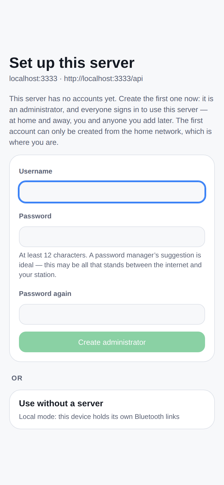

**U1 — The first screen starts in the middle of the story · Medium**

The very first thing a new user sees is **"Set up this server"**, a technical URL twice (`localhost:3333 · http://localhost:3333/api`), and a paragraph about administrators and the home network. The app has already picked a server for them without asking.

The important choice, a server versus **"Use without a server"**, is a small card below the form. Its explanation is one line ("Local mode: this device holds its own Bluetooth links"), which doesn't say what they give up: history, automations and remote access.

**Fix:** a welcome step with two clear choices before the form:

> **How do you want to use kraftverk?**
> - **With my kraftverk server** (recommended). Keeps history, works when the app is closed, and lets you reach it from anywhere.
> - **Just this phone or browser, over Bluetooth.** Live view and control while the app is open. No history.

Then title the form "Create your account". Show the server address once, small, with a "Change" link.

**U2 — Form details · Low**

- The disabled "Create administrator" button is pale green with white text and hard to read.
- There is no show-password toggle, and the setup form makes you type the 12+ character password twice.
- "Log in" (on the sign-in screen) and "Sign out" (in Accounts) are used together. Pick one pair: "Sign in" and "Sign out".
- The wrong-password message is good: clear, and it doesn't say which half was wrong.

---

## 2. Home: "Your devices"

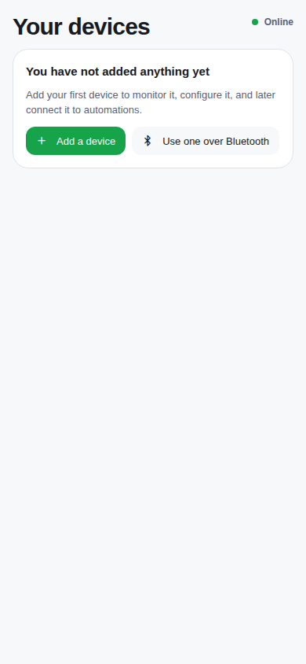 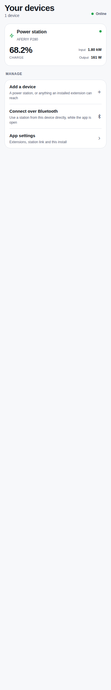

**U3 — An empty home has no way out · High**

The Manage section (Add a device, Bluetooth, **App settings**) only appears once at least one device exists (`client/app/index.tsx`, `devices.length > 0 || !editable`). A new user, or one whose server is unreachable, therefore has no way to reach App settings, Accounts, **Sign out**, or a different server.

**Fix:** a permanent settings button in the Home header, top right. That is where people look for it.

**U4 — "Online" is ambiguous · Medium**

The green "Online" pill in the Home header means *the server* is reachable. The same kind of pill on a device page means *the device* is connected ("Simulated", "Not answering"). The user can't tell the two apart.

**Fix:** say "Server online", or show nothing while things are fine and a distinct banner when they aren't.

**U5 — The home cards are read-only · Medium**

To turn AC on or off you tap the card, then scroll past the diagram and the expansion batteries to reach the switch.

**Fix:** put the most-used control on the card itself (the AC outlets switch for a station, on/off for a plug). Use a long press or the card body to open the device.

**U6 — Bluetooth shows up in four places, under four names · Low**

- Home empty state: "Use one over Bluetooth"
- Home Manage section: "Connect over Bluetooth"
- Add device: "Connect over Bluetooth instead"
- Station link: "This device"

They all lead to the same screen. Choose one entry point and one name (see U35).

---

## 3. Adding a device and connecting it

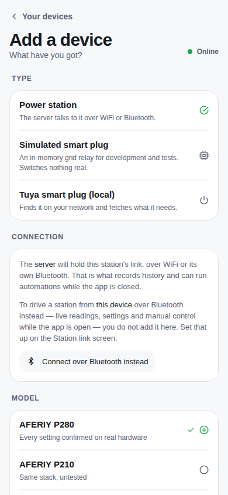

**U7 — Adding a station doesn't connect it to a station · High**

The add flow asks for type, model and name, then says "Add". It never asks *which* station, or how it is reached. On real hardware, the new device then either takes the first station the server hears ("auto-bind") or sits there "Looking for the station".

Choosing or changing the physical station for a device happens only in **App settings → Station link** (`client/app/link.tsx`), which is not on the device. Someone with two stations can't tell which one they just added.

**Fix:** make it a guided flow.

> Type → **How is it connected?** (Wi-Fi via server / Bluetooth via server / Bluetooth on this phone) → **Pick your station** (list of what the server can see, with signal and MAC, and "Not listed? Here's how to put it in local-broker mode") → Model (pre-selected; "Different model?" collapsed) → Name → Done

And on every device: **Settings → Connection**, showing the station it's using with Change and Disconnect.

**U8 — The Station link screen contradicts itself and gives developer instructions · Medium**

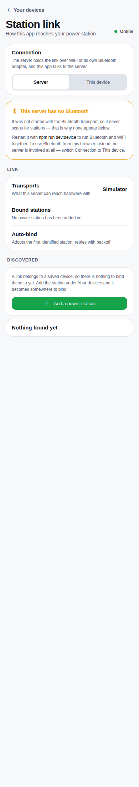

- With a station already added, it says **"No power station has been added yet"** and offers **"Add a power station"**. In simulator mode the list filters that station out; a real user would see something different, but this screen's wording has to hold in every mode.
- It says "Restart it with **npm run dev:device**" to an end user. On the Docker install the actual fix is a setting in `.env`.
- It shows internal words: "Transports", "Bound stations", "Auto-bind: adopts the first identified station; retries with backoff".
- The back button says "Your devices" although the screen is reached from App settings.

**Fix:** once the connection belongs to each device (U7), this screen becomes "Diagnostics → Connections", for experts only.

**U9 — The model list is long and its effect is unclear · Low**

All eight models are shown every time. "Something else — decoded as a P280 until told otherwise", and the README says choosing a model doesn't change decoding yet. That leaves users wondering whether the choice matters.

**Fix:** pre-select, collapse the rest under "Different model?", and say plainly: "This only labels the device for now."

**U10 — Developer-only items are shown to everyone · Low**

"Simulated smart plug — for development and tests" appears in Add device and in Extensions on a normal install. Hide it unless the server runs in simulator or development mode.

---

## 4. The device dashboard

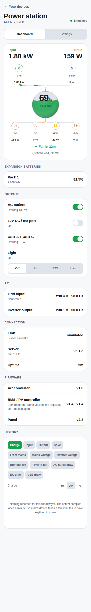

**U11 — One tap cuts the AC outlets, with no confirmation · Critical**

The Outputs switches call `togglePort` straight from `onCheckedChange` (`packages/devices/aferiy-p280/ui/dashboard.tsx:214`). In the test, tapping "AC outlets" turned them off immediately. There was no dialog and no undo.

The README warns about exactly this, for medical, heating and networking equipment. Meanwhile, granting the *relay* permission has a strong, well-written warning.

**Fix:**
- Confirm when turning **off** an output that is currently drawing power: "AC outlets are powering 166 W. Turn them off?"
- Turning *on* can stay one tap.
- Optionally show an undo toast afterwards.

**U12 — Failed actions are silent · High**

`useDeviceConnection` collects `error` (read-only refusal, no link, timeout, 409), but nothing on the device screens displays it. `connection.error` is never passed to the Dashboard or Settings panels. A refused switch flips, then quietly flips back on the next poll, and the user can't tell whether the hardware is broken.

**Fix:** an inline message under the control that failed, or a toast, with the server's reason ("The server is in read-only mode").

**U13 — The dashboard is in the wrong order for the tasks people do · Medium**

Current order:

1. Energy-flow diagram
2. Expansion batteries
3. **Outputs**
4. AC voltage
5. Connection (link, server version, uptime)
6. Firmware
7. History

The controls are below the fold on a phone. Server uptime and firmware versions are for troubleshooting, not a dashboard.

**Fix:** diagram → **Outputs** → History → battery packs. Move Connection and Firmware to an "About this device" section under Settings.

**U14 — The diagram's port icons look like buttons but aren't · Medium**

The AC/DC/USB/Light circles in the energy-flow diagram look like tappable controls, and users will tap them. Either make them toggle (with the confirmation from U11), or restyle them so they don't look like buttons.

**U15 — The history picker is heavy · Low**

There are 12 metric chips across four rows ("Charge, Input, Output, Solar, From mains, Mains voltage, Inverter voltage, Runtime left, Time to full, AC outlet draw, DC draw, USB draw").

**Fix:**
- Show Charge and Power (in and out, overlaid) by default, with "More…" for the rest.
- Remember the last choice.
- The 6h/24h/7d range selector isn't marked as a choice for assistive technology.

**U16 — Numbers are formatted inconsistently · Low**

- "2 048 Wh" is a hard-coded string (`dashboard.tsx:179`), while other numbers use the locale ("2,875 Wh").
- Durations appear as "3 min", "3m" and "8h" in different places.
- "1.80 kW" sits next to "170 W".

**Fix:** format everything through the helpers in `packages/ui/src/format.ts`.

---

## 5. Device settings

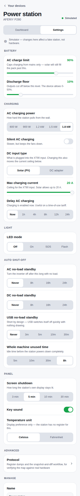

The grouping is good: Battery, Charging, Light, Auto shut-off, Panel, Advanced, Manage. So are the one-line explanations.

**U17 — Changes apply immediately with no feedback · Medium**

Each tap writes to the station straight away. There is no "Saving…" or "Saved", and no undo. Combined with U12, a failed write looks exactly like a successful one.

**Fix:** a small per-row state (spinner, then a checkmark, or an error), and an undo toast for the risky settings (discharge floor, standby timers, sleep).

**U18 — Read-only mode is half-communicated · Medium**

- The notice is only on Settings. The Dashboard switches look fully usable, and fail silently (U12).
- The controls stay enabled. They should be visibly disabled, with the notice explaining why.
- The instructions are for developers ("Restart the server without --read-only"). On the Docker install, which defaults to read-only, the actual fix is `READ_ONLY=0` in `.env`.
- The direct-link version points somewhere that no longer exists: "Turn on 'Allow writes' **under Devices**". The toggle is actually on the Station link screen.

**U19 — Values are shown before the station has answered · Medium**

Before the first reading, Settings shows invented defaults (charge limit 100 %, floor 0 %, 1.8 kW) as if they were the station's (see the first audit, R5). Show "Waiting for the station…" per section instead.

**U20 — Wording and placement · Low**

- "AC no-load standby" and "Whole machine unused time" could be "Turn off AC when nothing is plugged in" and "Power off the station after".
- "XT90" needs a short explanation ("the solar/DC input").
- **Temperature unit** is an app preference but sits among the hardware settings.
- **Advanced → Protocol** (register dumps) is shown to every user, and the screen it opens is titled differently ("Advanced" in the back button, "Protocol" on the row). Put it under "For experts" in About, or hide it until developer mode is on.

**U21 — Renaming is buried · Low**

The name field is at the very bottom of Settings under "Manage". Let the user tap the device title to rename it.

---

## 6. Smart plugs and extensions

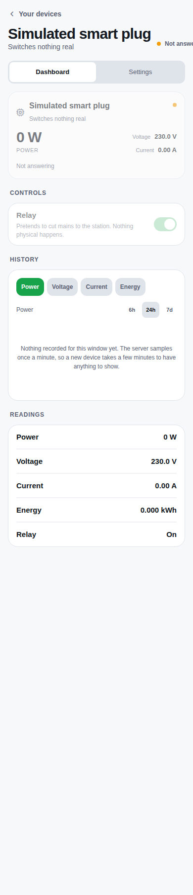 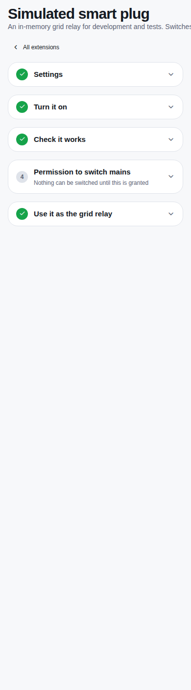

**U22 — Plug setup is spread across three screens with no guidance between them · High**

The path today:

1. Add the plug under Your devices. The fine print says keys are set up "on the Extensions screen".
2. Find Extensions under App settings, then work through a 5-step wizard.
3. Go back to the device.

The plug's own page gives no pointer to step 2. It shows a greyed relay switch with no explanation, the status "Not answering" **next to readings** (230 V, Relay On), and the plug's name three times (title, card, readings list).

**Fix:**
- Continue straight from "Add" into the plug's setup: find it, fetch keys, test, grant permission.
- On any device that isn't set up, replace the dashboard with one card: "Finish setting up this plug →".
- Don't show readings while the device isn't answering.

**U23 — The setup steps are ticked when they haven't been done · Medium**

In the wizard:
- **Settings** is ticked for a plugin that has no settings.
- **Check it works** is ticked without the check ever being run. It only means the plugin started.
- **Use it as the grid relay** (step 5) is ticked *before* step 4, the permission, was granted, because of auto-adoption.

Checkmarks that don't mean "done" teach users to ignore them.

**Fix:** tick a step only when the user has actually done it. Mark steps that don't apply as "Not needed".

**U24 — The extension page breaks the app's usual layout · Medium**

- The subtitle runs off the right edge of the screen.
- The back link ("All extensions") sits *below* the title, while every other screen has it above.
- The URL stays `/extensions`, so refreshing or using the browser's back button loses your place, and the page can't be linked to.

**Fix:** make it a route (`/extensions/[id]`) using the same `Screen` header.

**U25 — Admin warnings are shown to everyone · Low**

"Secrets are stored unencrypted … Set KRAFTVERK_SECRET_KEY" appears at the top of Extensions on every visit. It's a server-configuration issue. Show it in Diagnostics, or once to the admin with a "How to fix" link.

**U26 — Long names push the status off-screen · Low**

On the plug page the status pill is cut off ("Not answe…"). Let the title wrap, or put the status on a line of its own.

---

## 7. App settings: how it's organised

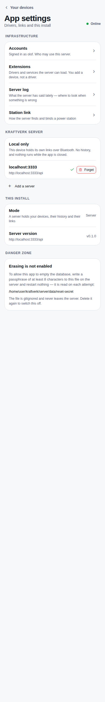

**U27 — App settings mixes everything together · Medium**

One screen holds all of this:
- Accounts, Extensions, Server log, Station link (under the heading "Infrastructure")
- A server list with "Local only"
- "This install" (mode, version)
- A Danger zone

**Sign out** is on the Accounts page: Home → App settings → Accounts → Sign out, and unreachable when you have no devices (U3).

**Proposed structure:**

```
Settings
├─ You            name · change password · Sign out
├─ People         who can use this server · add / remove
├─ Servers        which server this app uses · add · local mode
├─ Extensions     smart plugs and other add-ons
├─ Diagnostics    server log · connections (today's Station link) · protocol tools
└─ About          version · danger zone
```

**U28 — The server list is confusing · Medium**

- "Local only" looks like a list item, but it isn't clear whether it's selected. A small checkmark on another row is the only sign of which one is active.
- A red **Forget** button sits right next to the server you're using.
- The same URL appears three times on the screen.

**Fix:** radio-style rows (Local only / each server), with Forget moved into an edit mode or a swipe action.

**U29 — The Danger zone gives the user server instructions · Low**

It says to write a passphrase file at `/home/…/server/data/reset-secret` "and restart nothing". Say instead: "Erasing is turned off on this server. Your server admin can turn it on (how?)". Keep the details behind the link.

**U30 — The server log is for developers · Low**

Lines like `[http] POST /api/devices 200 9ms` are useful to the admin, but belong under Diagnostics, not beside Accounts.

---

## 8. When things go wrong

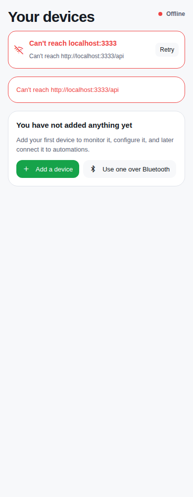

**U31 — Server unreachable reads as "you have no devices" · Critical**

With the server stopped:
- **Home** shows the error **twice** ("Can't reach localhost:3333", then "Can't reach http://localhost:3333/api"), **and then "You have not added anything yet — Add a device"**.
- **A device page** says **"That device is no longer in the list. It may have been removed."**

Both are false. Both invite the user to add their station again or panic. And because of U3 there is no way to switch server or reach settings.

**Fix:**
- Keep showing the last-known device list, greyed and marked "Last seen 10:42".
- Show one banner: "Can't reach your server. Retry · Change server".
- Never show the empty state or "removed" while the list simply couldn't be loaded.

**U32 — An unreachable server shows the whole app · Medium**

Auth treats "couldn't ask" as "allowed" (`AuthProvider.tsx:156`), so an unreachable server shows the full app filled with errors instead of one clear offline screen.

**U33 — Long actions report failure even when they succeeded · Medium**

Relay switching and extension setup take longer than the server's 10-second connection limit (first audit, H3). The app shows an error while the action did happen. Users retry, and get "too soon", or switch twice.

---

## 9. Wording

**U34 — Code vocabulary shows up in the interface · Medium**

Examples seen on screen:
- "A link belongs to a saved device, so there is nothing to bind these to yet"
- "Transports", "Auto-bind", "retries with backoff"
- "Drivers and services the server can load. You add a device, not a driver."
- "The core may cut and restore mains"
- "Mode: A server holds your devices, their history and their links"
- `npm run dev:device`, `--read-only`, `KRAFTVERK_SECRET_KEY`

Many descriptions are also long and explain the design rather than what to do next.

**Fix:** write each hint as "what this does for you", in one line. Keep the design rationale in the docs.

**U35 — One idea, many names · Medium**

| Idea | Names used today |
|---|---|
| How the app reaches a station | link, station link, connection, transport, bound |
| This phone or browser holds Bluetooth | local mode, local only, this device, direct, "use one over Bluetooth", "connect over Bluetooth" |
| Plug integrations | extensions, drivers, plugins |
| Removing a device | forget, remove |
| Getting in | log in, sign in, sign out |

**Fix:** pick one word for each, put the list in a short glossary in the repo, and use it everywhere.

---

## 10. Accessibility

**U36 — Switches have no names · High**

The accessibility tree for the dashboard shows `switch`, `switch`, `switch [checked]` with no label. A screen-reader user can't tell AC from USB, on the one screen that controls power.

Also:
- The back links ("‹ Your devices") are plain text, not links or buttons.
- The energy-flow diagram is an unlabelled image. Give it a text summary ("Charging at 1.8 kW from grid, 68 %, outputs 166 W").
- The history range (6h/24h/7d) isn't exposed as a choice.

**Fix:** pass `aria-label`/`accessibilityLabel` from the row title into `Toggle`; set `accessibilityRole="link"` on the back control.

**U37 — Contrast · Low (not measured)**

Check the 12 px grey subtitles and the disabled primary button against WCAG AA. Both looked faint on screen.

---

## 11. Desktop and dark mode

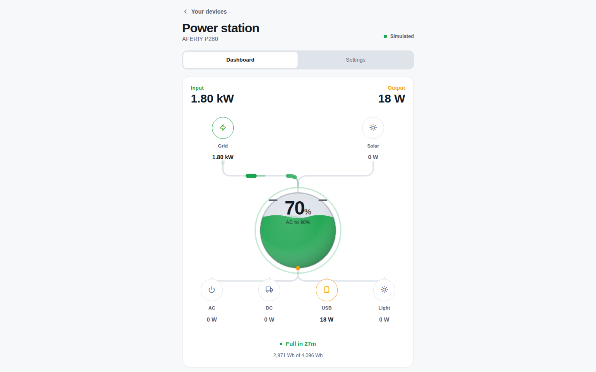 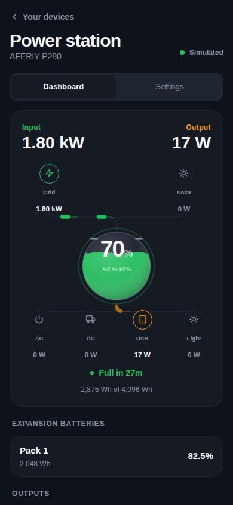

- **Dark mode** is well done: consistent, good contrast, the diagram reads well.
- **U38 — Desktop layout · Low.** At 1440 px everything stays in one narrow centred column, and the controls are far below the diagram. At ≥1024 px, use two columns: diagram and summary on the left, outputs, history and settings on the right. Home can use a grid of cards.

---

## What already works well

- The look is clean, calm and consistent, with good spacing and clear section headings.
- The energy-flow dashboard is excellent: you see what's happening in a second.
- Device settings are grouped by purpose, each with a one-line explanation.
- The relay permission step is well written: a clear warning, what it means physically, an explicit "I understand".
- "Forget this device" asks first and says what will be lost.
- The sign-in errors are good: clear, and they don't reveal which half was wrong.
- The empty state on Home has a clear call to action.
- Dark mode is complete.

---

## Quick wins (under an hour each)

- U3: settings button in the Home header.
- U31: don't render the empty state or "removed" when the load failed.
- U12: render `connection.error` on the Dashboard and Settings panels.
- U11: confirm when turning off an output that is drawing power.
- U36: labels on `Toggle`.
- U18: fix "under Devices", and say `READ_ONLY=0` for Docker.
- U16: stop hard-coding "2 048 Wh".
- U10: hide the simulated plug outside simulator mode.
- U8: fix "No power station has been added yet" and the back label.
- U2: "Sign in" and "Sign out" consistently; a show-password toggle.
