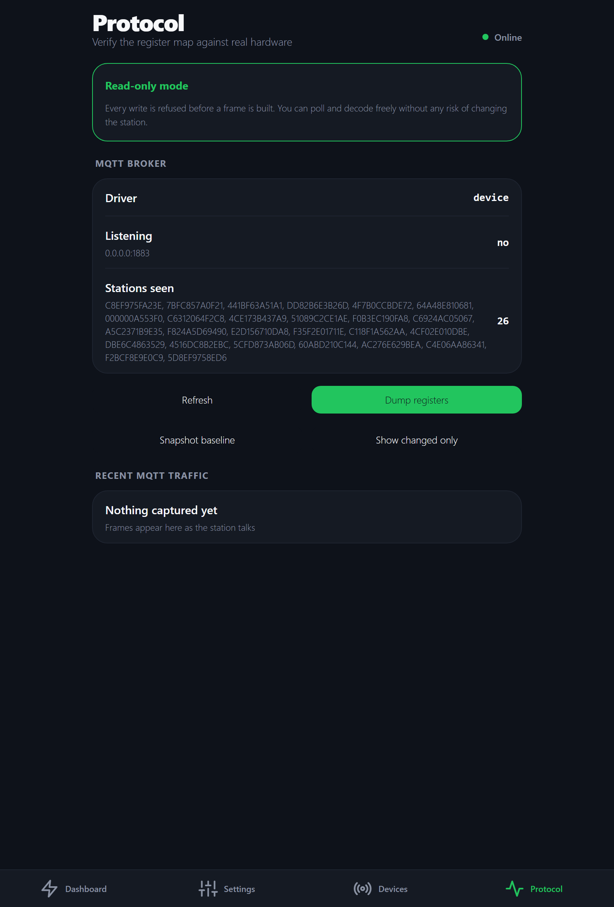

# AFERIY P280 — and the Sydpower family

## What it is

The device type for Sydpower-stack power stations, developed and verified
against an **AFERIY P280**: local control over Wi-Fi (through kraftverk's own
MQTT broker) or Bluetooth LE, **without the vendor cloud**.

> **Unofficial.** Not affiliated with, endorsed by, or supported by AFERIY,
> Sydpower, Fossibot or any related company. Those names appear only to identify
> the hardware this software talks to.

## What it does — and does not

- **Does:** the station as a device type — its parts (battery, inputs,
  outlets, expansion packs), its settings with their safe ranges, its methods
  over kraftverk's MQTT broker and over Bluetooth, its simulator, and its own
  screens (dashboard, energy flow, registers).
- **Does not:** speak its protocol (`@kraftverk/protocol-sydpower`), open a
  connection (the holder and the transports), or decide when to switch (the
  gateway and automations).

## Where it fits

A device type (docs/ARCHITECTURE.md §3): it imports the SDK and its
protocol; its `ui/` the kit and the API client. The server finds it by its
package.json (`deviceType`, `ui`); the app through the generated registry.

## Why a package of its own

Because device-specific code stays in its package and the core names no
product (AGENTS.md). Everything known about this station — its registers,
its quirks, and the rule that register 68 is never written 0 — lives here
and in its protocol, where the next Sydpower model can build on it.

## What it does

- **Live telemetry** — state of charge, power in and out per source and port,
  runtime remaining, AC voltage and frequency, expansion batteries, firmware
  versions.
- **Full settings control** — charge limit, discharge floor, AC charging power,
  silent charging, charge scheduling, DC input type, standby timers, screen
  timeout, light modes, and every output port. The charge limit, discharge
  floor and AC charging power carry the standard meanings
  `battery.chargeLimit`, `battery.dischargeFloor` and `power.in.ac.max`, so
  a shared recipe can change them without knowing this station.
- **Its own screens** — a live energy-flow dashboard, and settings grouped the
  way the station works rather than the way its registers are numbered.
- **Two ways in** — a local MQTT broker the station connects to instead of the
  vendor cloud, or a direct Bluetooth LE link, from the server or from a browser
  or phone. Both carry identical frames.
- **Protocol diagnostics** — full register dumps, a snapshot/diff workflow for
  identifying unknown registers, and a live frame log, under the device's
  **Settings → Advanced**.
- **A simulator**, so all of it works with no station present.

<p align="center">
  
  &nbsp;
  
  &nbsp;
  
</p>
<p align="center"><sub>The register tools are shown from an earlier version of the app, against a real station.</sub></p>

## Supported models

| Model | Status | Notes |
| --- | --- | --- |
| **AFERIY P280** | ✅ **Verified** | Every setting confirmed against real hardware over BLE. The reference device for this project. |
| AFERIY P210 / P310 | ⚠️ Untested | Same Sydpower stack; listed as supported by other community projects. Expect most things to work. |
| FOSSiBOT F2400 / F3600 / F3600 Pro | ⚠️ Untested | The published register maps were originally derived from these. |
| Eco Play SYD2400 / SYD3600 | ⚠️ Untested | Same stack. |
| ABOK Power Ark3600 | ⚠️ Untested | Same stack. |

If it works with the **BrightEMS** app, it is probably speaking this protocol.

**Untested does not mean compatible.** Several values are known to be
model-specific — the AC charging power scale is 600–1800 W on a P280 but
300–1100 W on an F2400, and the register map has diverged from the published
version in six places on the P280 alone. Assume yours differs until you have
checked it.

The **Protocol** screen exists precisely for this — it lives under a device's
**Settings → Advanced**, because it is a tool for one machine rather than a
property of the app. Dump your registers, compare against
[docs/P280-FINDINGS.md](../../../docs/P280-FINDINGS.md), and open an issue with what
differs.

You pick the model when you add the station, and can correct it afterwards on
its Settings screen; the picker marks which models are verified. The *decoding*
still assumes a P280 — choosing another model records what you have, it does not
yet change how registers are read.


## This software can permanently destroy your power station

Read this before running anything.

This project writes directly to a battery management system over an
**undocumented, reverse-engineered protocol**. The failure mode is not a crash
or a bad reading — it is **hardware that never turns on again**.

- **Writing `0` to holding register 68 permanently bricks the station.** Not a
  soft-lock. It does not come back. This is documented by multiple independent
  reverse-engineering efforts, and the vendor's own app removes the option that
  would send it.
- Registers 25 and 26 are reported to *toggle* on any write rather than honour
  the value sent.
- Writing an undocumented register may do anything at all. Nobody has a
  datasheet.

The code has three independent guards against the known brick value — a
register whitelist, a schema, and a test asserting the write is refused — and a
read-only mode that blocks every write at the driver. **None of that makes this
safe.** It makes it less likely that *this* code is what destroys your unit.

**There is no warranty of any kind, and the authors accept no liability for
damage to hardware, property, or anything else.** That disclaimer matters far
more here than for ordinary software: the realistic worst case is not lost data,
it is a dead battery pack worth roughly a thousand euros, and very likely a
voided warranty. Using this software is your decision and your risk alone.

If you are not willing to lose the station, do not run this against it.

Additional cautions:

- Do not change output ports while medical, heating, security, networking or
  other availability-critical equipment is connected.
- Start every session with a new unit in `--read-only`, which is the default for
  the hardware modes.
- **Everyone signs in**, at home too. The first account is created from the
  home network when the app first reaches a fresh server. Keep the server's own
  port and the MQTT broker off the internet; reach it from outside only through
  the web container behind HTTPS. The whole model, and what it does not cover,
  is in [**docs/SECURITY.md**](../../../docs/SECURITY.md).

## How it talks to the station

AFERIY does not write its own firmware stack — it rebadges **Sydpower**, the
platform also behind Fossibot, Eco Play and ABOK. One vendor app (BrightEMS)
drives all of them, which is why reverse-engineering work transfers between
brands. **Search for "Sydpower" and "Fossibot", not AFERIY.**

The station is a **MODBUS RTU slave at address `0x11`**, reachable two ways:

| Transport | Who holds the link | Requires |
| --- | --- | --- |
| `mqtt` | The server — through a broker that runs as its own process, so server restarts do not drop the station ([docs/BROKER.md](../../../docs/BROKER.md)) | BrightEMS's *Local MQTT Broker* setting pointed at your machine, or `mqtt.sydpower.com` redirected to it |
| `ble` | The server — Bluetooth LE GATT | A Bluetooth adapter on the server machine |
| Web Bluetooth | The browser, directly | Chrome or Edge, on `localhost` or HTTPS |
| react-native-ble-plx | The phone, directly | An iOS/Android development build ([docs/RUNNING.md](../../../docs/RUNNING.md#connecting-from-this-phone-or-browser)) |

Every one of them carries byte-identical frames, so a single codec, a single
register map and a single write whitelist serve all four. They live in
`packages/protocol`, which the server and the app both import — the app is not
a thin client that trusts the server's decoding, it contains the same decoder.

### The detail that will cost you a day

**The CRC is big-endian**, which contradicts the MODBUS specification. A stock
MODBUS library byte-swaps it and the device silently drops every frame with no
error at all. Verified against three independent captures:

| Frame | CRC | On the wire |
| --- | --- | --- |
| `110400000050` | `0xA6F2` | `a6f2` |
| `1106003f003c` | `0x47BB` | `47bb` |
| 168-byte response | `0xDFB5` | `dfb5` |

### Findings specific to this model

The published register maps were derived largely from **Fossibot F2400/F3600**
hardware. Several things differ on a P280, and trusting the published values
would give you plausible-looking wrong answers:

- **AC charging power** spans 600–1800 W in five steps, not the documented
  300–1100 W. It is a number in watts, stepping by 300; a wattage between
  the steps is refused before it reaches register 13, whose values are 1–5.
- **Register 48** is a bitmask reading `0x8040`, not the documented exact
  `0x8000`, so an equality check never sees the charging flag.
- **Register 41 bit 2** is the *inverter*, not AC input. The published mask
  would report a station running on its own battery as grid-connected.
- **The inverter backfeeds the AC input sense line** — 59.1 V at 0 Hz with
  nothing plugged in. Voltage alone cannot be used to detect mains.
- **Registers 15 and 47–50 are undocumented**: DC input type, and the four
  component firmware versions.
- **Register 67 caps AC charging only.** Solar charges straight past it.

Every claim above was verified against real hardware. The evidence for each,
and an explicit list of what remains unverified, is in
**[docs/P280-FINDINGS.md](../../../docs/P280-FINDINGS.md)**.

## Connecting it

How to run kraftverk itself is in [docs/RUNNING.md](../../../docs/RUNNING.md).
These are the station's own steps.

### Connecting over Wi-Fi

1. Start with `npm run dev`. The server starts the MQTT
   broker on `:1883` if one is not already running.
2. Point the station at your machine, one of two ways:
   - **BrightEMS 1.6.0+**: *Me → Settings → Local MQTT Broker Settings*, and
     enter your machine's LAN IP. Only the master account can change it. This is
     how the P280 in [P280-FINDINGS.md](../../../docs/P280-FINDINGS.md#connection-over-wi-fi)
     was connected.
   - **Older firmware**: redirect the vendor hostname in your router or Pi-hole —
     `mqtt.sydpower.com -> <your machine's LAN IP>` — and power-cycle the
     station so it re-resolves DNS.
3. Watch it arrive: `npm run broker:logs` shows the TCP connection, the MQTT
   handshake and the station's first frames as they happen.
4. Add it under **Your devices → Add a device → Power stations → AFERIY P280 →
   Wi-Fi, through your server**. The station is listed once it has connected
   to the broker — it also appears under **Found near you** on the home
   screen — and the check reads it once before it is saved. Nothing is adopted
   for you: a device exists because you added it.

The station still needs internet on first connect — it fetches MQTT credentials
from the vendor cloud before connecting. Only the MQTT traffic is redirected.

**Keep the broker running.** A P280 that loses its broker for more than a short
while can stop trying to reconnect until it is power-cycled. That is why the
broker is a separate process that server restarts do not touch;
`npm run broker:stop` and `broker:restart` are the only things that stop it.

Windows Firewall usually blocks the inbound connection:

```bash
netsh advfirewall firewall add rule name="kraftverk MQTT" dir=in action=allow protocol=TCP localport=1883 profile=private
```

### Connecting over Bluetooth

```bash
npm run dev
```

**Close the vendor app first.** These stations accept one BLE connection at a
time, and while the phone holds it, Windows sees only the generic GATT services
and the vendor service is invisible. Pairing is *not* required. Then add it as
**Bluetooth, through your server**.

## Identifying unknown registers

The **Protocol** screen — under a device's **Settings → Advanced** — implements
the workflow that produced everything in the findings document:

1. **Snapshot baseline** — captures all 160 registers
2. Change **one** thing on the station itself
3. **Dump registers**, then **Show changed only**

Whatever moved is the register behind that control. One change at a time, or the
diff stops being evidence. Note that USB switches itself off after about three
minutes with no load, so take the second dump promptly.

Two things that workflow taught us, worth knowing before you trust a hypothesis:

- **Two registers sharing a value proves nothing.** Three separate "mirror
  register" theories died this way.
- **A write can change a register you did not write.** Switching DC input type
  also moved the charging-current ceiling.

## Credits

This builds directly on other people's work:

- **[schauveau/sydpower-mqtt](https://github.com/schauveau/sydpower-mqtt)** —
  the most complete MQTT + MODBUS specification, and the primary source here
- **[iamslan/ha-fossibot](https://github.com/iamslan/ha-fossibot)** — Home
  Assistant integration; source of the writable-register whitelist
- **[dandwhelan/fossibot-bluetooth](https://github.com/dandwhelan/fossibot-bluetooth)** —
  BLE protocol and GATT UUIDs
- **[ylianst/esp-fbot](https://github.com/ylianst/esp-fbot)** — ESP32 BLE bridge
- **[bootuz-dinamon/Aferiy-Fossibot-Reverse-Engineering](https://github.com/bootuz-dinamon/Aferiy-Fossibot-Reverse-Engineering-)** —
  RS485 approach, and the only source naming the P280
- **[Jack Reeve — Reverse Engineering my smart battery](https://medium.com/@jack_57343/reverse-engineering-my-smart-battery-c01d711c770b)** —
  the write-up that established how the vendor app reaches the cloud
